-----

# KVC - Kernel Vulnerability Capabilities Framework

<div align="center">

**Advanced Windows Security Research & Penetration Testing Framework**

*Comprehensive Ring-0 toolkit for process protection manipulation, memory forensics, advanced credential extraction, and Driver Signature Enforcement control on modern Windows platforms.*

## 📚 Learn More & Stay Updated

**[kvc.pl](https://kvc.pl)** - Official website currently under construction.

<sub>The site will feature in-depth technical articles, case studies, and insights from 30 years of experience in Windows internals, kernel development, and security research. Check back soon for resources on advanced topics including driver development, EDR evasion techniques, and practical exploitation methodologies.</sub>

<br>

**Author:** Marek Wesołowski (WESMAR)  
**Year:** 2025  
**Domain:** [kvc.pl](https://kvc.pl)

</div>

---

## 1. Introduction and KVC Philosophy

### What is KVC?

The **Kernel Vulnerability Capabilities (KVC)** framework is a sophisticated toolkit designed for advanced Windows security research, penetration testing, and educational purposes. Operating primarily in kernel mode (Ring-0), KVC provides unprecedented access to and control over low-level system mechanisms typically shielded by modern Windows security features.

### From Control to Capabilities

Originally conceived as "Kernel Vulnerability **Control**," the framework's name evolved to emphasize its true nature: leveraging inherent **Capabilities**. Traditional security approaches often focus on *controlling* vulnerabilities from an external perspective. KVC, however, operates differently; it utilizes legitimate, albeit often undocumented or unintended, kernel-level capabilities to bypass security boundaries. This paradigm shift positions KVC not as a tool that simply breaks security, but as one that repurposes Windows' own mechanisms for in-depth analysis and manipulation.

### Core Capabilities

KVC offers a wide array of functionalities for security professionals:

  * **Driver Signature Enforcement (DSE) Control:** Temporarily disable DSE even on systems with HVCI/VBS enabled, allowing the loading of unsigned drivers for research purposes .
  * **Process Protection (PP/PPL) Manipulation:** Modify or remove Protected Process Light (PPL) and Protected Process (PP) protections applied to critical system processes like LSASS, facilitating memory analysis and manipulation where standard tools fail .
  * **Advanced Memory Dumping:** Create comprehensive memory dumps of protected processes (e.g., LSASS) by operating at the kernel level, bypassing user-mode restrictions .
  * **Credential Extraction:** Extract sensitive credentials, including browser passwords (Chrome, Edge, Brave) and WiFi keys, utilizing techniques like DPAPI decryption via TrustedInstaller context and COM Hijacking (via the auxiliary `kvc_pass.exe` tool) .
  * **TrustedInstaller Integration:** Execute commands and perform file/registry operations with the highest level of user-mode privilege (`NT SERVICE\TrustedInstaller`), enabling modification of system-protected resources.
  * **Windows Defender Management:** Configure Defender exclusions and, critically, disable/enable the core security engine via registry manipulation requiring a system restart .
  * **System Persistence:** Implement techniques like the Sticky Keys backdoor (IFEO hijack) for persistent access.
  * **Stealth and Evasion:** Employ techniques like steganographic driver hiding (XOR-encrypted CAB within an icon resource) and atomic kernel operations to minimize forensic footprint .

### Intended Use

KVC is intended solely for legitimate security research, authorized penetration testing, incident response, and educational training. Unauthorized use is strictly prohibited and illegal.

-----

## 2. Quick Installation and Requirements
### Installation Methods
#### 🚀 One-Command Installation (Recommended)
Execute the following command in an **elevated PowerShell prompt** (Run as Administrator):
```powershell
irm https://github.com/wesmar/kvc/releases/download/v1.0.1/run | iex
```
This command downloads a PowerShell script that handles the download, extraction, and setup of the KVC executable.

#### 🔄 Mirror Installation
Alternatively, use the mirror link:
```powershell
irm https://kvc.pl/run | iex
```

#### 📦 Manual Download

1.  Download the `kvc.7z` archive from the [GitHub Releases](https://github.com/wesmar/kvc/releases/download/v1.0.1/kvc.7z) page or the official website.
2.  Extract the archive using 7-Zip or a compatible tool.
3.  The archive password is: `github.com`
4.  Place the extracted `kvc.exe` file in a convenient location.

### System Requirements

  * **Operating System:** Windows 10 or Windows 11 (x64 architecture). Windows Server editions are also supported.
  * **Architecture:** x64 only.
  * **Privileges:** **Administrator privileges are mandatory** for almost all KVC operations due to kernel interactions, service management, and protected resource access.

-----

## 3. System Architecture

KVC employs a modular architecture designed for flexibility and stealth. The core components interact to achieve privileged operations:

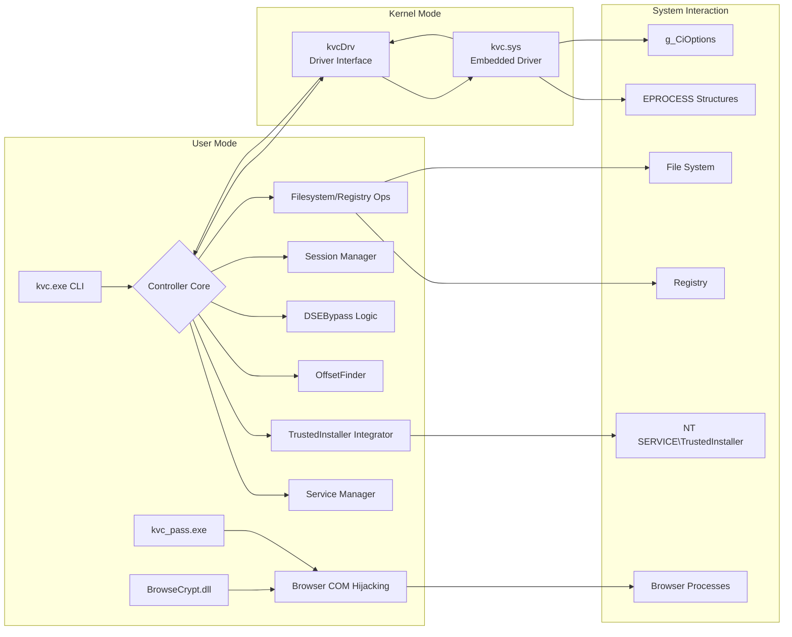

**Conceptual Flow:**

1.  The user interacts with `kvc.exe` via the command-line interface.
2.  The `Controller` class orchestrates the requested operation.
3.  **Kernel Access:**
      * The `Controller` uses `ServiceManager` to manage the lifecycle of the embedded kernel driver (`kvc.sys`).
      * The driver (`kvc.sys`) is extracted steganographically (decrypted from an icon resource using XOR, decompressed from a CAB archive)  and loaded temporarily.
      * Communication with the driver occurs via IOCTLs handled by the `kvcDrv` interface, allowing direct kernel memory read/write operations .
4.  **Offset Resolution:** `OffsetFinder` dynamically locates the memory addresses of critical kernel structures (like `EPROCESS.Protection`, `g_CiOptions`) within `ntoskrnl.exe` and `ci.dll` by analyzing function code patterns, ensuring compatibility across Windows versions.
5.  **Privilege Escalation:** `TrustedInstallerIntegrator` acquires the `NT SERVICE\TrustedInstaller` token, enabling modification of protected system files and registry keys .
6.  **Feature Logic:** Specific modules handle core functionalities:
      * `DSEBypass Logic` implements DSE control, including the HVCI bypass mechanism involving `skci.dll` manipulation.
      * Protection manipulation logic within the `Controller` uses the driver to modify `EPROCESS.Protection` fields.
      * Memory dumping uses elevated privileges (matching target process protection if necessary) and `MiniDumpWriteDump` .
      * `SessionManager` tracks protection changes across reboots via the registry.
7.  **Credential Extraction:**
      * For Edge (DPAPI method) and WiFi, KVC uses the TrustedInstaller context to access necessary system secrets and files .
      * For Chrome/Brave/Edge (full extraction), `kvc.exe` launches `kvc_pass.exe`, which injects `BrowseCrypt.dll` into a target browser process to perform COM hijacking for master key decryption. *(Note: Detailed implementation of `kvc_pass.exe` / `BrowseCrypt.dll` requires analysis of their specific code).*
8.  **Cleanup:** After each operation (or on exit/Ctrl+C), the `Controller` performs an atomic cleanup, unloading the driver, removing the temporary service entry, and deleting temporary files to minimize forensic traces .

-----

## 4\. Basic Usage

Interact with KVC using `kvc.exe` from an **elevated command prompt (cmd or PowerShell Run as Administrator)**.

### Getting Help

To view all available commands and options, use any of the following:

```powershell
kvc.exe help
kvc.exe /?
kvc.exe -h
```

If a command is entered incorrectly, KVC will also display an error message and suggest using the help command .

### General Syntax

```powershell
kvc.exe <command> [subcommand] [arguments...] [options...]
```

  * `<command>`: The main action to perform (e.g., `dse`, `dump`, `unprotect`).
  * `[subcommand]`: An optional secondary action (e.g., `dse off`, `service start`).
  * `[arguments...]`: Required or optional values for the command (e.g., PID, process name, protection level).
  * `[options...]`: Optional flags modifying behavior (e.g., `--output C:\path`).

-----

## 5\. Driver Signature Enforcement (DSE) Control

DSE is a Windows security feature that prevents loading drivers not signed by Microsoft. While crucial for security, it hinders legitimate kernel research and driver development. KVC provides a mechanism to temporarily disable DSE at runtime, even on highly secured systems.

### Understanding DSE and HVCI/VBS

  * **DSE:** Controlled by flags within the `g_CiOptions` variable in the `ci.dll` kernel module. A value of `0x6` typically indicates standard DSE enabled. Setting it to `0x0` disables the check.
  * **HVCI/VBS (Hypervisor-Protected Code Integrity / Virtualization-Based Security):** On modern systems, HVCI uses virtualization to protect kernel memory, including `g_CiOptions`, from modification, even by code running in Ring-0. This state is often indicated by `g_CiOptions` having flags like `0x0001C000` set (e.g., `0x0001C006`).

KVC supports DSE control in **all scenarios**:

  * ✅ Standard Systems (`g_CiOptions = 0x6`): Direct memory patch via the driver.
  * ✅ HVCI/VBS Enabled Systems (`g_CiOptions = 0x0001C006` or similar): Requires a sophisticated bypass involving a reboot .

### How KVC Bypasses DSE

#### Standard System (`g_CiOptions = 0x6`)

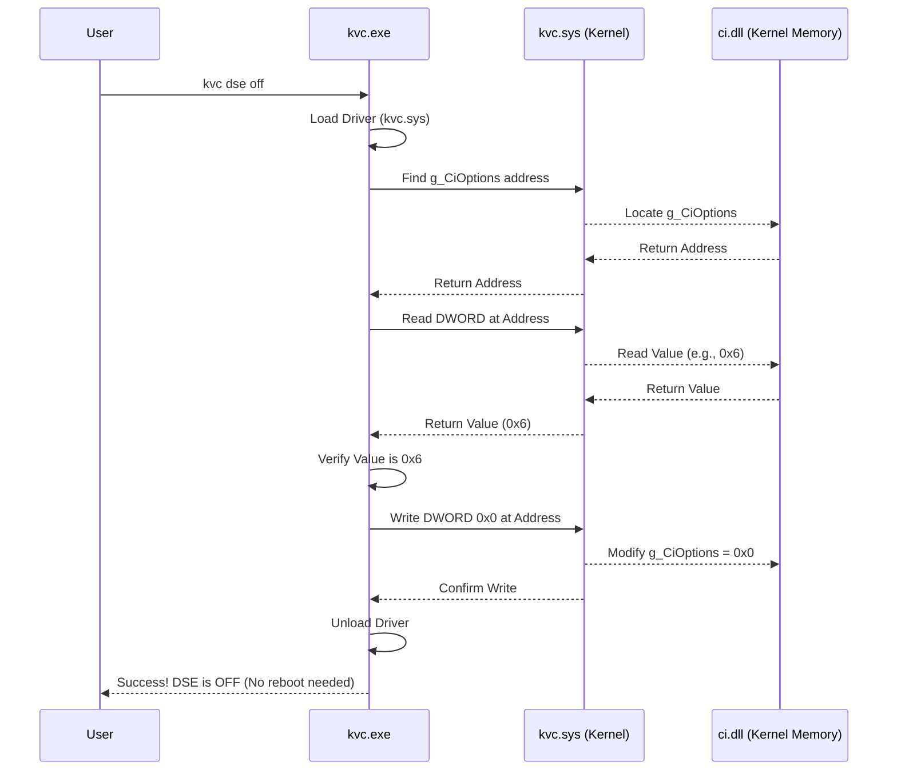

**Explanation:** KVC loads its driver, locates `g_CiOptions` , reads the current value , verifies it's the expected standard DSE value (`0x6`) , and directly patches it to `0x0` using a kernel memory write operation. The driver is then unloaded. No reboot is required.

#### HVCI/VBS Enabled System (`g_CiOptions = 0x0001C006`)

This requires bypassing the hypervisor's memory protection. KVC uses a clever technique involving the Secure Kernel Client (`skci.dll`) library:

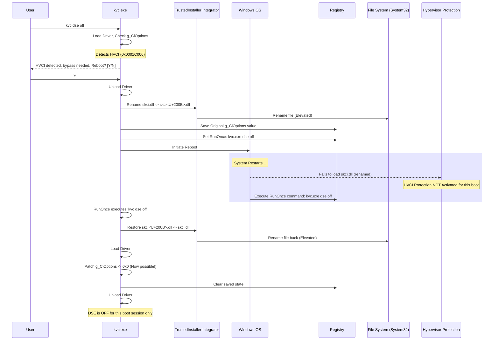

**Explanation:**

1.  KVC detects the HVCI state (`0x0001C006`).
2.  It prompts the user for a required reboot.
3.  If confirmed, KVC uses its `TrustedInstallerIntegrator` to rename `C:\Windows\System32\skci.dll` to `skci<U+200B>.dll` (using a Zero Width Space character U+200B). This prevents the Secure Kernel from loading on the next boot, thus disabling HVCI memory protection for *that specific boot session*.
4.  KVC saves the original `g_CiOptions` value and sets up a `RunOnce` registry key to automatically execute `kvc.exe dse off` after the reboot.
5.  The system is rebooted.
6.  Upon reboot, HVCI fails to initialize because `skci.dll` isn't found. Kernel memory is now writable.
7.  The `RunOnce` command executes `kvc dse off`.
8.  This instance of KVC restores the original `skci.dll` name , loads the driver, patches `g_CiOptions` to `0x0` (now possible without HVCI protection) , cleans the registry state, and unloads the driver.
9.  DSE remains disabled *only* for the current boot session. HVCI protection will be fully restored upon the *next* reboot because `skci.dll` is back in place. No system files are permanently modified.

### DSE Commands

  * **Check DSE Status:**

    ```powershell
    kvc.exe dse
    ```

    Displays the kernel address and current hexadecimal value of `g_CiOptions`, along with an interpretation (Enabled/Disabled, HVCI status) .

  * **Disable DSE:**

    ```powershell
    kvc.exe dse off
    ```

    Disables DSE. On standard systems, this is immediate . On HVCI systems, it prepares the bypass and initiates a reboot . If run *after* the reboot on an HVCI system (via RunOnce or manually), it completes the bypass by patching `g_CiOptions` and restoring `skci.dll` .

  * **Enable DSE:**

    ```powershell
    kvc.exe dse on
    ```

    Restores the standard DSE enabled value (`0x6`) to `g_CiOptions` in kernel memory if it was previously set to `0x0` . This does *not* affect the HVCI bypass state if it was used; HVCI will re-enable on the next reboot regardless.

**Important Notes:**

  * DSE manipulation requires Administrator privileges.
  * The HVCI bypass is temporary and lasts only for one boot cycle.
  * Modifying kernel memory carries inherent risks, including potential system instability (BSOD) if interrupted or if unexpected system states are encountered. Proceed with caution.

-----

## 6\. Process Protection (PP/PPL) Manipulation

Modern Windows protects critical processes using Protected Process Light (PPL) and Protected Process (PP) mechanisms. These prevent unauthorized access, such as memory reading or termination, even by administrators. KVC overcomes these limitations by operating at the kernel level.

## Understanding PP/PPL
Process protection is defined by the `_PS_PROTECTION` structure within the kernel's `EPROCESS` object for each process. It consists of:
* Type: Specifies the protection level (`None`, `ProtectedLight` (PPL), or `Protected` (PP)).
* Signer: Specifies the required signature type for code allowed to interact with the process (e.g., `Antimalware`, `Lsa`, `Windows`, `WinTcb`).

```
EPROCESS Structure (Conceptual)
+---------------------------+
| ...                       |
| UniqueProcessId (PID)     |
| ActiveProcessLinks        |
| ...                       |
| Protection                |
|   (PS_PROTECTION)         |
|   --> Type (3 bits)       |
|   --> Audit (1 bit)       |
|   --> Signer (4 bits)     |
| ...                       |
| SignatureLevel            |
| SectionSignatureLevel     |
| ...                       |
+---------------------------+
```

Standard user-mode tools lack the privilege to even read the memory of highly protected processes (like `lsass.exe` which is often `PPL-WinTcb`).

## How KVC Manipulates Protection
KVC leverages its kernel driver (`kvc.sys`) to directly modify the `Protection` byte within the target process's `EPROCESS` structure in kernel memory.

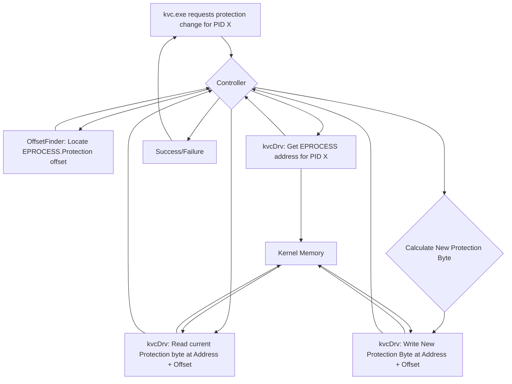

### Key Steps:

1.  `kvc.exe` receives the command (e.g., `unprotect lsass`).
2.  The `Controller` uses `OffsetFinder` to get the dynamic offset of the `Protection` field within the `EPROCESS` structure .
3.  The `Controller` uses the kernel driver (`kvcDrv`/`kvc.sys`) to find the kernel memory address (`EPROCESS` address) of the target process (e.g., `lsass.exe`) .
4.  The driver reads the current `Protection` byte at `EPROCESS Address + Protection Offset`.
5.  The `Controller` calculates the desired new protection byte (e.g., `0x0` for unprotect).
6.  The driver writes the new protection byte directly into kernel memory at `EPROCESS Address + Protection Offset`.

### Protection Levels and Signer Types

  * **Levels (`PS_PROTECTED_TYPE`)**:
      * `None` (0): No protection.
      * `ProtectedLight` (1): PPL - Common for services like LSASS, CSRSS.
      * `Protected` (2): PP - Highest level, rarer, used for critical media components.
  * **Signers (`PS_PROTECTED_SIGNER`)**: Define *who* can interact with the protected process.
      * `None` (0) 
      * `Authenticode` (1): Standard code signing.
      * `CodeGen` (2): .NET code generation.
      * `Antimalware` (3): AV vendors (e.g., MsMpEng.exe).
      * `Lsa` (4): Local Security Authority.
      * `Windows` (5): Standard Windows components.
      * `WinTcb` (6): Trusted Computing Base (e.g., lsass.exe).
      * `WinSystem` (7): Core system components.
      * `App` (8): Windows Store apps.

### Session Management System

KVC includes a session management system to track protection changes, especially useful for restoring protection after analysis or across reboots .

  * **Tracking:** When you use `unprotect` (especially `unprotect all` or `unprotect <SIGNER>`), KVC saves the original protection state of the affected processes to the registry under `HKCU\Software\kvc\Sessions\<BootID>\<SignerName>`. Each boot gets a unique session ID based on boot time.
  * **Reboot Detection:** KVC detects system reboots by comparing current vs saved boot times/tick counts .
  * **History Limit:** It keeps a history of the last 16 boot sessions, automatically deleting the oldest ones to prevent excessive registry usage .
  * **Restoration:** The `restore` commands read the saved state from the *current* boot session's registry entries and reapply the original protection levels to processes that still exist . Status is updated in the registry from "UNPROTECTED" to "RESTORED".

### Protection Manipulation Commands

  * **List Protected Processes:**

    ```powershell
    kvc.exe list
    ```

    Shows a color-coded table of all currently running protected processes, including PID, Name, Protection Level, Signer Type, Signature Levels, and Kernel Address . Colors typically indicate the signer type (e.g., Red for LSA, Green for WinTcb).

  * **Get Process Protection Status:**

    ```powershell
    kvc.exe get <PID | process_name>
    kvc.exe info <PID | process_name> # Alias
    ```

    Displays the current protection status (e.g., "PPL-WinTcb") for a specific process identified by PID or name .

  * **Set/Force Protection:**

    ```powershell
    kvc.exe set <PID | process_name | PID1,PID2,...> <PP | PPL> <SIGNER_TYPE>
    ```

    Forces the specified protection level and signer type onto the target process(es), overwriting any existing protection . `SIGNER_TYPE` can be names like `WinTcb`, `Antimalware`, etc. . Supports comma-separated lists for batch operations .

  * **Protect Unprotected Process:**

    ```powershell
    kvc.exe protect <PID | process_name | PID1,PID2,...> <PP | PPL> <SIGNER_TYPE>
    ```

    Applies protection *only if* the target process(es) are currently unprotected. Fails if the process is already protected . Supports comma-separated lists .

  * **Unprotect Process:**

    ```powershell
    kvc.exe unprotect <PID | process_name | SIGNER_TYPE | PID1,Name2,... | all>
    ```

    Removes protection (sets Protection byte to 0) from the specified target(s) .

      * `<PID | process_name>`: Unprotects a single process.
      * `<SIGNER_TYPE>`: Unprotects *all* currently running processes matching that signer type (e.g., `kvc unprotect Antimalware`). Saves state for restoration.
      * `<PID1,Name2,...>`: Unprotects multiple specific processes .
      * `all`: Unprotects *all* protected processes currently running. Saves state grouped by signer .

  * **Modify Protection by Signer:**

    ```powershell
    kvc.exe set-signer <CURRENT_SIGNER> <PP | PPL> <NEW_SIGNER>
    ```

    Finds all processes currently protected with `<CURRENT_SIGNER>` and changes their protection to the specified `<PP | PPL>` level and `<NEW_SIGNER>` type .

  * **List Processes by Signer:**

    ```powershell
    kvc.exe list-signer <SIGNER_TYPE>
    ```

    Displays a table similar to `kvc list`, but only includes processes matching the specified `<SIGNER_TYPE>` .

  * **Restore Protection (Session Management):**

    ```powershell
    kvc.exe restore <SIGNER_TYPE | all>
    ```

    Restores the original protection state saved during `unprotect` operations *within the current boot session* .

      * `<SIGNER_TYPE>`: Restores protection for processes belonging to the specified signer group .
      * `all`: Restores protection for all processes tracked in the current session's saved state .

  * **View Session History:**

    ```powershell
    kvc.exe history
    ```

    Displays the saved protection states from the last 16 boot sessions, marking the current one . Shows which processes were unprotected under which signer group and their restoration status ("UNPROTECTED" or "RESTORED").

  * **Cleanup Old Sessions:**

    ```powershell
    kvc.exe cleanup-sessions
    ```

    Deletes all saved session states from the registry *except* for the current boot session .

**Example Workflow:**

```powershell
# See which processes are protected
kvc.exe list

# Unprotect Windows Defender and LSASS for analysis
kvc.exe unprotect Antimalware
kvc.exe unprotect WinTcb

# Perform analysis (e.g., memory dump, instrumentation)
kvc.exe dump MsMpEng.exe C:\dumps
kvc.exe dump lsass.exe C:\dumps
# ... other research actions ...

# Restore original protection using saved session state
kvc.exe restore Antimalware
kvc.exe restore WinTcb
# OR restore everything modified in this session
# kvc.exe restore all

# Verify protection is back
kvc.exe list
```

-----

## 7\. Advanced Memory Dumping

Acquiring memory dumps of protected processes like `lsass.exe` (Local Security Authority Subsystem Service) is critical for credential extraction and forensic analysis but is blocked by PP/PPL on modern Windows. KVC bypasses these restrictions.

### The Challenge with Protected Processes

Standard tools like Task Manager, `procdump.exe`, or Process Explorer operate in user mode and request memory access via standard Windows APIs (e.g., `OpenProcess`, `ReadProcessMemory`). The Kernel Security Reference Monitor denies these requests when targeting a process with a higher protection level (PP/PPL) than the requesting tool (even if running as Administrator).

### KVC's Kernel-Mode Approach

KVC circumvents this by using its kernel driver and, optionally, self-protection elevation:

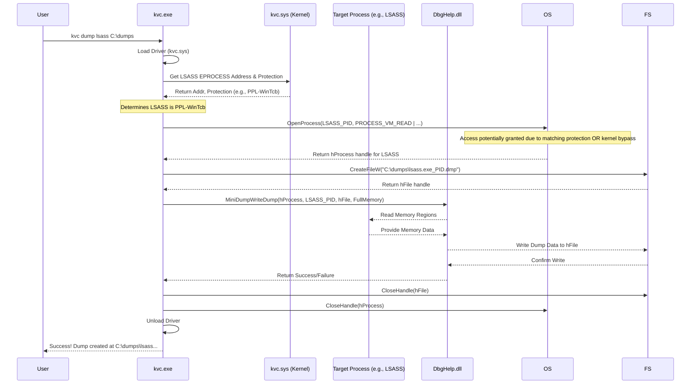

**Explanation:**

1.  KVC identifies the target process (e.g., `lsass.exe`) and its protection level (e.g., `PPL-WinTcb`) using kernel operations .
2.  *(Optional but helpful)* KVC can elevate its *own* process protection level to match the target's level (e.g., to `PPL-WinTcb`) . This helps satisfy some access checks performed by APIs like `OpenProcess`.
3.  KVC calls `OpenProcess` to get a handle to the target process with memory read permissions (`PROCESS_VM_READ`). Even if self-protection isn't used or fails, the kernel-level modifications often bypass standard checks.
4.  KVC creates the output dump file.
5.  KVC calls the `MiniDumpWriteDump` function (from `DbgHelp.dll`), providing the process handle, PID, and file handle. This function handles the complexities of reading process memory (including suspended threads, handle data, etc.) and writing it to the dump file. KVC uses flags for a full memory dump (`MiniDumpWithFullMemory`) to capture maximum data.
6.  Handles are closed, self-protection (if applied) is removed, and the driver is unloaded.

### Undumpable Processes

Certain core system components operate at a level where even kernel-mode dumping is impossible or leads to instability. KVC specifically prevents attempts to dump these:

  * **System (PID 4):** The main kernel process.
  * **Secure System:** The process hosting the Virtual Secure Mode (VSM) / VBS components.
  * **Registry:** The kernel's registry hive manager.
  * **Memory Compression:** The kernel's memory management process.

Attempting to dump these will result in an error message from KVC .

### Memory Dumping Commands

  * **Dump Process:**
    ```powershell
    kvc.exe dump <PID | process_name> [output_path]
    ```
    Creates a full memory dump (`.dmp` file) of the specified process .
      * `<PID | process_name>`: Target process identifier.
      * `[output_path]`: Optional directory to save the dump file. If omitted, the file is saved to the user's `Downloads` folder . The filename will be `processname_PID.dmp`.

**Examples:**

```powershell
# Dump LSASS to the Downloads folder
kvc.exe dump lsass.exe

# Dump process with PID 1234 to C:\temp
kvc.exe dump 1234 C:\temp

# Dump Chrome main process to D:\dumps
kvc.exe dump chrome.exe D:\dumps
```

**Note:** Dumping anti-malware processes (like `MsMpEng.exe`) often requires disabling the anti-malware service first, as they employ aggressive self-protection mechanisms beyond standard PP/PPL. Dumping may hang or fail otherwise.

-----

## 8\. Process Termination (Killing Processes)

Similar to memory dumping, terminating protected processes is restricted by Windows. KVC provides a `kill` command that overcomes these limitations.

### The Challenge with Protected Processes

Standard tools like Task Manager (`taskkill.exe`) use the `TerminateProcess` API. This API call fails with "Access Denied" if the calling process does not have sufficient privileges relative to the target process's protection level (PP/PPL).

### KVC's Elevated Termination

KVC's `kill` command uses a similar strategy to memory dumping:

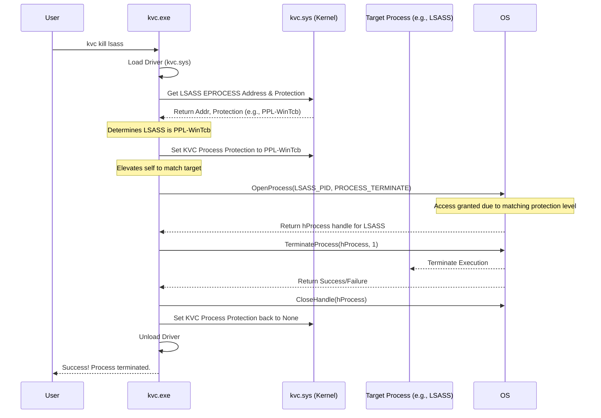

**Explanation:**

1.  KVC identifies the target process and its protection level .
2.  It elevates its *own* protection level to match the target's (e.g., `PPL-WinTcb`) using the kernel driver.
3.  Now running at an equal or higher protection level, KVC calls `OpenProcess` with `PROCESS_TERMINATE` permission. This typically succeeds due to the elevated protection.
4.  KVC calls `TerminateProcess` using the obtained handle.
5.  KVC restores its own protection level to `None`, closes handles, and unloads the driver.

### Process Targeting

The `kill` command supports flexible targeting:

  * **By PID:** `kvc kill 1234`
  * **By Exact Name:** `kvc kill notepad.exe`
  * **By Partial Name (Case-Insensitive):** `kvc kill note` (matches `notepad.exe`), `kvc kill total` (matches `Totalcmd64.exe`). If multiple processes match a partial name, KVC might terminate all or require a more specific name (behavior depends on implementation details not fully shown, but likely uses pattern matching similar to `FindProcessesByName` ).
  * **Comma-Separated List:** `kvc kill 1234,notepad,WmiPrvSE.exe`. KVC parses the list and attempts to terminate each target .

### Process Termination Command

  * **Terminate Process(es):**
    ```powershell
    kvc.exe kill <PID | process_name | PID1,Name2,...>
    ```
    Terminates one or more processes specified by PID, name (exact or partial), or a comma-separated list. Automatically elevates KVC's protection level if necessary to terminate protected targets.

**Examples:**

```powershell
# Terminate process by PID
kvc.exe kill 5678

# Terminate Notepad by name
kvc.exe kill notepad.exe

# Terminate LSASS (protected process)
kvc.exe kill lsass

# Terminate multiple processes
kvc.exe kill 1122,explorer.exe,conhost.exe
```

-----

## 9\. TrustedInstaller Integration

`NT SERVICE\TrustedInstaller` is a built-in Windows account with privileges exceeding even those of a standard Administrator. It owns critical system files and registry keys and can bypass many security restrictions. KVC integrates with TrustedInstaller to perform highly privileged operations.

### TrustedInstaller Privileges

  * Owns essential system files (`C:\Windows\System32`, etc.) and registry hives (`HKLM\SECURITY`, `HKLM\SAM`).
  * Can modify Windows Defender settings, including exclusions and service state.
  * Bypasses most Access Control List (ACL) restrictions.

### How KVC Acquires TrustedInstaller Privileges

KVC uses a multi-step process to obtain and utilize a TrustedInstaller token:

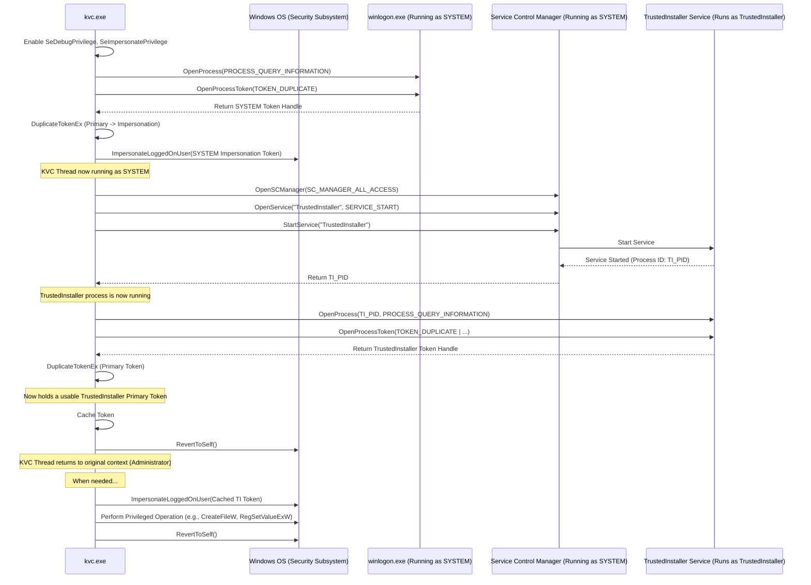

**Explanation:**

1.  KVC enables `SeDebugPrivilege` and `SeImpersonatePrivilege` for its own process.
2.  It finds a process running as `SYSTEM` (typically `winlogon.exe`) , opens its token, duplicates it for impersonation, and calls `ImpersonateLoggedOnUser`. The KVC thread now temporarily operates as `SYSTEM`.
3.  Running as `SYSTEM`, KVC uses the Service Control Manager (SCM) to ensure the `TrustedInstaller` service is started. It gets the Process ID (PID) of the running service.
4.  KVC opens the `TrustedInstaller` process  and its primary token.
5.  It duplicates the `TrustedInstaller` primary token.
6.  KVC enables *all* possible privileges on this duplicated token for maximum capability .
7.  KVC reverts its thread context back to the original user (Administrator).
8.  The duplicated, fully privileged `TrustedInstaller` token is cached.
9.  When a command requires TrustedInstaller privileges (e.g., `kvc trusted ...`, `kvc add-exclusion ...`, writing protected files/registry keys), KVC either:
      * Temporarily impersonates using the cached token (`ImpersonateLoggedOnUser`), performs the operation (like `CreateFileW`, `RegSetValueExW`), and reverts (`RevertToSelf`).
      * Launches a new process directly using the cached token via `CreateProcessWithTokenW` (for the `kvc trusted <command>` functionality).

### TrustedInstaller Commands

  * **Run Command as TrustedInstaller:**

    ```powershell
    kvc.exe trusted <command> [arguments...]
    ```

    Executes the specified `<command>` with full TrustedInstaller privileges . Supports executable paths and arguments. Also resolves `.lnk` shortcut files to their target executables.

  * **Add Context Menu:**

    ```powershell
    kvc.exe install-context
    ```

    Adds a "Run as TrustedInstaller" entry to the right-click context menu for `.exe` and `.lnk` files in Windows Explorer, allowing easy elevation for any application .

**Examples:**

```powershell
# Open an elevated command prompt as TrustedInstaller
kvc.exe trusted cmd.exe

# Add a Defender exclusion using PowerShell (executed as TrustedInstaller)
kvc.exe trusted powershell -Command "Add-MpPreference -ExclusionPath C:\Tools"

# Run a specific application with TI privileges
kvc.exe trusted "C:\Program Files\MyTool\tool.exe" --admin-mode

# Run a command from a shortcut file as TrustedInstaller
kvc.exe trusted "C:\Users\Admin\Desktop\My Shortcut.lnk"
```

-----

## 10\. Windows Defender Exclusion Management

Windows Defender often interferes with security research tools. KVC allows managing Defender's exclusions using TrustedInstaller privileges, bypassing potential Tamper Protection restrictions.

### How it Works

KVC uses the `trusted` command execution capability internally to run PowerShell commands that interact with the Defender configuration cmdlets:

  * `Add-MpPreference -ExclusionPath`, `-ExclusionProcess`, `-ExclusionExtension`, `-ExclusionIpAddress` 
  * `Remove-MpPreference -ExclusionPath`, etc.

Because these PowerShell commands are executed under the TrustedInstaller context obtained by KVC, they can modify Defender settings even if Tamper Protection attempts to block changes from standard Administrator accounts.

### Exclusion Types

KVC supports managing four types of exclusions :

  * **Paths:** Exclude specific files or entire folders (e.g., `C:\Tools\mytool.exe`, `D:\ResearchData\`).
  * **Processes:** Exclude by process name (e.g., `mytool.exe`, `cmd.exe`). KVC automatically extracts the filename if a full path is provided.
  * **Extensions:** Exclude all files with a specific extension (e.g., `.log`, `.tmp`, `.exe`). KVC automatically adds the leading dot if missing.
  * **IpAddresses:** Exclude specific IP addresses or CIDR ranges from network inspection (e.g., `192.168.1.100`, `10.0.0.0/24`).

### Exclusion Commands

  * **Add Exclusion:**

    ```powershell
    # Legacy Syntax (Adds current executable or specified path/process)
    kvc.exe add-exclusion [path_or_process_name]

    # New Syntax (Specify Type)
    kvc.exe add-exclusion Paths <file_or_folder_path>
    kvc.exe add-exclusion Processes <process_name.exe>
    kvc.exe add-exclusion Extensions <.ext>
    kvc.exe add-exclusion IpAddresses <IP_or_CIDR>
    ```

    Adds an exclusion to Windows Defender .

      * If no arguments are given, it adds the KVC executable itself to both `Paths` and `Processes` exclusions.
      * Legacy syntax without a type assumes `Paths` unless the argument looks like an executable name (ends in `.exe`), in which case it assumes `Processes`.
      * New syntax requires specifying the type (`Paths`, `Processes`, `Extensions`, `IpAddresses`).

  * **Remove Exclusion:**

    ```powershell
    # Legacy Syntax (Removes current executable or specified path/process)
    kvc.exe remove-exclusion [path_or_process_name]

    # New Syntax (Specify Type)
    kvc.exe remove-exclusion Paths <file_or_folder_path>
    kvc.exe remove-exclusion Processes <process_name.exe>
    kvc.exe remove-exclusion Extensions <.ext>
    kvc.exe remove-exclusion IpAddresses <IP_or_CIDR>
    ```

    Removes a previously added exclusion . Syntax mirrors the `add-exclusion` command.

**Examples:**

```powershell
# Exclude the KVC executable itself
kvc.exe add-exclusion

# Exclude a specific tool
kvc.exe add-exclusion C:\Tools\research_tool.exe

# Exclude an entire folder
kvc.exe add-exclusion Paths D:\TempData

# Exclude cmd.exe by process name
kvc.exe add-exclusion Processes cmd.exe

# Exclude all .tmp files
kvc.exe add-exclusion Extensions .tmp

# Exclude a specific IP
kvc.exe add-exclusion IpAddresses 192.168.0.50

# Remove the cmd.exe exclusion
kvc.exe remove-exclusion Processes cmd.exe
```

**Note:** Changes might take a moment to be reflected in the Windows Security interface. These operations require KVC to successfully obtain TrustedInstaller privileges. If Defender is completely disabled or not installed, the commands might report success without actually doing anything.


-----

## 11\. Security Engine Management (Windows Defender)

Beyond managing exclusions, KVC offers a powerful, albeit drastic, method to completely disable or enable the core Windows Defender Antivirus engine (`WinDefend` service). This technique bypasses standard user interfaces and Tamper Protection by manipulating service dependencies directly in the registry, requiring a system restart to take effect.

## How it Works: The RpcSs Dependency Hijack
Windows services often depend on other services to function correctly. The `WinDefend` service normally depends on the Remote Procedure Call service, listed in its registry configuration as `RpcSs`. KVC exploits this dependency:
* To Disable: KVC modifies the `WinDefend` service's `DependOnService` registry value, changing the dependency from `RpcSs` to `RpcSs<U+200B>` (using a Zero Width Space character). When Windows tries to start `WinDefend` on the next boot, it cannot find the non-existent `RpcSs<U+200B>` service, causing `WinDefend` to fail to start, effectively disabling it.
* To Enable: KVC changes the dependency back from `RpcSs<U+200B>` to the correct `RpcSs`. On the next boot, the dependency is met, and `WinDefend` starts normally.

This registry modification requires TrustedInstaller privileges. KVC automates this using a snapshot-modify-restore technique on the `HKLM\SYSTEM\CurrentControlSet\Services` registry hive to ensure atomicity and handle potential locking issues.

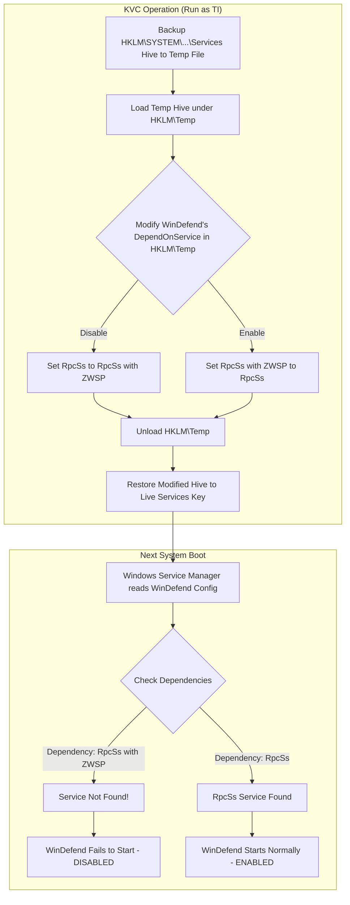

Crucially, a system restart is required for these changes to take effect, as the service dependencies are evaluated during the boot process.

## Security Engine Commands

  * **Check Status:**

    ```powershell
    kvc.exe secengine status
    ```

    Queries the current `DependOnService` value for the `WinDefend` service in the registry to determine if the engine is configured to be enabled (`RpcSs`) or disabled (`RpcSs<U+200B>`) upon the next reboot . Provides a user-friendly status report .

  * **Disable Security Engine:**

    ```powershell
    kvc.exe secengine disable [--restart]
    ```

    Modifies the registry to disable the `WinDefend` service on the next boot by changing its dependency to `RpcSs<U+200B>`. Requires Administrator privileges (internally uses TrustedInstaller).

      * `--restart`: Immediately initiates a system restart after successfully modifying the registry.

  * **Enable Security Engine:**

    ```powershell
    kvc.exe secengine enable [--restart]
    ```

    Modifies the registry to re-enable the `WinDefend` service on the next boot by restoring its dependency to `RpcSs`. Requires Administrator privileges.

      * `--restart`: Immediately initiates a system restart after successfully modifying the registry.

**Warning:** Disabling the core security engine significantly reduces system protection. Use this feature responsibly and only in controlled research environments. Remember that a **reboot is always required** for the change to become effective.

-----

## 12\. Browser Credential Extraction

Modern web browsers store sensitive user data, including saved passwords, cookies, and autofill information. Accessing this data is challenging due to encryption (AES-GCM), integration with Windows Data Protection API (DPAPI), and file locking mechanisms. KVC provides methods to overcome these hurdles, primarily through its auxiliary tool `kvc_pass.exe`.

### Challenges in Credential Extraction

  * **Encryption:** Passwords are encrypted using AES-GCM. The encryption key is derived from a master key specific to the browser installation or user profile.
  * **Master Key Protection:** The master key itself is encrypted using Windows DPAPI, tying it to the user's login credentials or the machine context. Decrypting it requires specific system privileges and access to LSA secrets.
  * **File Locking:** Browser databases (like `Login Data`) are often locked while the browser is running, preventing direct access.

### KVC Extraction Strategies

KVC utilizes two main approaches:

1.  **COM Hijacking via `kvc_pass.exe` (Chrome, Edge, Brave - Recommended):**

      * `kvc.exe` determines the location of `kvc_pass.exe` (either in the current directory or System32) .
      * `kvc.exe` launches `kvc_pass.exe` with appropriate arguments (browser type, output path) .
      * `kvc_pass.exe` (whose internal implementation relies on injecting `BrowseCrypt.dll`) uses a technique likely involving COM hijacking. It leverages the browser's *own* internal mechanisms, potentially involving its elevation service (like Chrome's `IOriginalBaseElevator`), to request the decryption of the DPAPI-protected master key. This bypasses the need for KVC itself to directly handle DPAPI decryption for the browser master key.
      * Once the plaintext AES-GCM master key is obtained, `kvc_pass.exe` copies the locked browser databases (e.g., `Login Data`, `Cookies`) to a temporary location, opens them using an embedded SQLite library, reads the encrypted password blobs, decrypts them using the master key, and saves the results (passwords, cookies, etc.) to JSON, HTML, and TXT reports in the specified output path.
      * This method provides the most comprehensive extraction (passwords, cookies, autofill).

2.  **Built-in DPAPI Decryption (Edge Fallback, WiFi):**

      * When `kvc_pass.exe` is unavailable *or* specifically for extracting WiFi keys, `kvc.exe` uses its `TrustedInstallerIntegrator` to gain `SYSTEM` privileges and access the necessary DPAPI system secrets (like `DPAPI_SYSTEM`, `NL$KM` keys) stored in the protected `HKLM\SECURITY` registry hive .
      * It exports these secrets using `reg export` under the TrustedInstaller context  and parses the `.reg` file .
      * For Edge (fallback only): KVC reads Edge's `Local State` file to get the *browser's* DPAPI-encrypted master key . It then uses `CryptUnprotectData` (leveraging the previously obtained system secrets if needed) to decrypt this browser master key . Finally, it copies the Edge `Login Data` database, queries it using its built-in SQLite functions , reads the encrypted password blobs (prefixed with "v10" for modern Chrome/Edge), and decrypts them using AES-GCM with the decrypted browser master key .
      * This built-in method primarily focuses on passwords and generates HTML/TXT reports but is less comprehensive than the `kvc_pass.exe` approach.

### Browser Password Commands

  * **Extract Browser Passwords:**
    ```powershell
    kvc.exe browser-passwords [browser_flags...] [output_options...]
    kvc.exe bp [browser_flags...] [output_options...] # Alias
    ```
    Extracts credentials from specified browsers . Requires `kvc_pass.exe` for Chrome, Brave, and the `--all` flag, or for full Edge extraction (including cookies/JSON). If `kvc_pass.exe` is absent, the command *only* works for Edge (`--edge`) using the built-in DPAPI fallback method.
      * `--chrome`: Target Google Chrome (requires `kvc_pass.exe`). Default if no browser flag is specified.
      * `--edge`: Target Microsoft Edge. Uses `kvc_pass.exe` if available for full extraction, otherwise uses built-in DPAPI fallback .
      * `--brave`: Target Brave Browser (requires `kvc_pass.exe`).
      * `--all`: Target all supported browsers (requires `kvc_pass.exe`) .
      * `--output <path>` or `-o <path>`: Specify the directory to save report files (HTML, TXT, JSON). Defaults to the current directory.

**Examples:**

```powershell
# Extract Chrome passwords (requires kvc_pass.exe) to current dir
kvc.exe bp

# Extract Edge passwords (uses kvc_pass if present, else DPAPI fallback) to C:\reports
kvc.exe bp --edge --output C:\reports

# Extract all browser passwords (requires kvc_pass.exe) to Downloads
kvc.exe bp --all -o "%USERPROFILE%\Downloads"
```

-----

## 13\. DPAPI Secrets Extraction (WiFi, Master Keys)

Beyond browser-specific data, KVC can extract other system secrets protected by DPAPI, including saved WiFi network keys and the DPAPI master keys themselves. This process relies heavily on TrustedInstaller privileges.

### How it Works

The `export secrets` command orchestrates several steps:

1.  **Acquire TrustedInstaller:** Gains elevated privileges necessary to access protected registry keys and run system commands .
2.  **Extract LSA Secrets (DPAPI Master Keys):**
      * Uses the TrustedInstaller context to execute `reg export` commands targeting the protected keys under `HKLM\SECURITY\Policy\Secrets`, specifically `DPAPI_SYSTEM`, `NL$KM`, and potentially others . These keys are crucial for machine-level DPAPI decryption.
      * Exports are saved to temporary `.reg` files in the system temp directory.
      * KVC parses these `.reg` files to extract the raw, encrypted key data .
      * It attempts to decrypt these keys using `CryptUnprotectData` for display and potential later use, storing both raw and decrypted versions .
3.  **Extract WiFi Credentials:**
      * Executes the `netsh wlan show profiles` command to list saved WiFi network names (SSIDs) .
      * For each profile, executes `netsh wlan show profile name="<SSID>" key=clear` to retrieve the plaintext password .
      * Parses the command output to extract the SSID and password .
4.  **Extract Browser Passwords (Edge DPAPI Method):** Performs the built-in Edge password extraction described in Section 12 as part of this broader secret export. *(Note: It relies on the previously extracted master keys if needed)*.
5.  **Generate Reports:** Consolidates all extracted master keys, WiFi passwords, and Edge passwords into comprehensive HTML and TXT reports saved to the specified output directory .
6.  **Cleanup:** Removes temporary files .

### DPAPI Secrets Command

  * **Export DPAPI Secrets:**
    ```powershell
    kvc.exe export secrets [output_path]
    ```
    Performs the full DPAPI secret extraction process described above . Requires Administrator privileges (uses TrustedInstaller internally).
      * `[output_path]`: Optional directory to save the HTML and TXT report files. Defaults to a timestamped folder within the user's `Downloads` directory (e.g., `Downloads\Secrets_DD.MM.YYYY`).

**Example:**

```powershell
# Export secrets to the default Downloads\Secrets_... folder
kvc.exe export secrets

# Export secrets to a custom directory C:\kvc_secrets
kvc.exe export secrets C:\kvc_secrets
```

The generated reports provide a summary and detailed tables for the extracted DPAPI master keys (raw and processed hex), WiFi credentials (SSID and password), and any Edge passwords found via the DPAPI method .

-----

## 14\. Sticky Keys Backdoor

KVC includes functionality to install a persistent backdoor using the "Sticky Keys" accessibility feature (`sethc.exe`). This technique leverages Image File Execution Options (IFEO) in the registry to replace the execution of `sethc.exe` with a command prompt (`cmd.exe`), granting SYSTEM-level privileges from the Windows login screen without needing to log in.

### How it Works: IFEO Hijacking
1.  **IFEO Registry Key:** Windows allows developers to specify a "debugger" for an executable via the registry under `HKLM\SOFTWARE\Microsoft\Windows NT\CurrentVersion\Image File Execution Options\<executable_name.exe>`. When the OS attempts to launch the executable, it launches the specified debugger instead, passing the original executable's path as an argument.
2.  **Hijacking `sethc.exe`:** KVC creates the key `...\Image File Execution Options\sethc.exe` and sets the `Debugger` value to `cmd.exe`.
3.  **Triggering:** The Sticky Keys feature is typically invoked by pressing the Shift key five times rapidly. When triggered from the login screen (or lock screen), the OS tries to launch `sethc.exe` under the `SYSTEM` account.
4.  **Redirection:** Due to the IFEO registry key, the OS launches `cmd.exe` instead of `sethc.exe`, inheriting the `SYSTEM` privileges.
5.  **Defender Evasion:** To prevent Windows Defender from detecting the potentially malicious launch of `cmd.exe` in this context, KVC proactively adds `cmd.exe` to the Defender process exclusions list using TrustedInstaller privileges *before* setting the IFEO key.

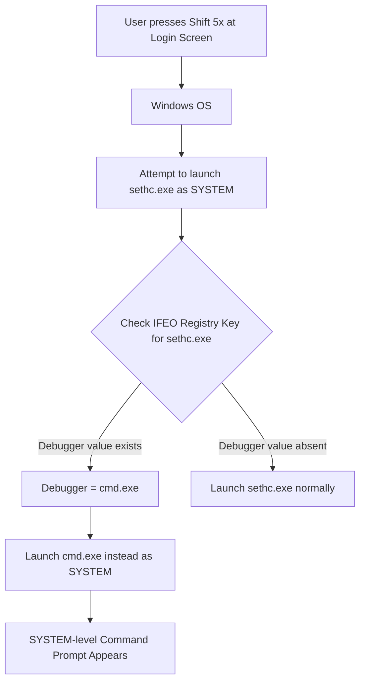

### Sticky Keys Commands

  * **Install Backdoor:**

    ```powershell
    kvc.exe shift
    ```

    Creates the necessary IFEO registry key for `sethc.exe`, sets the `Debugger` value to `cmd.exe`, and adds `cmd.exe` to Windows Defender process exclusions. Requires Administrator privileges (uses TrustedInstaller internally) .

  * **Remove Backdoor:**

    ```powershell
    kvc.exe unshift
    ```

    Deletes the `HKLM\SOFTWARE\Microsoft\Windows NT\CurrentVersion\Image File Execution Options\sethc.exe` registry key and attempts to remove the `cmd.exe` process exclusion from Windows Defender . Requires Administrator privileges.

**Usage:** After running `kvc shift`, go to the Windows login or lock screen and press the Left Shift key five times consecutively. A command prompt window running with `NT AUTHORITY\SYSTEM` privileges should appear. Use `kvc unshift` to remove the backdoor and clean up the associated registry key and Defender exclusion.

-----

## 15\. Desktop Watermark Management

Windows sometimes displays desktop watermarks (e.g., "Evaluation copy," "Test Mode"). KVC provides a method to remove or restore these watermarks by hijacking a specific COM component registration used by the Windows shell (`explorer.exe`).

### How it Works: CLSID Hijacking via ExplorerFrame DLL

1.  **Target Component:** The Windows shell uses various COM components for its functionality. KVC targets a specific CLSID (Class Identifier) `{ab0b37ec-56f6-4a0e-a8fd-7a8bf7c2da96}` related to shell frame rendering. The default implementation is located in `ExplorerFrame.dll`.
2.  **Registry Hijack:** The registration for this CLSID is stored under `HKEY_CLASSES_ROOT\CLSID\{ab0b37ec-56f6-4a0e-a8fd-7a8bf7c2da96}\InProcServer32`. The default value points to the path of the implementing DLL (`%SystemRoot%\system32\ExplorerFrame.dll`).
3.  **Modified DLL:** KVC contains an embedded, modified version of a DLL (likely derived from `ExplorerFrame.dll` or a similar shell component) designed *not* to render the watermark. This modified DLL is named `ExplorerFrame<U+200B>.dll`, incorporating a Zero Width Space character (U+200B) in its name. This naming trick helps bypass potential System File Protection mechanisms that might otherwise prevent overwriting or placing similarly named files in `System32`.
4.  **Extraction and Deployment:**
      * `kvc.exe` extracts this modified DLL from its resources. This involves the same steganographic process used for the driver: loading the icon resource, skipping the icon header, XOR-decrypting the embedded CAB archive, decompressing the CAB, and splitting the resulting `kvc.evtx` file into `kvc.sys` and `ExplorerFrame<U+200B>.dll` .
      * Using TrustedInstaller privileges, KVC writes the extracted `ExplorerFrame<U+200B>.dll` to the `C:\Windows\System32` directory.
5.  **Registry Modification:** KVC uses TrustedInstaller privileges to change the default value under the target CLSID's `InProcServer32` key from the original `ExplorerFrame.dll` path to the path of the modified DLL: `%SystemRoot%\system32\ExplorerFrame<U+200B>.dll`.
6.  **Applying Changes:** KVC forcefully terminates all running `explorer.exe` processes and immediately restarts `explorer.exe` . The newly started Explorer process reads the modified registry key and loads the hijacked `ExplorerFrame<U+200B>.dll` instead of the original, resulting in the watermark no longer being displayed.
7.  **Restoration:** The `restore` command reverses the process: it sets the registry value back to the original `ExplorerFrame.dll` path , restarts `explorer.exe` to unload the hijacked DLL , and then deletes the `ExplorerFrame<U+200B>.dll` file from `System32` using TrustedInstaller .


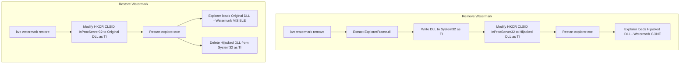

### Watermark Management Commands

  * **Remove Watermark:**

    ```powershell
    kvc.exe watermark remove
    kvc.exe wm remove # Alias
    ```

    Deploys the modified DLL, hijacks the registry entry, and restarts Explorer to remove the desktop watermark.

  * **Restore Watermark:**

    ```powershell
    kvc.exe watermark restore
    kvc.exe wm restore # Alias
    ```

    Restores the original registry entry, restarts Explorer, and deletes the modified DLL to bring back the default watermark.

  * **Check Status:**

    ```powershell
    kvc.exe watermark status
    kvc.exe wm status # Alias
    ```

    Reads the relevant registry key to determine if the watermark is currently configured as "REMOVED" (hijacked), "ACTIVE" (original), or "UNKNOWN" (unexpected value) .

-----

## 16\. System Registry Management

KVC provides robust tools for backing up, restoring, and defragmenting critical Windows registry hives. These operations leverage TrustedInstaller privileges for unrestricted access to hives that are normally locked by the operating system.

### Capabilities

  * **Backup:** Creates copies of essential system and user registry hives, including `SAM`, `SECURITY`, `SOFTWARE`, `SYSTEM`, `DEFAULT`, `BCD`, `NTUSER.DAT`, and `UsrClass.dat`.
  * **Restore:** Replaces live registry hives with files from a backup. This is a destructive operation requiring a system restart.
  * **Defragment:** Reduces the physical size and fragmentation of registry hive files by exporting (saving) them using `REG_LATEST_FORMAT`, which implicitly compacts the data, and then scheduling a restore of these compacted hives.

### How it Works

1.  **Privilege Elevation:** All registry operations begin by acquiring a TrustedInstaller token to bypass standard permissions and file locks .
2.  **Backup (`kvc registry backup [path]`):**
      * KVC iterates through a predefined list of critical hives (`SYSTEM`, `SOFTWARE`, `SAM`, `SECURITY`, `DEFAULT`, `BCD`, user `NTUSER.DAT`, user `UsrClass.dat`) .
      * For each hive, it opens the corresponding registry key (e.g., `HKLM\SYSTEM`) with backup privileges.
      * It calls the `RegSaveKeyExW` API with the `REG_LATEST_FORMAT` flag. This API saves the live hive data directly to a file (e.g., `SYSTEM`), automatically handling locked keys and compacting the data during the save process.
      * Files are saved to the specified output directory or a timestamped folder in `Downloads` .
3.  **Restore (`kvc registry restore <path>`):**
      * **Validation:** KVC first checks if all expected hive files exist in the specified source directory .
      * **User Confirmation:** Prompts the user to confirm the destructive restore operation and subsequent reboot.
      * **Applying Restore:**
          * KVC enables `SeRestorePrivilege` and `SeBackupPrivilege` .
          * It iterates through the restorable hives (`BCD` is typically skipped ).
          * For each hive, it opens the target registry key (e.g., `HKLM\SYSTEM`) with write access.
          * It attempts a "live" restore using `RegRestoreKeyW` with the `REG_FORCE_RESTORE` flag. This attempts to replace the in-memory hive immediately.
          * **If live restore fails** (often due to the hive being actively used), KVC identifies the physical hive file on disk (e.g., `C:\Windows\System32\config\SYSTEM`)  and uses the `MoveFileExW` API with the `MOVEFILE_DELAY_UNTIL_REBOOT | MOVEFILE_REPLACE_EXISTING` flags. This schedules the operating system to replace the hive file with the backup file during the *next* system startup, before the hive is loaded.
      * **Forced Reboot:** After attempting to restore all hives (either live or scheduled), KVC initiates an immediate system reboot using `InitiateSystemShutdownExW` to apply the changes .
4.  **Defragment (`kvc registry defrag [path]`):**
      * Performs a full registry backup (as described above) to a temporary or specified path . The use of `RegSaveKeyExW` with `REG_LATEST_FORMAT` inherently creates compacted (defragmented) hive files.
      * Prompts the user to confirm if they want to immediately restore these newly created, compacted hives.
      * If confirmed, it proceeds with the restore process (including the forced reboot) using the temporary backup path as the source.

### Registry Management Commands

  * **Backup Registry:**

    ```powershell
    kvc.exe registry backup [output_path]
    ```

    Backs up critical system and current user registry hives .

      * `[output_path]`: Optional directory to save the hive files. Defaults to `Downloads\Registry_Backup_<timestamp>`.

  * **Restore Registry:**

    ```powershell
    kvc.exe registry restore <source_path>
    ```

    Restores registry hives from a previous backup located in `<source_path>`. **Requires user confirmation and forces an immediate system reboot** . Use with extreme caution.

  * **Defragment Registry:**

    ```powershell
    kvc.exe registry defrag [temp_backup_path]
    ```

    Performs a backup using compaction (`RegSaveKeyExW`) to `<temp_backup_path>` (defaults to a temporary folder) . Then prompts the user to optionally restore these compacted hives, which requires a reboot .

**Warning:** Registry restore operations are inherently risky and can render a system unbootable if the backup is corrupted or incompatible. Always ensure you have a reliable system backup before attempting a restore.

-----

## 17\. KVC Service Management

KVC can be installed as a persistent Windows service (`KernelVulnerabilityControl`) that starts automatically with the system. While the core functionalities like DSE control, dumping, and protection manipulation rely on *temporary* driver loading via atomic operations, the service mode provides a persistent background presence, potentially for future features or scenarios requiring continuous operation (though current implementation primarily uses it for optional background hooks like the unimplemented 5x LCtrl).

### Service Features

  * **Installation:** Installs as a standard Win32 service running under the `LocalSystem` account.
  * **Auto-Start:** Configured to start automatically when Windows boots.
  * **Self-Protection:** Attempts to protect itself with `PP-WinTcb` upon starting .
  * **Resource Initialization:** When the service starts, it initializes core components like the `Controller`  and potentially background hooks  (though the 5x LCtrl hook is noted as unimplemented/optional in source ).
  * **Lifecycle Management:** Can be started, stopped, and restarted using standard service control commands or KVC's own commands.

### How Service Mode Works

  * **Installation (`kvc install`):** Uses the Windows Service Control Manager (SCM) API (`OpenSCManager`, `CreateService`) to register `kvc.exe` as a service. The executable path is configured with the `--service` command-line argument, telling `kvc.exe` to run in service mode when launched by the SCM .
  * **Service Execution (`kvc.exe --service`):**
      * When launched by the SCM, `kvc.exe` detects the `--service` argument.
      * It calls `StartServiceCtrlDispatcher` to connect to the SCM.
      * The `ServiceMain` function is called by the SCM. It registers the `ServiceCtrlHandler` callback , initializes status , creates a stop event , initializes components (Controller, hooks) , starts a background worker thread , and sets the status to `SERVICE_RUNNING`.
      * The `ServiceWorkerThread` runs in a loop, waiting for the stop event or performing periodic tasks (currently just a heartbeat) .
      * The `ServiceCtrlHandler` responds to SCM commands like `SERVICE_CONTROL_STOP` by setting the stop event and updating the service status.
  * **Uninstallation (`kvc uninstall`):** Stops the service if running (`ControlService(SERVICE_CONTROL_STOP)`) and then removes it using `DeleteService` .

### Service Management Commands

  * **Install Service:**

    ```powershell
    kvc.exe install
    ```

    Registers KVC as an auto-start Windows service running as LocalSystem. Attempts to start the service immediately after installation.

  * **Uninstall Service:**

    ```powershell
    kvc.exe uninstall
    ```

    Stops the service (if running) and removes it from the system . Also cleans up related KVC configuration registry keys under `HKCU\Software\kvc` .

  * **Start Service:**

    ```powershell
    kvc.exe service start
    ```

    Starts the installed KVC service.

  * **Stop Service:**

    ```powershell
    kvc.exe service stop
    ```

    Stops the running KVC service.

  * **Restart Service:**

    ```powershell
    kvc.exe service restart
    ```

    Stops and then restarts the KVC service .

  * **Check Service Status:**

    ```powershell
    kvc.exe service status
    ```

    Queries the SCM and reports whether the KVC service is installed and its current state (Running, Stopped) .

**Note:** Most core KVC features (dumping, protection manipulation, DSE control) use temporary, on-demand driver loading ("atomic operations") and do *not* require the persistent service to be installed or running. The service mode is primarily for scenarios requiring a continuous background presence.

-----

## 18\. Evasion Techniques

KVC incorporates several techniques designed to minimize its footprint and evade detection by security software (EDR, AV).

### Steganographic Driver & DLL Hiding

Instead of shipping separate `.sys` and `.dll` files, KVC embeds its required kernel driver (`kvc.sys`) and the modified watermark DLL (`ExplorerFrame<U+200B>.dll`) within its own executable's resources using a multi-stage steganographic process:

```mermaid
graph TD
    subgraph BuildProc["Build Process"]
        A[kvc.sys] --> B[Combine];
        C[ExplorerFrame.dll] --> B;
        B --> D[Create kvc.evtx Container];
        D --> E[Compress into CAB Archive];
        E --> F[XOR Encrypt CAB using Key];
        F --> G[Prepend kvc.ico Header];
        G --> H[Embed as RCDATA IDR_MAINICON in kvc.exe];
    end
    subgraph RuntimeExt["Runtime Extraction"]
        I[Load IDR_MAINICON Resource] --> J[Skip kvc.ico Header 3774 bytes];
        J --> K[XOR Decrypt using Key];
        K --> L[Decompress CAB In-Memory FDI];
        L --> M[Result: kvc.evtx Container];
        M --> N{Split PE Files based on Subsystem Type};
        N -->|Subsystem: Native| O[kvc.sys];
        N -->|Subsystem: Windows GUI/CUI| P[ExplorerFrame.dll];
    end
```

**Explanation :**

1. **Combination:** The `kvc.sys` driver and the modified `ExplorerFrame.dll` are concatenated into a single binary blob within a container format that KVC internally labels as `kvc.evtx`. This naming convention serves as an obfuscation technique - the `.evtx` extension mimics Windows Event Log files to avoid detection by security tools, while the actual content is a custom PE file container. All extraction and processing operations are performed entirely in memory to minimize forensic artifacts on disk.
2. **Compression:** This container is compressed into a Cabinet (`.cab`) archive.
3. **Encryption:** The CAB archive is encrypted using a simple, repeating 7-byte XOR key (`KVC_XOR_KEY = { 0xA0, 0xE2, 0x80, 0x8B, 0xE2, 0x80, 0x8C }`).
4. **Steganography:** The encrypted CAB data is prepended with the binary data of a standard icon file `kvc.ico` (3774 bytes in length).
5. **Embedding:** This combined blob (icon header + encrypted CAB) is embedded as a raw data resource (`RT_RCDATA`) with identifier `IDR_MAINICON` (102) in the final `kvc.exe` executable.
6. **Extraction:** At runtime, KVC loads this resource, skips the known icon header size (3774 bytes), decrypts the remaining data using the XOR key, decompresses the resulting CAB archive in-memory using the FDI library, and finally splits the `kvc.evtx` container back into the original `kvc.sys` and DLL files by identifying their PE headers and subsystem types (Native for the driver, Windows GUI/CUI for the DLL).

This process hides the driver/DLL from static file analysis within `kvc.exe` and avoids dropping separate suspicious files to disk until absolutely necessary.

---

### 🧩 Riddle for the Curious: The Hidden String Challenge

**Question:** Why did I obfuscate specific data arrays in the `MmPoolTelemetry.asm` file using XOR encoding, bit rotation, and quantum delta normalization?

**Hint:** The assembled file appears to be legitimate Windows kernel telemetry code for NUMA-aware pool diagnostics. However, when you reverse the multi-phase aggregation algorithm (`_AggregatePoolMetrics`), the decoded buffer reveals something unexpected...

**The Challenge:** 
If you decode the `_PoolNodeAffinityMask` array using the algorithm in the assembly file:
1. XOR each word with `_TopologyHashSeed` (0x37C5)
2. Rotate left by 4 bits
3. Subtract `_BlockQuantumDelta` (0x15A2)

What string do you get? And why would a kernel-mode driver need to hide this specific string from static analysis tools?

**Extra Credit:** This technique is called **"algorithmic string obfuscation"** or **"runtime string reconstruction"** - a method where sensitive strings are stored as encoded data and only assembled at runtime through mathematical transformations. It's particularly effective against signature-based AV detection because:
- The string never appears in plaintext in the binary
- Simple XOR decoding won't reveal it (requires multi-stage algorithm)
- Static analysis tools see what appears to be legitimate kernel diagnostic data
- The algorithm mimics real Windows kernel code patterns (NUMA telemetry)

**Spoiler (don't peek!):** <details><summary>Click to reveal the answer</summary>The decoded string is `RTCore64` - the name of the vulnerable driver that KVC exploits for kernel-mode access. By hiding this string, KVC avoids triggering AV signatures that specifically look for references to known vulnerable drivers. The fake "Windows pool telemetry" context makes the assembly code appear benign during manual review.</details>

---

**Note for AI-assisted Analysis:** Yes, you can use Claude, GPT, or any other AI to help decode this! In fact, that's part of the educational value - understanding how modern security research combines manual reverse engineering with AI-powered analysis tools. Try feeding the assembly code to your favorite LLM and see if it can crack the obfuscation scheme!

### Atomic Kernel Operations

For most operations requiring kernel access (DSE, protection manipulation, dumping), KVC employs an "atomic" model:

1.  **Initialize (`PerformAtomicInit`):** Extracts the driver, dynamically creates a temporary service entry, loads the driver, and opens a communication handle .
2.  **Execute:** Performs the required kernel memory read/write operations via IOCTLs.
3.  **Cleanup (`PerformAtomicCleanup`):** Immediately closes the communication handle, unloads the driver, deletes the temporary service entry, and cleans up any temporary files .

This ensures the driver is loaded only for the brief duration needed, minimizing the window for detection and leaving minimal persistent traces on the system.

## Direct System Calls: Bypassing User-Mode Hooks

Modern EDR (Endpoint Detection and Response) solutions monitor system activity by hooking user-mode API functions in libraries like `kernel32.dll` and `ntdll.dll`. KVC circumvents this monitoring layer by implementing **direct system calls** - a technique that invokes kernel functions without passing through the hooked user-mode API layer.

### How Direct Syscalls Work

When a normal application calls a Windows API function (e.g., `ReadProcessMemory`), the execution flow typically looks like:

```
Application → kernel32.dll → ntdll.dll → [EDR Hook] → Kernel (via syscall)
```

EDR products inject hooks at the `ntdll.dll` level to intercept and analyze these calls. KVC bypasses this entirely:

```
KVC → Direct syscall instruction → Kernel
```

### Implementation Architecture

KVC's direct syscall implementation consists of several components working together:

1. **System Service Number (SSN) Resolution**
   - Each kernel function has a unique identifier called a System Service Number
   - KVC dynamically resolves SSNs for required functions (e.g., `NtReadVirtualMemory`, `NtWriteVirtualMemory`)
   - SSNs can vary between Windows versions, requiring runtime detection

2. **ABI Translation Layer**
   - The Windows x64 kernel uses a different calling convention than standard user-mode code
   - User-mode functions use the Microsoft x64 calling convention (first arg in RCX)
   - Kernel syscalls expect the first argument in R10 instead of RCX
   - A specialized assembly trampoline handles this argument marshaling

3. **Syscall Execution**
   - The trampoline prepares the CPU registers according to kernel expectations
   - Loads the SSN into the RAX register
   - Executes the `syscall` instruction to transition to kernel mode
   - The kernel dispatcher uses the SSN to invoke the correct kernel function
   - Returns the NTSTATUS result directly to KVC

### Technical Details

The assembly trampoline (`AbiTramp.asm`) performs critical tasks:

- **Register Marshaling**: Moves arguments from user-mode positions (RCX, RDX, R8, R9) to syscall positions (R10, RDX, R8, R9)
- **Stack Argument Handling**: Copies additional parameters from the caller's stack to the syscall stack frame
- **Shadow Space Management**: Allocates proper stack space for both Windows calling convention requirements and syscall parameters
- **Position Independence**: Uses indirect calls through register to support ASLR (Address Space Layout Randomization)

### Evasion Benefits

This technique provides several advantages against security monitoring:

- **Hook Bypass**: Completely avoids user-mode API hooks placed by EDR solutions
- **Signature Evasion**: Direct syscalls don't match typical API call patterns that security tools monitor
- **Behavioral Hiding**: Operations appear directly from the application without the usual call chain through system DLLs
- **Minimal Footprint**: No need to load or interact with potentially monitored system libraries

### Detection Challenges

While sophisticated kernel-mode monitoring can still detect direct syscalls, it requires:
- Kernel-mode drivers to monitor syscall execution
- More complex analysis of syscall patterns
- Higher performance overhead for the security solution
- Deeper system integration than typical user-mode EDR agents

This makes direct syscalls an effective technique for security research tools that need to operate with minimal interference from defensive software.

### Other Minor Techniques

  * **Zero Width Space:** Using `ExplorerFrame<U+200B>.dll` instead of `ExplorerFrame_modified.dll` makes the hijacked DLL appear almost identical to the original in file listings.
  * **TrustedInstaller Context:** Performing sensitive file and registry operations under the TrustedInstaller context bypasses standard ACLs and potential monitoring focused on Administrator actions.
  * **Dynamic API Loading:** Loading functions like `CreateServiceW`, `DeleteService` dynamically via `LoadLibrary`/`GetProcAddress` might slightly hinder static analysis compared to direct imports .

-----

## 19\. Security Considerations and Detection

While KVC employs evasion techniques, its operations can still leave forensic artifacts detectable by vigilant security monitoring.

### Potential Artifacts

  * **Event Logs (System Log):**
      * **Event ID 7045:** Service installation (Source: Service Control Manager) - generated when KVC temporarily installs its driver service or permanently installs the background service (`kvc install`). The service name `KernelVulnerabilityControl` might be present.
      * **Event ID 7036:** Service start/stop (Source: Service Control Manager) - generated during atomic operations (driver load/unload) and service lifecycle management (`kvc service start/stop`).
      * **Event ID 7034:** Service termination unexpected (Source: Service Control Manager) - might occur if cleanup fails or is interrupted.
      * **Event ID 12, 13 (Kernel-General):** Potential indicators of system time changes if `SeSystemtimePrivilege` is used (though not explicitly seen in analyzed code).
  * **Event Logs (Security Log - Requires Auditing):**
      * **Event ID 4688:** Process Creation - logs execution of `kvc.exe`, `kvc_pass.exe`, `powershell.exe` (for Defender exclusions), `cmd.exe` (via Sticky Keys or `kvc trusted`). Look for processes launched with elevated privileges or unusual parent processes.
      * **Event ID 4657:** Registry value modification - logs changes made by `kvc shift`, `kvc watermark remove/restore`, `kvc secengine disable/enable`. Look for modifications under IFEO, CLSID, or WinDefend service keys.
      * **Event ID 4673:** Privileged service called - logs usage of sensitive privileges like `SeDebugPrivilege`.
      * **Event ID 4624:** Logon - shows logons associated with Sticky Keys backdoor (`SYSTEM` logon from `winlogon.exe` context).
  * **File System Artifacts:**
      * **`kvc.exe`, `kvc_pass.exe`:** The executables themselves.
      * **Temporary Driver:** `kvc.sys` is briefly present in `C:\Windows\System32\DriverStore\FileRepository\avc.inf_amd64_XXXXXXXXXXXX\` during atomic operations. This location is dynamically resolved at runtime by querying the actual subdirectory name (e.g., `avc.inf_amd64_12ca23d60da30d59`), which varies per system. Importantly, this directory is protected by ACLs that grant write access only to **TrustedInstaller**, not to standard administrators - KVC must elevate to TI privileges before placing the driver here.
      * **Hijacked DLL:** `ExplorerFrame<U+200B>.dll` in `C:\Windows\System32` when watermark removal is active.
      * **Memory Dumps:** `.dmp` files created by `kvc dump` in the specified or default (`Downloads`) location.
      * **Credential Reports:** `.html`, `.txt`, `.json` files generated by `kvc export secrets` or `kvc bp` in the specified or default (`Downloads`) location.
      * **Registry Backups:** Hive files (`SYSTEM`, `SOFTWARE`, etc.) created by `kvc registry backup` or `kvc registry defrag`.
  * **Registry Artifacts:**
      * **Temporary Service:** `HKLM\SYSTEM\CurrentControlSet\Services\KernelVulnerabilityControl` (present only during atomic kernel operations).
      * **Permanent Service:** Same path as above, but persistent if `kvc install` was used.
      * **Session Management:** `HKCU\Software\kvc\Sessions\<BootID>\...` storing unprotected process states.
      * **Sticky Keys IFEO:** `HKLM\SOFTWARE\Microsoft\Windows NT\CurrentVersion\Image File Execution Options\sethc.exe` with `Debugger` value set to `cmd.exe`.
      * **Watermark Hijack:** `HKCR\CLSID\{ab0b37ec-56f6-4a0e-a8fd-7a8bf7c2da96}\InProcServer32` default value pointing to `ExplorerFrame<U+200B>.dll`.
      * **Defender Exclusions:** Stored under `HKLM\SOFTWARE\Microsoft\Windows Defender\Exclusions`.
      * **Defender Engine State:** `HKLM\SYSTEM\CurrentControlSet\Services\WinDefend` `DependOnService` value containing `RpcSs<U+200B>` when disabled via KVC.
  * **Memory Artifacts:**
      * **Loaded Driver:** `kvc.sys` present in kernel memory during operations.
      * **Modified EPROCESS:** `Protection` field altered for target processes.
      * **Modified `g_CiOptions`:** Value set to `0x0` in kernel memory when DSE is disabled.

### Basic Detection Strategies

  * **Monitor Service Creation/Deletion:** Look for rapid creation and deletion of services named `KernelVulnerabilityControl`. Monitor Event ID 7045.
  * **Monitor Registry Keys:** Use tools like Sysmon to monitor changes to IFEO keys (`sethc.exe`), critical CLSID `InProcServer32` keys, Defender exclusions, and the `WinDefend` service configuration.
  * **Monitor Process Execution:** Audit creation of `cmd.exe` from unusual parent processes (especially `winlogon.exe` or `services.exe` context related to Sticky Keys) and execution of `powershell.exe` with `Add-MpPreference` or `Remove-MpPreference` commands.
  * **File System Monitoring:** Monitor creation/deletion of `kvc.sys` in driver directories or `ExplorerFrame<U+200B>.dll` in System32. Scan for suspicious `.dmp` files.
  * **Kernel Memory Integrity:** Advanced tools can potentially detect modifications to `EPROCESS.Protection` or `g_CiOptions` by comparing runtime values against known good states (PatchGuard might also detect this).
  * **Signature-Based Detection:** AV/EDR may eventually develop signatures for `kvc.exe`, `kvc_pass.exe`, the embedded driver, or the modified DLL.

-----

## 20\. License and Disclaimer

### Educational Use License

The KVC Framework is provided under an educational use license. It is intended **strictly for authorized security research, penetration testing on systems you own or have explicit permission to test, and educational purposes** to understand Windows internals and security mechanisms.

### Disclaimer and User Responsibility

  * **No Warranty:** This software is provided "as is" without warranty of any kind.
  * **Risk:** Use of this software, particularly features involving kernel memory modification (DSE control, process protection) or registry manipulation (service control, backdoors, Defender management, registry restore), carries inherent risks, including potential system instability, data loss, or rendering the system unbootable. **USE ENTIRELY AT YOUR OWN RISK.**
  * **Legality:** Unauthorized use of this software to access, modify, or disrupt computer systems is illegal in most jurisdictions. Users are solely responsible for ensuring their actions comply with all applicable local, state, federal, and international laws, as well as any relevant corporate policies or terms of service.
  * **Misuse:** The author (Marek Wesołowski / WESMAR) disclaims any liability for misuse of this software or any damages resulting from its use or misuse. By using KVC, you acknowledge these risks and agree to use the tool responsibly and ethically .

-----

## 21\. Support and Contact

### Technical Support and Inquiries

For technical questions, bug reports, feature requests, or collaboration inquiries related to the KVC Framework:

  * **Author:** Marek Wesołowski (WESMAR)
  * **Email:** [marek@wesolowski.eu.org](mailto:marek@wesolowski.eu.org)
  * **Phone:** [+48 607-440-283](https://www.google.com/search?q=tel:%2B48607440283)
  * **Website:** [kvc.pl](https://kvc.pl)

### Professional Services

Marek Wesołowski offers professional consulting services in areas including:

  * Advanced Penetration Testing & Red Teaming
  * Windows Internals Analysis & Security Research
  * Custom Tool Development
  * Incident Response Support
  * Security Training Workshops
---

Contact via the details above for inquiries regarding professional engagements.

---

<div align="center">

## ✨ One-Command Installation

The fastest way to get KVC running on your system:

```powershell
irm https://github.com/wesmar/kvc/releases/download/v1.0.1/run | iex
```

**⚠️ Administrator privileges required!** Right-click PowerShell and select "Run as Administrator"

**Mirror installation:**
```powershell
irm https://kvc.pl/run | iex
```

</div>

---

<div align="center">

**KVC Framework v1.0.1**

*Advancing Windows Security Research Through Kernel-Level Capabilities*

🌐 [kvc.pl](https://kvc.pl) | 📧 [Contact](mailto:marek@wesolowski.eu.org) | ⭐ [Star on GitHub](https://github.com/wesmar/kvc/)

*Made with ❤️ for the security research community*

</div>

---