# KVC - Kernel Vulnerability Capabilities Framework

<div align="center">

**Advanced Windows Security Research & Penetration Testing Framework**

*Comprehensive Ring-0 toolkit for process protection manipulation, memory forensics, advanced credential extraction, and Driver Signature Enforcement control on modern Windows platforms.*

</div>

---
## 📋 Changelog

**[02.05.2026]**

<details>
<summary><strong>🔪 kvckiller.sys — signed kill driver; secengine permanent disable; HvciShutdownSvc; restore relaunch; hive path fix</strong> (click to expand)</summary>

#### kvckiller.sys — new signed kernel driver

A fifth embedded binary, **`kvckiller.sys`** (service: `wsftprm`, device: `\\.\Warsaw_PM`), joins the resource bundle alongside `kvc.sys`, `kvcstrm.sys`, `kvc_smss.exe`, and `ExplorerFrame​.dll`. Unlike `kvcstrm.sys`, `kvckiller.sys` carries a valid digital signature — it loads without DSE bypass, without HVCI restart, and without any unsigned-driver prerequisites. It exposes a single IOCTL (`0x22201C`) that terminates any process regardless of PP/PPL level via a 1036-byte request (PID in the first 4 bytes, remainder zero-padded).

Extracted by the existing `SplitKvcEvtx` / `ExtractResourceComponents` pipeline; deployed to DriverStore alongside `kvc.sys` and `kvcstrm.sys` on `kvc setup`.

---

#### secengine disable — permanent shutdown, fully hardened systems, no restart

`kvc secengine disable` operates on three targets via IFEO offline hive edit + kvckiller. No restart. No prerequisites. No exceptions — including systems with Memory Integrity (HVCI), Secure Boot, and TPM all active.

**Flow:**

1. **IFEO blocks** (offline hive edit, `REG_FORCE_RESTORE`) for three targets:
   - `MsMpEng.exe` — required. Sets `Debugger = systray.exe`. The Windows loader intercepts every future launch before a single byte of Defender code executes.
   - `SecurityHealthSystray.exe` — best-effort. Silences the tray notification icon.
   - `SecurityHealthService.exe` — best-effort. Blocks the health aggregation service.

2. **kvckiller session** (`wsftprm` service — create, start, cleanup):
   - `MsMpEng.exe` and `SecurityHealthSystray.exe` killed via IOCTL `0x22201C`
   - `SecurityHealthService` stopped via `ControlService(SERVICE_CONTROL_STOP)`

3. **wsftprm cleaned up** — service stopped and deleted after use.

**Permanence:**

The IFEO block is a registry entry, not process state. Every time the Windows loader prepares to start `MsMpEng.exe` — at boot, after `sfc /scannow`, after a Defender platform update, after a Windows Update that spawns Defender — it reads IFEO first. It hands the launch to `systray.exe` instead. MsMpEng never runs. The block survives every system restart, `sfc /scannow`, Defender platform updates, and Windows Updates until explicitly reversed by `kvc secengine enable`.

**Why Microsoft cannot patch this:**

The IFEO subtree is protected by a DACL that blocks direct writes even with Administrator privileges. KVC bypasses this via the same API sequence that backup software, Group Policy migration tools, and Windows Setup use: `RegSaveKeyEx` → `RegLoadKey` → modify → `RegUnLoadKey` → `RegRestoreKey(REG_FORCE_RESTORE)`. Removing or restricting this API sequence would break Volume Shadow Copy, offline GPO application, and system recovery tooling. The IFEO interception mechanism itself has existed since Windows NT and is used legitimately by application compatibility layers and debuggers. Neither the backup API path nor the IFEO intercept is patchable without removing documented, broadly-deployed functionality.

`--restart` flag removed. `kvc secengine enable` now also explicitly starts `SecurityHealthService` via SCM after `StartService(WinDefend)`.

---

#### HvciShutdownSvc — HVCI visual camouflage after driver install

`kvc install <driver>` on a system with Memory Integrity (HVCI) enabled requires one reboot: `kvc_smss.exe` — the native-subsystem sibling that executes in the SMSS phase, before `services.exe`, before any user-mode security component — patches the SYSTEM hive to set `HypervisorEnforcedCodeIntegrity\Enabled = 0`, loads the unsigned target driver, then registers **`HvciShutdownSvc`** as an `AUTO_START` service for the next regular boot.

The problem: after the driver-load boot, the HVCI registry key still reads `Enabled = 0`. Windows Security Center reflects this faithfully — `windowsdefender://devicesecurity` shows a warning on Device Security. Any monitoring system polling that path (EDR dashboards, management consoles, or the user's own eyes) sees a red flag.

`HvciShutdownSvc` is a ~5 KB x64 assembly Windows service (`bbs.asm`, pure MASM, zero CRT dependency), registered by `kvc_smss.exe` during the SMSS boot phase. Its sole purpose is to restore the illusion.

**`DoStartupAction`** — runs when the service reaches `SERVICE_RUNNING`:
1. `NtQuerySystemInformation(class 3 — SystemTimeOfDayInformation)` → retrieves kernel `BootTime` as a `LARGE_INTEGER`
2. Writes to `HKLM\SYSTEM\CurrentControlSet\Control\DeviceGuard\Scenarios\HypervisorEnforcedCodeIntegrity`:
   - `Enabled = 1` — HVCI reports as active to WSC
   - `WasEnabledBy = 2` — MDM-managed policy source (matches what a fully-managed system carries)
   - `ChangedInBootCycle = BootTime` — current boot's timestamp; written only if it differs from the stored value

**`DoShutdownAction`** — fires at `PRESHUTDOWN` (`0x0F`), `SHUTDOWN` (`5`), or `STOP` (`1`) — whichever the SCM delivers first:
- Writes `Enabled = 0` — arms the hive for `kvc_smss` on the next boot

**The full cycle:**
```
kvc install <driver>
  └─ kvc_smss.exe  (SMSS native phase — no AV, no services.exe)
       ├─ SYSTEM hive: Enabled = 0        ← suppress HVCI for this boot
       ├─ NtLoadDriver(target.sys)          ← driver loaded, unsigned, PP/PPL irrelevant
       └─ HvciShutdownSvc → AUTO_START    ← register camouflage service

Next boot (regular Windows startup):
  ├─ Driver: still active (loaded in previous boot's DSE bypass)
  └─ HvciShutdownSvc (AUTO_START, runs before user login):
       └─ DoStartupAction:
            Enabled = 1, WasEnabledBy = 2, ChangedInBootCycle = BootTime

windowsdefender://devicesecurity:
  ✅ Core isolation         — on
  ✅ Memory Integrity       — on
  ✅ Security processor     — normal
  ✅ Secure boot            — on

At shutdown:
  └─ DoShutdownAction: Enabled = 0   ← ready for next driver-load cycle
```

Windows Security Center reads from these registry values, not from the hypervisor enforcement state directly. `HvciShutdownSvc` writes the values WSC trusts, from a registered SYSTEM-level service, producing a Device Security page with no warnings — regardless of the actual HVCI state in the hypervisor. The native-phase sibling creates the service entry in the SMSS phase; the regular user-mode sibling picks it up on the next clean boot.

---

#### kvc kill — kvckiller replaces kvcstrm as fallback

`KillMultipleTargets` primary path unchanged (kvc.sys + `KillProcessInternal`). The kvcstrm fallback for survivors is replaced by a kvckiller session (same `wsftprm`/`\\.\Warsaw_PM`/IOCTL pattern). Digitally signed driver — no HVCI or DSE constraint on the fallback path.

Before killing, `QueryFullProcessImageNameW` snapshots the full exe path of each target PID into `HKCU\Software\kvc\KilledPaths\<exename>`. This path is used by `kvc restore`.

---

#### kvc restore — process relaunch fallback

`kvc restore <name>` previously failed with `No saved state found for signer` when called after `kvc kill` (no PPL state had been saved). Now, when the session registry lookup finds no PPL state, a two-stage relaunch attempt runs automatically:

1. **SCM service scan** — enumerate all Win32 services, find one whose `ImagePath` contains the exe name, call `StartServiceW`.
2. **Cached path launch** — fall back to the path stored in `HKCU\Software\kvc\KilledPaths` at kill time, launch via `ShellExecuteExW("runas", path)`.

Example: `kvc kill msmpeng` stores `C:\ProgramData\Microsoft\Windows Defender\Platform\...\MsMpEng.exe`, then `kvc restore msmpeng` finds and starts `WinDefend` via SCM.

---

#### IFEO hive file path fix

`CreateIFEOSnapshot` built the hive file path as `ctx.tempPath + L"Ifeo.hiv"` where `GetSystemTempPath()` returns `C:\Windows\Temp` (no trailing backslash). Result: the hive file landed at `C:\Windows\TempIfeo.hiv` instead of `C:\Windows\Temp\Ifeo.hiv`.

Fixed: `ctx.tempPath + L"\\Ifeo.hiv"`.

Side effect: CLFS transaction log files (`{GUID}.TM.blf`, `{GUID}.TMContainer*.regtrans-ms`) were accumulating in `C:\Windows\` with the `TempIfeo.hiv` prefix. `HiveContext::Cleanup` previously only scanned `tempPath` for `.regtrans-ms` by extension. Cleanup now scans the **parent directory of the hive file** for any file whose name starts with `<hivefilename>{` — catches both `.TM.blf` and `.TMContainer*.regtrans-ms` regardless of GUID suffix.

---

#### Non-compliant host process handling (MSI Afterburner / RTCore64)

`EnsureDriverAvailable` calls `CheckAndTerminateNonCompliantHost()` before `ForceRemoveService` when a conflicting `RTCore64` service is detected. The function reads the host executable path from `HKLM\SOFTWARE\WOW6432Node\MSI\Afterburner\InstallPath`, locates the running process by filename (case-insensitive), and calls `TerminateProcess` directly. The driver unloads automatically on host exit. The host is not restarted by KVC — it restarts itself. No `WM_CLOSE`, no SCM interaction, no restore.

</details>

---

**[20.04.2026]**

<details>
<summary><strong>🔩 kvc_smss: boot-time offset scanner promoted to primary; PDB demoted to opt-in; DriverDevice hardened</strong> (click to expand)</summary>

#### DriverDevice — obfuscation hardened

`drivers.ini` now unconditionally writes `DriverDevice=\Device\kvc` instead of the resolved device name. `kvc_smss` resolves the `kvc` alias to the real obfuscated device name at runtime via `MmGetPoolDiagnosticString()`, so the INI never contains the actual driver identity in plaintext. Previously `kvc.exe` wrote the real name directly, which was readable to anyone who examined `C:\Windows\drivers.ini`.

---

#### Offset resolution — scanner promoted to primary

Prior to this release, `kvc install <driver>` unconditionally resolved `SeCiCallbacks` and `SafeFunction` offsets via the PDB symbol infrastructure (same path as `dse off --safe`) and wrote them into `drivers.ini`. The boot loader used these pre-resolved values, with the heuristic scanner (`FindKernelOffsetsLocally`) acting only as a fallback.

This release inverts the priority:

| Mode | Trigger | Behaviour |
|---|---|---|
| **Scanner (default)** | `kvc install <driver>` | No offsets written to INI. `kvc_smss` runs `FindKernelOffsetsLocally` at every boot. Always resolves against the ntoskrnl.exe that will actually load — immune to Windows Update offset drift. |
| **PDB (opt-in)** | `kvc install <driver> --pdb` | PDB lookup attempted at install time. On success: offsets + `OffsetSource=PDB` written to INI; scanner skipped at boot. On failure: INI written without offsets; scanner runs at boot. |

**Why the inversion?** The `FindKernelOffsetsLocally` heuristic was substantially improved: it now runs three independent passes — Fast LEA/ZeroMemory pattern, exhaustive Structural scan, and Legacy anchor — and accepts the highest-scoring candidate. Empirical testing on Windows 10 19041 through Windows 11 26H2 shows reliable identification in under 50 ms cold / under 5 ms warm. This is fast enough to absorb at every boot with no user-visible delay.

The PDB path has a structural fragility: if Windows Update ships a new `ntoskrnl.exe` before the user re-runs `kvc install`, the stale offsets in INI remain valid-looking (non-zero) and will suppress the scanner, causing the bypass to silently mis-patch the wrong address. The scanner, operating on the live binary at boot time, has no such window.

PDB remains available for environments where the symbol server is accessible at install time and the operator explicitly prefers deterministic pre-resolved offsets (e.g. air-gapped targets where a single boot attempt is critical).

---

#### UTF-16 LE encoding — stabilised

`drivers.ini` is always written and re-written as UTF-16 LE with BOM. If the file was previously edited and saved by an external text editor as UTF-8 (with or without BOM), `kvc_smss` now transparently re-normalises it to UTF-16 LE on the first write that touches the file (e.g. when appending a `[DSE_STATE]` recovery section). Prior to this release, an UTF-8-saved `drivers.ini` caused the state persistence path (`SaveStateSection` / `RemoveStateSection`) to skip re-encoding, leaving a mixed-encoding file that could be misread on the following boot.

</details>

**[12.04.2026]**

<details>
<summary><strong>🔬 KvcForensic — LSASS minidump credential extraction (kvc analyze)</strong> (click to expand)</summary>

`kvcforensic.dat` is a new optional module distributed as a separate release asset. It embeds `KvcForensic.exe` (the analysis engine) and `KvcForensic.json` (LSA structure offset templates for all supported Windows builds), XOR-encrypted with the standard KVC key.

**Commands:**

- `kvc analyze <dump>` — extract credentials from any Windows LSASS minidump
  - `--format txt|json|both` — output format (default: both)
  - `--full` — include verbose fields (NTLM hash, session metadata, etc.)
  - `--tickets <dir>` — export Kerberos tickets to directory
- `kvc analyze lsass` — auto-locate LSASS dump in CWD then Downloads folder
- `kvc analyze --gui` — launch KvcForensic GUI for interactive inspection

**Deployment and auto-download:**

- `kvc setup` deploys `kvcforensic.dat` to System32 if present in CWD (optional, non-fatal if absent)
- If `kvcforensic.dat` is not present when `kvc analyze` is called, KVC prompts to download it automatically from the GitHub release
- Same on-demand mechanism for `kvc.dat`: if `kvc bp` or `kvc export secrets` is called and `kvc_pass.exe` is not deployed, KVC prompts to download and set up `kvc.dat` automatically

**Integration:**

- After `kvc dump lsass`, KVC prompts whether to analyze the dump immediately if `kvcforensic.dat` is available
- At runtime: `kvcforensic.dat` is decrypted to `%TEMP%\KvcForensic\`, executed with inherited console, cleaned up after exit
- Built with KvcXor option 7 (new menu entry)

</details>

**[10.04.2026]**

<details>
<summary><strong>🔍 g_CiOptions: fully offline semantic locator — Windows 10 and Windows 11 26H1 (no PDB)</strong> (click to expand)</summary>

#### Background

`g_CiOptions` is a DWORD in `ci.dll` that controls Driver Signature Enforcement and HVCI state. KVC must locate it at runtime to read or patch DSE flags. Prior to this release, the locator used a fixed offset from the `CiPolicy` PE section and, when that failed (Windows 10), fell back to a PDB symbol download from the Microsoft Symbol Server.

This release replaces both paths with a deterministic offline analysis. No network access is required. No PDB files are downloaded. No offsets are hardcoded.

---

#### Windows 11 26H1 — Offset Change in CiPolicy Section

In Windows 11 build 26100 (26H1), Microsoft relocated `g_CiOptions` within the `CiPolicy` PE section. The field moved from offset `+0x4` to `+0x8` relative to the section start. The previous implementation read the hardcoded `CiPolicy+0x4` unconditionally, which returned `0x00000000` on 26H1 — a silent failure that allowed a DSE patch operation to proceed against a null-derived address, causing a BSOD.

The shift was confirmed by IDA analysis of `C:\Windows\System32\ci.dll` on build 26100:

```
CiPolicy section start: 0x180053000
g_CiOptions:            0x180053008   (offset +0x8)
```

The build-number fallback (`GetCiOptionsBuildFallbackOffset`) now returns `+0x8` for builds >= 26100 and `+0x4` for earlier builds. The fallback is only reached if the semantic probe is inconclusive.

---

#### CiOptionsFinder — Semantic Offline Probe

`CiOptionsFinder` is a new class extracted from `DSEBypass`. It operates entirely on the on-disk `ci.dll` image (read from `System32` at runtime) and live kernel memory reads via the driver primitive. No PDB, no symbol server, no internet.

**Win11 path (CiPolicy section present):**

1. Walk the live kernel PE headers via driver reads to locate the `CiPolicy` section base and size.
2. Load `ci.dll` from disk. Parse PE sections.
3. Scan all executable sections (`.text`, `PAGE`, `INIT`) for RIP-relative instructions that reference an address within the first 64 bytes of `CiPolicy`.
4. Recognised encodings:

| Encoding | Instruction | Score |
|---|---|---|
| `8B /5 disp32` | `mov r32, [rip+disp32]` | 12 |
| `REX 8B /5 disp32` | `mov r64/r32, [rip+disp32]` | 12 |
| `F7 05 disp32 imm32` | `test [rip+disp32], imm32` | 18 + mask bonus |
| `0F BA 25 disp32 imm8` | `bt [rip+disp32], imm8` | 16 |
| `0F BA 2D disp32 imm8` | `bts [rip+disp32], imm8` | 16 |
| `81 3D disp32 imm32` | `cmp [rip+disp32], imm32` | 10 + mask bonus |

5. Score candidates by reference count, instruction kind diversity, and proximity to section start.
6. Accept the winner if it leads runner-up by >= 8 points and has at least one flags-like use.
7. Fall back to the build-number offset only if the probe is inconclusive.

**Win10 path (no CiPolicy section):**

On Windows 10, `ci.dll` does not contain a `CiPolicy` section. `g_CiOptions` resides in `.data`. The locator uses a different scoring strategy:

1. Load `ci.dll` from disk. Parse PE sections. Locate `.data`.
2. Scan code sections for RIP-relative references landing in `.data` at 4-byte-aligned addresses.
3. Two additional encodings are required for Win10:

| Encoding | Instruction | Notes |
|---|---|---|
| `85 /r disp32` | `test [rip+disp32], r32` | Mask in register — no immediate |
| `REX 85 /r disp32` | `test [rip+disp32], r32` | REX-prefixed form |

   The compiler in this build emits register-loaded masks (`mov ebx, 4000h` / `test [rip+x], ebx`) rather than direct-memory immediates. The decoder handles both forms.

4. Win10 `ci.dll` prefixes many RIP-relative accesses with `0x2E` (CS segment override). The scanner skips this prefix transparently before decoding.

5. The `PAGE` section on Win10 kernel drivers is marked `IMAGE_SCN_CNT_CODE` but not `IMAGE_SCN_MEM_EXECUTE` in the PE headers (execute permission is granted by the memory manager at load time). The section filter uses `CNT_CODE OR MEM_EXECUTE` to avoid skipping `PAGE` entirely.

6. After a `mov reg, [rip+target]`, the scanner looks ahead up to 32 bytes for a `test reg, imm` instruction. The full 32-bit immediate is extracted — not truncated to 8 bits — so high-bit family masks (`0x4000`, `0x8000`, `0x200000`, `0x800000`) are detected from the register path as well.

7. Each `.data` address accumulates:

| Field | Meaning |
|---|---|
| `TotalHits` | Total instruction references |
| `DirectHighMasks` | High-bit family tests seen (bit 0: 0x4000/0x8000, bit 1: 0x200000/0x800000) |
| `LowBitEvidence` | Low-bit family tests from mov+lookahead (bits 0-4) |
| `BitOpsCount` | Count of `bt`/`bts` operations |
| `DistinctFuncApx` | Approximate distinct-function count (reference delta > 0x200 bytes) |

8. **Winner selection uses qualification, not raw score.** A candidate enters the final round only if it satisfies:

```
(DirectHighMasks != 0  OR  BitOpsCount >= 2)  AND  LowBitEvidence != 0
```

   This deliberately excludes high-volume non-flag variables (spinlocks, counters, pointers) that accumulate large raw scores from frequent MOV references but lack the bit-manipulation signature of a mutable DWORD flags field. The score margin is computed only among qualified candidates — an unqualified candidate with a higher raw score does not suppress the winner.

9. A light runtime sanity read checks the live kernel value of the winner. A non-zero high byte (suggesting a pointer or non-flag datum) is logged as a warning but does not block the result — the structural qualification criteria are the authoritative gate.

---

#### Why No Hardcoded Patterns

Typical PoC implementations for g_CiOptions location rely on one of three approaches: a fixed RVA extracted from a specific build, a known byte pattern (`signature scan`) around the variable, or a PDB symbol lookup. All three require either build-specific data or internet connectivity.

This implementation requires neither. The scoring algorithm was derived from IDA analysis of multiple `ci.dll` builds across Windows 10 19041 and Windows 11 26H1. The recognised instruction patterns, scoring weights, and qualification criteria are a direct encoding of the semantic properties of `g_CiOptions` — specifically: that it is a DWORD flag field that is read frequently, tested against both low enforcement bits and high policy bits, and has bits set via `bts` during CI initialisation. Any build of `ci.dll` that compiles from the same source will produce the same observable code patterns around the same variable, regardless of address.

Verified output on Windows 10 19041.6811 (latest updates):

```
[+] g_CiOptions via Win10 .data probe: 0xFFFFF80230C391B0
    RVA=0x391B0  score=1445  hits=85  highMasks=0x3  lowBits=0x1F  bitOps=7
[*] g_CiOptions value: 0x0001C006
```

`highMasks=0x3` confirms both high-bit families were found. `lowBits=0x1F` confirms all five low-bit DSE enforcement flags were observed. `bitOps=7` matches the `bts` call count visible in IDA for this build (IDA reports 82 cross-references; the offline scanner counts 85 due to inclusion of the `INIT` section).

---

#### HVCI Detection Fix

The `IsHVCIEnabled` check previously required all three HVCI bits simultaneously (`value == 0x0001C000`). Some configurations set only a subset. The check now uses `(value & 0x0001C000) != 0` — any bit in the HVCI family is sufficient. A registry fallback (`SecurityServicesRunning` bit 2 and the `HypervisorEnforcedCodeIntegrity\Running` key) handles configurations where HVCI is active but the bit state in `g_CiOptions` is not yet reflected at query time.

---

#### kvcstrm — New IOCTL

One additional IOCTL primitive was added to the `kvcstrm.sys` (OmniDriver) interface in this release. See the kvcstrm section for the updated primitive table.

</details>

---

**[08.04.2026]**

<details>
<summary><strong>🚀 kvc_smss — SMSS Boot-Phase Driver Loader (C, NATIVE subsystem)</strong> (click to expand)</summary>

KVC now ships a fourth embedded binary — **`kvc_smss.exe`** — a native application (`SUBSYSTEM:NATIVE`) written entirely in C, executed by the Windows Session Manager (SMSS.EXE) during the early boot phase, before `services.exe`, before `winlogon.exe`, and critically, before any antivirus user-mode components are initialized.

#### Why This Phase Matters

The SMSS phase is one of the last remaining execution contexts that runs with full kernel access and no user-mode security infrastructure in place. There is no Defender, no ETW-based detection, no filter drivers for user-mode callbacks — just the Session Manager, the kernel, and the hardware. Any kernel driver loaded at this stage is indistinguishable from a legitimately boot-loaded driver from the perspective of subsequent user-mode security software.

#### Architecture

`kvc_smss.exe` is a pure C binary with no CRT dependency, linked as `SUBSYSTEM:NATIVE`. It communicates directly with the kernel via NT native APIs (`NtDeviceIoControlFile`, `NtReadFile`, `NtQuerySystemInformation`). It uses `kvc.sys` found in the DriverStore (`avc.inf_amd64_*\kvc.sys`) as its DSE bypass primitive — a signed, legitimate driver already present on the system from a prior `kvc setup` run. No new vulnerable driver is dropped to disk.

The full DSE bypass cycle per driver load:

```
STEP 1  Load kvc.sys (from DriverStore — already signed)
STEP 2  Resolve ntoskrnl.exe base via NtQuerySystemInformation
STEP 3  Patch SeCiCallbacks+0x20 (CiValidateImageHeader) → ZwFlushInstructionCache
STEP 4  Load unsigned target driver (NtLoadDriver)
STEP 5  Restore original SeCiCallbacks callback
STEP 6  Unload kvc.sys
```

Kernel symbol offsets (`Offset_SeCiCallbacks`, `Offset_SafeFunction`) are resolved by `kvc_smss` at every boot using the built-in heuristic scanner (`FindKernelOffsetsLocally`) — no PDB download, no network access, no pre-baked values. The scanner operates on the `ntoskrnl.exe` image that will actually load, making it immune to offset drift after Windows Update. Optionally, `kvc install <driver> --pdb` resolves offsets at install time via the `SymbolEngine` PDB infrastructure and writes `OffsetSource=PDB` to `drivers.ini`; the boot scanner is then skipped. Re-run install after any Windows Update when using `--pdb` mode.

#### INI-Driven Operation

All operations are declared in `C:\Windows\drivers.ini` (UTF-16 LE with BOM). The file is generated automatically by `kvc install <driver>` with a populated `[Config]` section and a `[Driver0]` entry. The full format supports four action types:

| Action | Description |
|---|---|
| `LOAD` | Load unsigned kernel driver with full DSE bypass cycle |
| `UNLOAD` | Stop and remove a running driver service |
| `RENAME` | Rename or move a file/directory at native NT path level |
| `DELETE` | Delete a file or directory tree (optionally recursive) |

**Example `C:\Windows\drivers.ini` (full reference):**

```ini
; ============================================================================
; BootBypass Configuration File — UTF-16 LE with BOM
; Operations execute sequentially in declaration order.
; ============================================================================

[Config]
Execute=YES                       ; NO = disable all operations without removing entries
RestoreHVCI=NO                    ; YES = re-enable Memory Integrity flag after patching
Verbose=NO                        ; YES = screen output during boot; NO = silent (verify via sc query)

DriverDevice=\Device\kvc          ; resolved to real device name at runtime by kvc_smss
IoControlCode_Read=2147491912     ; 0x80002048 — physical memory read IOCTL
IoControlCode_Write=2147491916    ; 0x8000204C — physical memory write IOCTL

; Offset fields omitted by default — kvc_smss scanner resolves them at boot.
; Present only when kvc install <driver> --pdb was used:
; Offset_SeCiCallbacks=...        ; ntoskrnl RVA of SeCiCallbacks
; Offset_Callback=32              ; slot offset within SeCiCallbacks (CiValidateImageHeader)
; Offset_SafeFunction=...         ; ntoskrnl RVA of ZwFlushInstructionCache
; OffsetSource=PDB                ; suppresses boot-time scanner when set

; --- LOAD: unsigned driver with AutoPatch DSE bypass ---
[Driver0]
Action=LOAD
AutoPatch=YES
ServiceName=omnidriver
DisplayName=omnidriver
ImagePath=\SystemRoot\System32\drivers\omnidriver.sys
Type=KERNEL
StartType=DEMAND
CheckIfLoaded=YES                 ; Skip silently if already loaded

; --- UNLOAD: stop a running driver ---
[Driver1]
Action=UNLOAD
ServiceName=WdFilter

; --- RENAME: move/rename file at NT path level (pre-filesystem-filter) ---
[Rename1]
Action=RENAME
SourcePath=\??\C:\ProgramData\Microsoft\Windows Defender\Platform\4.18.25110.5-0\MsMpEng_.exe
TargetPath=\??\C:\ProgramData\Microsoft\Windows Defender\Platform\4.18.25110.5-0\MsMpEng.exe
ReplaceIfExists=NO

; --- DELETE: remove file or directory tree ---
[Delete1]
Action=DELETE
DeletePath=\??\C:\Windows\Temp
RecursiveDelete=YES
```

> **Note:** Section names (`[Driver0]`, `[Rename1]`, `[Delete1]`) are arbitrary labels — the parser ignores the name and reads only `Action=`. Sections are processed in file order.

<details>
<summary><strong>🔧 RENAME & DELETE — Native NT Path File Operations</strong> (click to expand)</summary>

Both `RENAME` and `DELETE` actions operate at the **NT native file system level**, using raw `NtOpenFile` / `NtSetInformationFile` / `NtQueryDirectoryFile` syscalls — no Win32 `MoveFile` or `DeleteFile` involvement. This means they work **before any filesystem filter drivers are loaded**, operating directly against the I/O manager.

#### RENAME Implementation

The rename operation uses `NtSetInformationFile` with **FileRenameInformation (class 10)**:

1. Opens the target path with `FILE_READ_DATA | SYNCHRONIZE` to check if it already exists
2. If the target exists and the source also exists, the operation is **skipped silently** (`STATUS_SUCCESS` returned, no error)
3. Opens the source with `DELETE | SYNCHRONIZE` access and `FILE_OPEN_FOR_BACKUP_INTENT` — this flag grants access even to files that would otherwise be locked
4. Constructs a `FILE_RENAME_INFORMATION` structure with `ReplaceIfExists` (YES/NO) and the target path as a variable-length Unicode string
5. Calls `NtSetInformationFile(hFile, &iosb, pRename, requiredSize - sizeof(WCHAR), 10)` — the `- sizeof(WCHAR)` accounts for the fact that `FILE_RENAME_INFORMATION` already declares one `WCHAR` in the flexible array member `FileName[]`

**Key detail:** The rename is atomic at the I/O manager level. No temporary copy is created. The source file is simply relinked to the target path in the MFT/FAT. If the source doesn't exist, the operation fails with `STATUS_OBJECT_NAME_NOT_FOUND`.

#### DELETE Implementation

The delete operation uses `NtSetInformationFile` with **FileDispositionInformation (class 13)**:

1. Opens the target with `DELETE | FILE_READ_ATTRIBUTES | SYNCHRONIZE` and `FILE_OPEN_FOR_BACKUP_INTENT`
2. Queries `FileStandardInformation` to determine if the target is a **file or directory**
3. **If it's a file:** sets `FILE_DISPOSITION_INFORMATION.DeleteFile = TRUE` via `NtSetInformationFile(..., 13)` — the file is marked for deletion on close (actual removal happens when the last handle is closed)
4. **If it's a directory and `RecursiveDelete=NO`:** opens with `FILE_DIRECTORY_FILE` flag, sets disposition to delete — only succeeds if the directory is empty
5. **If it's a directory and `RecursiveDelete=YES`:** calls `DeleteDirectoryRecursive()` which:
   - Opens the directory with `NtQueryDirectoryFile` and iterates all entries (`FileDirectoryInformation`)
   - Skips `.` and `..` entries
   - Recursively descends into subdirectories (depth-first)
   - For each file/subdirectory: opens with `DELETE | SYNCHRONIZE`, sets disposition to delete, closes handle
   - After all children are processed, opens the parent directory itself and marks it for deletion

**Key detail:** The recursive walk uses a **4 KB directory buffer** (`FILE_DIRECTORY_INFORMATION`). If a directory contains more entries than fit in 4 KB, `NtQueryDirectoryFile` is called repeatedly with `firstQuery = FALSE` to continue enumeration. Each nested call to `DeleteDirectoryRecursive` opens its own directory handle — the maximum recursion depth is limited by the **512-byte stack buffer** in `ExecuteRename` and the `MAX_PATH_LEN` (512 WCHARs) in path construction, both validated with `validate_string_space` bounds checks before any string copy.

#### Why Native NT Paths?

Both actions require paths in the NT native format: `\??\C:\Windows\Temp` (for DOS drive letters) or `\Device\HarddiskVolume1\Windows\Temp` (for device paths). This is the format the NT I/O manager understands internally — it bypasses the Win32 subsystem entirely. At the SMSS boot phase, there is no `kernel32.dll`, no `MoveFileEx`, no `DeleteFile` — only NT syscalls exist.

</details>

#### HVCI Handling

If Memory Integrity (`g_CiOptions & 0x0001C000`) is active, `kvc_smss.exe` patches the SYSTEM registry hive directly (offline binary edit) to disable HVCI, schedules a reboot via the `RebootGuardian` service, and completes driver loading on the subsequent boot with HVCI suppressed.

After the driver-load boot, **`HvciShutdownSvc`** — an `AUTO_START` x64 assembly service (~5 KB, `bbs.asm`, pure MASM) registered by `kvc_smss.exe` in the SMSS phase — restores `HypervisorEnforcedCodeIntegrity\Enabled = 1`, `WasEnabledBy = 2`, and `ChangedInBootCycle = BootTime` so Windows Security Center reflects Memory Integrity as active. `windowsdefender://devicesecurity` shows no warnings. At shutdown, `HvciShutdownSvc` writes `Enabled = 0` so the cycle can repeat on the next driver-load boot.

<details>
<summary><strong>🔧 Offline SYSTEM Hive Chunked NK/VK Parser</strong> (click to expand)</summary>

##### The Problem

In the SMSS boot phase, there is no user-mode registry API. The HVCI registry key (`\Registry\Machine\SYSTEM\CurrentControlSet\Control\DeviceGuard\Scenarios\HypervisorEnforcedCodeIntegrity\Enabled`) resides in the live SYSTEM hive, which is memory-mapped and locked by the kernel. Standard file open operations fail. Yet KVC must patch this key offline — before the full security stack initialises — to suppress Memory Integrity for the current boot.

##### The Solution: Raw Hive File Walking

`kvc_smss.exe` opens `\SystemRoot\System32\config\SYSTEM` with `FILE_OPEN_FOR_BACKUP_INTENT` — a backup-mode access flag that grants read/write access to the hive file even while it is actively mounted and used by the kernel. The file is then scanned using a **chunked NK/VK cell walker** — a raw binary parser that understands the internal structure of Windows registry hive files.

**Why chunked?** The SYSTEM hive can exceed 50 MB. Allocating a single buffer that large in a native application (no heap manager, no CRT) is impractical. Instead, the hive is scanned in **1 MB chunks with a 256-byte overlap** between consecutive reads. The overlap ensures that a pattern match spanning a chunk boundary is never missed.

##### NK Cell Discovery

The parser searches each chunk for the 31-byte ASCII pattern `"HypervisorEnforcedCodeIntegrity"`. When found, it walks backward `0x4C` bytes and verifies the presence of the `nk` cell signature (`0x6E`, `0x6B`). This is the **Key Node (NK) cell** — the fundamental building block of registry keys in a hive file. The NK cell contains:

- `ValuesCount` — number of values under this key (at `-0x28` from the name)
- `ValuesListOffset` — file offset to the array of VK cell offsets (at `-0x24` from the name)

The backward walk and signature check eliminates false positives where the same string might appear in value data rather than a key name.

##### VK Cell Indirection: Why This Works on Both Windows 10 and Windows 11

Through reverse engineering of the SYSTEM hive binary layout, a critical structural difference was observed between Windows 10 and Windows 11:

- **Windows 11** — The hive file is defragmented during maintenance operations. VK cells (registry values) are stored **adjacent to their parent NK cell** in the file. The `Enabled` value sits physically close to the `HypervisorEnforcedCodeIntegrity` key name in the binary — a naive byte scanner would find both.
- **Windows 10** — Values are **scattered** throughout the hive file. The `Enabled` VK cell can reside at a completely unrelated file offset, potentially megabytes away from the NK cell that references it. A contiguous scanner would find the key name but miss the value entirely.

The KVC parser solves this through **structural indirection**. It never assumes proximity between the NK cell and its values. Instead, it reads the `ValuesListOffset` from the NK cell header and follows that offset to the VK cell array — regardless of where in the file those VK cells physically reside. This is the same mechanism the Windows registry engine uses internally: **NK cells reference values by offset, not by position**.

Each VK cell is then validated:

| Check | Purpose |
|---|---|
| `vk` signature (`0x76`, `0x6B`) | Confirms this is a valid VK cell |
| Name = `"Enabled"` | Case-insensitive match; handles both ANSI (flag `0x0001`) and Unicode name storage |
| Type = `REG_DWORD` | Value must be a 32-bit integer |
| Data = inline (`0x80000004`) | Small values are stored inline in the VK cell itself, not as a separate data block |
| Current value = 0 or 1 | HVCI Enabled is a boolean DWORD; unexpected values abort the patch |

##### Atomic Patch + Verify

Once the correct VK cell is identified, the new DWORD value (0 or 1) is written directly at `vkFileOffset + 12` — the inline data payload offset within the VK cell structure. The write is immediately followed by a **read-back verification**: the same 4 bytes are re-read and compared against the expected value. Only after successful verification is the hive flushed to disk via `NtFlushBuffersFile`.

##### Cross-Version Compatibility

This approach works identically on **Windows 10 and Windows 11** because:

- The registry hive file format (NK/VK cell structure) has been stable since Windows NT 4.0
- The `HypervisorEnforcedCodeIntegrity` key exists on both platforms (introduced in Windows 10 1709)
- `FILE_OPEN_FOR_BACKUP_INTENT` is a fundamental I/O manager flag, not subject to version-specific changes
- No CRT, no user-mode dependencies — pure NT syscall path
- **Structural indirection via `ValuesListOffset`** — the parser does not assume value proximity to the key, making it immune to hive defragmentation differences between Windows versions

This is not a heuristic or a hack — it is a deterministic, structurally-aware parser that operates on the documented internal format of Windows registry hive files.

</details>

#### Install

```
kvc install omnidriver           # scanner resolves offsets at every boot (default)
kvc install omnidriver --pdb     # pre-resolve offsets from PDB; re-run after Windows Update
```

`kvc install <driver>` (default):
1. Extracts `kvc_smss.exe` from the embedded icon resource and writes it to `C:\Windows\System32\`
2. Writes `C:\Windows\drivers.ini` — `[Config]` with `DriverDevice=\Device\kvc`, no offset fields; `[Driver0]` entry
3. Registers `kvc_smss` in `BootExecute` (`autocheck autochk *` → `kvc_smss`)
4. At each boot, `kvc_smss` runs the heuristic scanner on `ntoskrnl.exe` to resolve offsets fresh

`kvc install omnidriver --pdb` additionally:
- Downloads ntoskrnl PDB (once, cached in `.\symbols\`) and resolves `Offset_SeCiCallbacks` + `Offset_SafeFunction`
- Writes offsets + `OffsetSource=PDB` to `drivers.ini`; boot scanner is skipped
- If PDB lookup fails: proceeds without offsets, scanner runs at boot

#### Cleanup

```
kvc uninstall smss          # Remove BootExecute entry + drivers.ini + kvc_smss.exe from System32
kvc uninstall               # Full cleanup: NT service + SMSS loader
```

#### ⚠️ Drivers That BSOD in This Phase

Not every kernel driver can be loaded during the SMSS phase. Drivers that depend on subsystems not yet initialized will crash the system. Specifically, any driver that in `DriverEntry`:

- Calls `WSKStartup` / `WSKSocket` — the network stack (WSK) is not initialized
- References `\Driver\Kbdclass` via `ObReferenceObjectByName` — the keyboard class driver is not yet loaded
- Touches PnP device stacks — PnP manager enumeration has not completed
- Uses COM, RPC, LPC — `csrss.exe` / `lsass.exe` are not running

**Example:** `kvckbd.sys` — a keyboard filter driver that attaches to `\Driver\Kbdclass` and initializes a UDP network client (WSK) in `DriverEntry` — will BSOD unconditionally if loaded in this phase. Both `ObReferenceObjectByName(\Driver\Kbdclass)` and `WSKStartup()` fail fatally because their subsystems are not yet online. **Only drivers that are self-contained and do not depend on other drivers or system services are suitable for SMSS-phase loading.**

**Planned: multi-phase loading.** A future revision of `drivers.ini` will introduce a `LoadPhase=` key per entry, selecting the earliest phase at which the driver's dependencies are satisfied:

| `LoadPhase` | Trigger point | Available subsystems |
|---|---|---|
| `SMSS` | Current default — Session Manager BootExecute | Kernel, HAL, boot drivers only |
| `WINLOGON` | Winlogon initialisation — before LogonUI | PnP, network stack (WSK), Kbdclass, RPC |
| `SESSION` | Interactive session creation — DWM/Themes startup | Full Win32, COM, all session services |

`kvc_smss.exe` will honour the `LoadPhase` field and defer entries that cannot safely execute in the SMSS context to a registered Winlogon notification DLL or an early AUTO_START service, retaining the same INI-driven declarative model across all phases.

</details>

---

**[06.04.2026]**

<details>
<summary><strong>⚔️ kvcstrm (OmniDriver) — Original kernel primitive driver, first surface exposed</strong> (click to expand)</summary>

KVC now ships with a second kernel driver — **`kvcstrm.sys`** (internally: OmniDriver) — embedded alongside `kvc.sys` in the steganographic icon resource. This is not a repurposed CVE payload or a reverse-engineered third-party binary. It is a purpose-built KMDF driver written from scratch, exposing a structured IOCTL interface over a sequential `METHOD_BUFFERED` queue with access restricted by SDDL to SYSTEM and local Administrators.

**Full primitive set (OmniDriver interface):**

| IOCTL | Capability |
|---|---|
| `IOCTL_READWRITE_DRIVER_READ/WRITE` | Cross-process virtual memory R/W via `MmCopyVirtualMemory` with `KernelMode` previous-mode — user-mode address range checks suppressed on the kernel side |
| `IOCTL_READWRITE_DRIVER_BULK` | Batch of up to 64 R/W operations in a single round-trip, each with an individual status field |
| `IOCTL_KILL_PROCESS` | Process termination via `ObOpenObjectByPointer` + `ZwTerminateProcess` with a kernel handle — PP/PPL protection is irrelevant at this level |
| `IOCTL_KILL_PROCESS_WESMAR` | Legacy single-PID path (raw 4-byte input, direct status return) used by the KVC client for PP/PPL targets |
| `IOCTL_SET_PROTECTION` | Direct write to `EPROCESS.PS_PROTECTION` — strip or assign any PP/PPL level on any running process |
| `IOCTL_PHYSMEM_READ/WRITE` | Physical memory access via `MmMapIoSpaceEx`, validated against `MmGetPhysicalMemoryRanges` before mapping |
| `IOCTL_ALLOC_KERNEL` | Non-paged pool allocation (optionally executable), tracked in a driver-side list guarded by spinlock — prevents arbitrary free and double-free |
| `IOCTL_FREE_KERNEL` | Safe release through the tracked allocation list only |
| `IOCTL_WRITE_PROTECTED` | Write to read-only kernel memory via CR0.WP clear at `DISPATCH_LEVEL` with interrupts disabled — CPU state fully restored in `__except` on exception |
| `IOCTL_ELEVATE_TOKEN` | Replace the primary token of any process with the SYSTEM token |
| `IOCTL_FORCE_CLOSE_HANDLE` | Close a handle in a target process handle table from kernel context |

Only a small subset of these primitives is currently wired into the KVC command surface. The driver is capable of substantially more than what `kvc secengine disable` and `kvc kill` expose today.

**What is used in this release:**

**`kvc secengine disable` — permanent, no restart, fully hardened systems:**
The IFEO block is written via offline hive edit (`Debugger=systray.exe` on `MsMpEng.exe`, `SecurityHealthSystray.exe`, `SecurityHealthService.exe`). Immediately after, KVC starts a `kvckiller` (`wsftprm`) session via auto-lifecycle — digitally signed, no DSE bypass needed — and kills `MsMpEng.exe` + `SecurityHealthSystray.exe` via IOCTL `0x22201C`, stops `SecurityHealthService` via SCM. Engine dead immediately. IFEO block persists across every restart, `sfc /scannow`, and Defender update until `kvc secengine enable` is called. **No restart required at any point.**

**`kvc secengine enable` — no restart required:**
Removes the IFEO block via offline hive edit, starts `SecurityHealthService` + `WinDefend` via SCM. `MsMpEng.exe` launches within seconds — **no restart needed**.

**`kvc kill` — automatic PP/PPL fallback:**  
`kvc kill <name|pid>` first attempts termination via the standard path (`kvc.sys` + `TerminateProcess`). If the target is PP/PPL-protected and that fails, KVC falls back to `kvckiller` (`wsftprm` session, IOCTL `0x22201C`) automatically — digitally signed, no HVCI or DSE constraint. `[info]` replaces `[failed]` when the process is gone after the fallback.

**Auto-lifecycle (load/unload):**  
`kvckiller` is not permanently registered. KVC creates the `wsftprm` service, starts it, uses IOCTL `0x22201C`, then stops and deletes the service — SCM registry stays clean. The driver loads without DSE bypass because it carries a valid digital signature. If the service was already loaded manually, the existing handle is reused.

**`implementer.exe` updated:**  
`kvc.ini` lists `DriverFile=kvc.sys`, `DriverFile=kvcstrm.sys`, `DriverFile=kvckiller.sys`, `ExeFile=kvc_smss.exe`, `DllFile=ExplorerFrame.dll`. All five are embedded in the steganographic icon resource. At runtime, `kvc.exe` splits the decompressed container by positional MZ offset order: [0] `kvc.sys`, [1] `kvcstrm.sys`, [2] `kvckiller.sys`, [3] `kvc_smss.exe`, [4] `ExplorerFrame.dll`. Subsystem validation (`IMAGE_SUBSYSTEM_NATIVE` for the `.sys` and `.exe` entries, non-Native for the DLL) is a post-split sanity check. All three `.sys` drivers are deployed to DriverStore on `kvc setup`; `kvc_smss.exe` is written to System32 by `kvc install <driver>`.

</details>

---

**[04.04.2026]**

<details>
<summary><strong>🛡️ Process Signature Spoofing (Full Camouflage)</strong> (click to expand)</summary>

Added the ability to spoof cryptographic signature levels (`SignatureLevel` and `SectionSignatureLevel`) within the `EPROCESS` structure. 
- **Automated Spoofing:** When applying protection via `kvc protect` or `kvc set` (e.g., `PPL-Antimalware`), KVC now automatically calculates and applies the optimal signature levels (e.g., `0x37` and `0x07`). The process becomes indistinguishable from legitimate protected binaries (like `MsMpEng.exe`) even under deep kernel inspection.
- **Manual Spoofing:** A new command `kvc spoof <PID|name> <ExeSigHex> <DllSigHex>` allows for surgical manipulation of these signature bytes, enabling a process to mimic any Windows component (including Kernel/System signatures like `0x1E` and `0x1C`).

</details>

---


**[03.04.2026]**

<details>
<summary><strong>🛡️ Security Engine: IFEO block replaces RpcSs dependency hijack</strong> (click to expand)</summary>

`secengine disable` no longer manipulates `WinDefend`'s `DependOnService` registry value (`RpcSs` → `RpcSs​` homograph). That method required a restart **in both directions** and was fragile — SCM could repair the dependency on a service repair pass.

The new method targets the **Image File Execution Options** loader intercept:

```
HKLM\SOFTWARE\Microsoft\Windows NT\CurrentVersion\Image File Execution Options\MsMpEng.exe
  Debugger = systray.exe
```

When this value is present, the Windows loader hands every `MsMpEng.exe` launch to `systray.exe` instead — before a single byte of Defender code runs. The DACL on the IFEO subtree blocks direct writes even as Administrator, so KVC uses the same offline hive cycle it already uses for other protected keys: `RegSaveKeyEx` (IFEO subtree → `Ifeo.hiv`) → `RegLoadKey` (mount as `HKLM\TempIFEO`) → create/delete `TempIFEO\MsMpEng.exe\Debugger` → `RegUnLoadKey` → `RegRestoreKey(REG_FORCE_RESTORE)`.

**Asymmetry between disable and enable:**
- `secengine disable` — sets the block; **restart required** to stop the running engine in the original implementation (kvc.sys strips PP/PPL but cannot force-terminate MsMpEng). As of `[06.04.2026]`, `kvcstrm.sys` integration eliminated this requirement. As of `[02.05.2026]`, `kvcstrm` is replaced by `kvckiller.sys` (digitally signed — no DSE bypass, works on HVCI systems), and the IFEO block now also targets `SecurityHealthSystray.exe` and `SecurityHealthService.exe`.
- `secengine enable` — removes the block, then calls `StartService(WinDefend)` via SCM; MsMpEng launches immediately — **no restart needed**

**`secengine status`** now reports three independent dimensions: IFEO Debugger presence, WinDefend service state (`RUNNING`/`STOPPED`), and MsMpEng process presence in the snapshot. This correctly handles systems where Defender has been fully uninstalled (WinDefend service absent) vs. merely stopped, and where another AV product is active.

</details>

> **Permanently restart-free.** `kvc secengine disable` kills the running engine via `kvckiller.sys` (digitally signed — no DSE bypass, no HVCI prerequisite) immediately after writing the IFEO block. The block persists across every restart until `kvc secengine enable` is called. [KvcKiller](https://github.com/wesmar/kvcKiller/) remains available as a standalone tool for environments where KVC itself is not deployed.

---

**[30.03.2026]**

<details>
<summary><strong>💾 Windows 10 DSE Support via SymbolEngine</strong> (click to expand) — superseded by [10.04.2026]</summary>

```
C:\>kvc driver load kvckbd
[*] Loading external driver: kvckbd
[*] CiPolicy section not found in ci.dll. Falling back to SymbolEngine (Windows 10)...
[+] [SymbolEngine] Symbol 'g_CiOptions' resolved to RVA: 0x391B0
[+] Resolved g_CiOptions via SymbolEngine at: 0xFFFFF807192391B0 (RVA: 0x391B0)
```

**Universal DSE bypass** — `kvc dse off` now works on both Windows 10 and Windows 11. The Standard method uses a dual-path approach: first attempts fast PE-section parsing to locate the `CiPolicy` section (Windows 11), and if not found, automatically falls back to SymbolEngine-based resolution of `g_CiOptions` from PDB symbols (Windows 10). This ensures compatibility across all supported Windows versions without requiring the `--safe` flag. Symbol resolution is performed locally using Microsoft Symbol Server — PDB files are downloaded automatically on first use and cached in `C:\ProgramData\dbg\sym\`.

> **Superseded:** As of [10.04.2026], the SymbolEngine PDB fallback for Windows 10 has been replaced by a fully offline semantic probe (`CiOptionsFinder`). No PDB download or network access is required. The `SymbolEngine` infrastructure is retained for `SeCiCallbacks`/`SafeFunction` offset resolution used by `dse off --safe`. `kvc_smss` uses its own boot-time heuristic scanner by default; PDB resolution is opt-in via `kvc install --pdb`.

</details>

---

**[29.03.2026]**

<details>
<summary><strong>🌐 Browser extraction, kvc.dat, Legacy CPU, Static CRT</strong> (click to expand)</summary>

**Browser extraction without closing** — Chrome, Edge, and Brave passwords, cookies, and payment data are now extracted while the browser is running. No forced close required. The orchestrator kills only the network-service subprocess (which holds database file locks), lets `kvc_crypt.dll` read the databases, and the browser continues operating normally. For Edge, a second network-service kill is performed immediately after the DLL receives its configuration — timed to hit just before the Cookies database is opened, because Edge restarts its network service faster than Chrome (~1–2 s vs ~3–5 s).

**COM Elevation for Edge (passwords and cookies)** — Edge master key decryption now uses the browser's own COM elevation service (`IEdgeElevatorFinal`, CLSID `{1FCBE96C-1697-43AF-9140-2897C7C69767}`) for all data types, including passwords. DPAPI (`CryptUnprotectData`) is used as a fallback only when COM elevation fails. The previous split-key strategy (DPAPI for passwords, COM for cookies) has been removed.

**kvc.dat deployment** — `kvc_pass.exe` and `kvc_crypt.dll` are now distributed as a single combined encrypted file (`kvc.dat`). Running `kvc setup` or the one-command `irm` installer automatically extracts both components and places them in `C:\Windows\System32`. When `kvc export secrets` or `kvc bp` detect these files in System32, full browser extraction (including `v10`/`v20` AES-GCM decryption) is used. Without `kvc.dat` deployed, the command falls back to the built-in DPAPI method for Edge passwords only.

**Legacy CPU support** — `kvc_pass.exe` and `kvc_crypt.dll` are compiled without AVX/YMM instructions. Both binaries run correctly on 3rd-generation Intel Core processors and older systems with SSE2-only support. No `/arch:AVX2` or equivalent — verified with `dumpbin /disasm | findstr ymm` (no matches).

**Static CRT** — `kvc_pass.exe` and `kvc_crypt.dll` now link the C++ runtime statically (`/MT`, `MultiThreaded`). No dependency on `vcruntime140.dll` or `msvcp140.dll`. The binaries are self-contained and run on any x64 Windows 10/11 installation without requiring Visual C++ Redistributables.

</details>

**UnderVolter — EFI undervolting module (Ring-1, Intel only)** — KVC supports an optional separate module `UnderVolter.dat` (available in `other-tools/undervolter/`), an encrypted UEFI payload that deploys a custom EFI application to the EFI System Partition. The key engineering challenge on OEM Intel platforms is that the BIOS typically enforces two firmware-level locks that block all MSR access regardless of OS privilege level: **CFG Lock** (blocks `MSR 0xE2` — power control) and **OC Lock** (blocks `MSR 0x150` — Intel OC Mailbox, the voltage control interface). UnderVolter solves this without physical BIOS flashing or external tools: running as a UEFI application before the Windows bootloader, it directly patches the hidden `Setup` EFI NVRAM variable — writing `0x00` to the CFG Lock offset and OC Lock offset extracted from the platform's IFR (Internal Form Representation) dump. Once patched, a reboot causes the BIOS POST to read the modified variable and initialise the CPU with both locks cleared. From that point on, `MSR 0x150` writes succeed and UnderVolter applies the configured negative voltage offsets and power-limit values per-domain (`IACORE`, `RING`, `ECORE`, `UNCORE`, `GTSLICE`, `GTUNSLICE`) on every subsequent boot — transparently, before Windows loads. **AMD is not supported** — the OC Mailbox (`MSR 0x150`) is an Intel-specific interface; AMD uses a different voltage control architecture. Deployment via `kvc undervolter deploy`: KVC locates the ESP by GPT partition GUID (`C12A7328-F81F-11D2-BA4B-00A0C93EC93B`) using `FindFirstVolume` + `IOCTL_DISK_GET_PARTITION_INFO_EX` — no drive-letter assignment, no `mountvol`. Mode **A** replaces `\EFI\BOOT\BOOTX64.EFI` (original backed up as `BOOTX64.efi.bak`); mode **B** copies to `\EFI\UnderVolter\` for a manual UEFI boot entry.

**Plundervolt-class research capability** — With CFG Lock and OC Lock cleared at firmware level, `MSR 0x150` is fully writable from UEFI privilege. This enables systematic exploration of the Plundervolt attack surface (CVE-2019-11157): by adjusting the core voltage offset mid-computation, controlled voltage glitches can be induced into cryptographic operations in SGX enclaves or kernel context — allowing fault-injection research without physical probing equipment. Intel's microcode patch for CVE-2019-11157 blocks `MSR 0x150` writes only during SGX enclave execution (EENTER/ERESUME); general undervolting outside SGX context remains fully functional on all supported platforms.

**Per-generation CPU configuration via `UnderVolter.ini`** — The module ships with a documented `UnderVolter.ini` covering Intel **2nd through 15th generation** Core processors: Sandy Bridge, Ivy Bridge, Haswell, Broadwell, Skylake, Kaby Lake, Coffee Lake (8th/9th gen), Comet Lake, Tiger Lake, Rocket Lake, Alder Lake, Raptor Lake, Meteor Lake, and Arrow Lake (Core Ultra 200S/HX). Each profile is identified by CPUID (family/model) and defines safe voltage offset ranges per domain (`IACORE`, `RING`, `ECORE`, `UNCORE`, `GTSLICE`, `GTUNSLICE`), IccMax limits, and power-limit values where applicable. All offsets include a 20% safety margin based on community-reported stable values. The framework selects the matching profile automatically at boot time via CPUID. The shipped offsets are intentionally conservative — for optimal results, tune the negative voltage values in `UnderVolter.ini` for your specific chip. Per-generation tuning guidance is available at **[kvc.pl/repositories/undervolter](https://kvc.pl/repositories/undervolter)**. **Lunar Lake (Core Ultra 200V)** is explicitly not supported: its embedded power delivery bypasses the traditional `MSR 0x150` OC Mailbox interface entirely. Full documentation, raw binaries, and EFI application source available at **[kvc.pl/repositories/undervolter](https://kvc.pl/repositories/undervolter)**. The `.dat` package is built with `KvcXor.exe` option 6 (`Loader.efi + UnderVolter.efi + UnderVolter.ini -> UnderVolter.dat`).

**UnderVolter subcommands:**

| Subcommand | Action |
|---|---|
| `kvc undervolter deploy` | Decrypt `UnderVolter.dat`, extract `Loader.efi` + `UnderVolter.efi` + `UnderVolter.ini`, write to ESP. Interactive prompt selects Mode A (replace `BOOTX64.EFI`, original backed up as `.bak`) or Mode B (copy to `\EFI\UnderVolter\` for manual boot entry). |
| `kvc undervolter remove` | Restore `BOOTX64.efi.bak` → `BOOTX64.EFI` (Mode A) and delete `\EFI\UnderVolter\`. |
| `kvc undervolter status` | Check whether `UnderVolter.efi`, `UnderVolter.ini`, and the Mode A backup exist on the ESP. Reports `NOT DEPLOYED` or `DEPLOYED | UnderVolter.efi: OK | ...`. |

---

**GUI process list** — `kvc list --gui` opens a graphical interface for convenient viewing and interaction with long process lists.
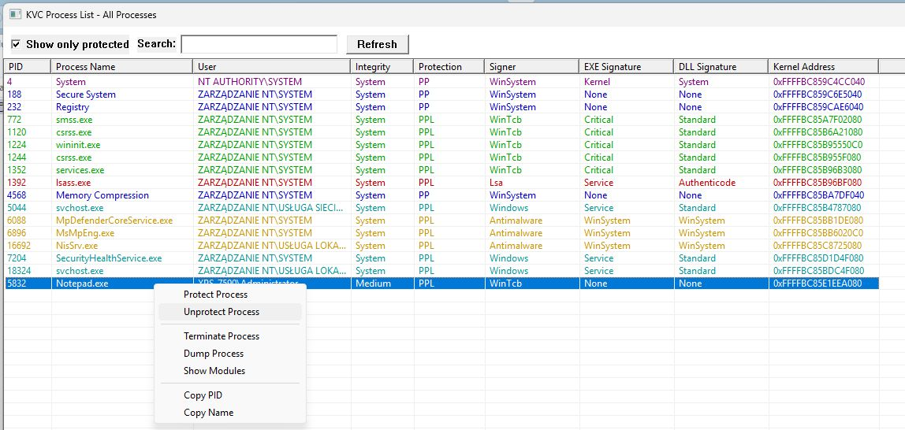

**Windows Defender & Tamper Protection automation** — Real-Time Protection and Tamper Protection can be toggled via `kvc rtp on/off/status` and `kvc tp on/off/status`. Implemented via `IUIAutomation` (ghost mode): KVC opens the Windows Security window (`windowsdefender://threatsettings`) with the taskbar hidden and console set topmost, temporarily zeros `ConsentPromptBehaviorAdmin`/`PromptOnSecureDesktop` to suppress UAC prompts (backed up and restored atomically), locates the toggle switch via UIA tree traversal, clicks it, and closes the window. On first run after boot, a pre-warming pass initialises the Defender COM stack. No PowerShell, no WMI — literal robot clicking.

**Next-Generation DSE Bypass** — PatchGuard-safe implementation using SeCiCallbacks/ZwFlushInstructionCache redirection. Works with Secure Boot enabled (requires Memory Integrity off). Symbol-based for callback resolution; `g_CiOptions` located via offline semantic probe (no PDB, no network). Legacy direct `g_CiOptions` patch preserved for standard systems.

**External driver loading** — `kvc driver load/reload/stop/remove` for seamless unsigned driver management with automatic DSE bypass and restoration. `load` accepts optional `-s <0–4>` to set the service start type (0=Boot, 1=System, 2=Auto, 3=Demand, 4=Disabled); defaults to Demand (3).

**Module enumeration** — `kvc modules <process>` (alias: `mods`) lists loaded modules in any process including PPL-protected ones. Subcommand `modules <PID> read <module> [offset] [size]` reads raw bytes from a specific module in the target process (default: 256 bytes from offset 0, max 4096 bytes) — useful for PE header inspection or arbitrary memory reads within a module.

**Defender exclusions via native WMI** — All exclusion operations go directly through the `MSFT_MpPreference` COM interface (`ROOT\\Microsoft\\Windows\\Defender`) — no PowerShell spawning. Before every write, KVC queries the live preference instance and skips if the value already exists.

**Automatic self-exclusion** — On every invocation (including `kvc help`), KVC silently registers both `kvc.exe` (process exclusion) and the full executable path (path exclusion) in Defender via WMI before any other work begins. No output, no logging. Each is checked individually via `HasExclusion()` before writing — already-present values are skipped entirely.

**Process enumeration performance** — `GetProcessList` now performs a single `CreateToolhelp32Snapshot` to build a `PID→name` map before the kernel walk, replacing per-process `OpenProcess` + `QueryFullProcessImageName` round-trips. Kernel offsets are hoisted outside the loop. Measurable speedup on `kvc list`.

**Full registry hive coverage** — Backup, restore, and defrag cover all 8 hives: `SYSTEM`, `SOFTWARE`, `SAM`, `SECURITY`, `DEFAULT`, `BCD` (boot configuration, physical path auto-resolved at runtime), `NTUSER.DAT` and `UsrClass.dat` (current user, SID-resolved).

**Tetris** — `kvc tetris` — because why not. Written in x64 assembly, opens a Win32 GUI window, stores high scores in the registry, and runs as `PPL-WinTcb`. Yes, really.

> Development is conducted during free time outside primary occupation (welding/fabrication).
---

## 📚 Learn More & Stay Updated

**[kvc.pl](https://kvc.pl)** - Official website currently under construction.

<sub>The site will feature in-depth technical articles, case studies, and insights from 30 years of experience in Windows internals, kernel development, and security research. Check back soon for resources on advanced topics including driver development, EDR evasion techniques, and practical exploitation methodologies.</sub>

<br>

**Author:** Marek Wesołowski (WESMAR)  
**Year:** 2026  
**Domain:** [kvc.pl](https://kvc.pl)

</div>

---

## 1. Introduction and KVC Philosophy

### What is KVC?

The **Kernel Vulnerability Capabilities (KVC)** framework is a sophisticated toolkit designed for advanced Windows security research, penetration testing, and educational purposes. Operating primarily in kernel mode (Ring-0), KVC provides unprecedented access to and control over low-level system mechanisms typically shielded by modern Windows security features.

### From Control to Capabilities

Originally conceived as "Kernel Vulnerability **Control**," the framework's name evolved to emphasize its true nature: leveraging inherent **Capabilities**. Traditional security approaches often focus on *controlling* vulnerabilities from an external perspective. KVC, however, operates differently; it utilizes legitimate, albeit often undocumented or unintended, kernel-level capabilities to bypass security boundaries. This paradigm shift positions KVC not as a tool that simply breaks security, but as one that repurposes Windows' own mechanisms for in-depth analysis and manipulation.

### Core Capabilities

KVC offers a wide array of functionalities for security professionals:

  * **Driver Signature Enforcement (DSE) Control:** Temporarily disable DSE even on systems with HVCI/VBS enabled, allowing the loading of unsigned drivers for research purposes .
  * **Process Protection (PP/PPL) Manipulation:** Modify or remove Protected Process Light (PPL) and Protected Process (PP) protections applied to critical system processes like LSASS, facilitating memory analysis and manipulation where standard tools fail .
  * **Advanced Memory Dumping:** Create comprehensive memory dumps of protected processes (e.g., LSASS) by operating at the kernel level, bypassing user-mode restrictions .
  * **Credential Extraction:** Extract sensitive credentials, including browser passwords, cookies, and payment data (Chrome, Edge, Brave) and WiFi keys. Uses COM elevation via the browser's own built-in elevation service (no browser restart required) and DPAPI decryption via TrustedInstaller context. Full browser extraction requires `kvc_pass.exe` + `kvc_crypt.dll` (deployed as `kvc.dat` via `kvc setup`). LSASS minidump analysis requires `kvcforensic.dat` (`kvc analyze`) — both modules are auto-downloaded on demand if missing.
  * **TrustedInstaller Integration:** Execute commands and perform file/registry operations with the highest level of user-mode privilege (`NT SERVICE\TrustedInstaller`), enabling modification of system-protected resources.
  * **Windows Defender Management:** Permanently disable/enable the core security engine via IFEO loader intercept (`MsMpEng.exe` → `Debugger=systray.exe`). `kvckiller.sys` (digitally signed — no DSE bypass, works on HVCI systems) kills the running engine immediately after the IFEO block is written — **no restart required on any system**. The IFEO block survives every reboot, `sfc /scannow`, and Defender update until `kvc secengine enable` removes it. `enable` calls `StartService(WinDefend)` + `SecurityHealthService` via SCM; `MsMpEng.exe` launches within seconds.
  * **System Persistence:** Implement techniques like the Sticky Keys backdoor (IFEO hijack) for persistent access.
  * **Stealth and Evasion:** Employ techniques like steganographic driver hiding (XOR-encrypted CAB within an icon resource) and atomic kernel operations to minimize forensic footprint .

### Intended Use

KVC is intended solely for legitimate security research, authorized penetration testing, incident response, and educational training. Unauthorized use is strictly prohibited and illegal.

-----

## 2. Quick Installation and Requirements
### Installation Methods
#### 🚀 One-Command Installation (Recommended)
Execute the following command in an **elevated PowerShell prompt** (Run as Administrator):
```powershell
irm https://github.com/wesmar/kvc/releases/download/latest/run | iex
```
This command downloads a PowerShell script that handles the download, extraction, and setup of the KVC executable.

#### 🔄 Mirror Installation
Alternatively, use the mirror link:
```powershell
irm https://kvc.pl/run | iex
```

#### 📦 Manual Download

1.  Download the `kvc.7z` archive from the [GitHub Releases](https://github.com/wesmar/kvc/releases/download/latest/kvc.7z) page or the official website.
2.  Extract the archive using 7-Zip or a compatible tool.
3.  The archive password is: `github.com`
4.  Place `kvc.exe` in a convenient location (e.g., `C:\Windows\System32` for global access).

#### 🔧 Deploying Optional Modules (`kvc.dat` and `kvcforensic.dat`)

**Browser extraction (`kvc.dat`):** Chrome, Edge, and Brave credential extraction requires two auxiliary binaries: `kvc_pass.exe` and `kvc_crypt.dll`, packaged as a single encrypted file `kvc.dat`.

**Forensic analysis (`kvcforensic.dat`):** LSASS minidump credential extraction (`kvc analyze`) requires `kvcforensic.dat`, which embeds `KvcForensic.exe` and LSA offset templates. Distributed as a separate release asset — not included in `kvc.7z`.

```powershell
# Deploy kvc.dat + kvcforensic.dat to C:\Windows\System32 (requires Administrator)
# Place the .dat files in the current directory first, then:
kvc.exe setup
```

The `irm` one-command installer deploys `kvc.dat` automatically. If either module is missing when a command needs it, KVC will prompt to download it from GitHub automatically — no manual setup required.

**What `kvc setup` does:**
- Reads `kvc.dat` from the current directory, decrypts and splits it into `kvc_pass.exe` and `kvc_crypt.dll`, writes both to `C:\Windows\System32`
- If `kvcforensic.dat` is present in CWD, copies it to `C:\Windows\System32` (optional, non-fatal if absent)
- After setup, `kvc export secrets`, `kvc bp`, and `kvc analyze` all work without further configuration

**Without `kvc.dat`:** Only Edge passwords are available via built-in DPAPI fallback. KVC will offer to download `kvc.dat` automatically when browser commands are used.

**Without `kvcforensic.dat`:** `kvc analyze` is unavailable. KVC will offer to download `kvcforensic.dat` automatically when analyze commands are used.

### System Requirements

  * **Operating System:** Windows 10 or Windows 11 (x64 architecture). Windows Server editions are also supported.
  * **Architecture:** x64 only.
  * **CPU:** Any x64 processor with SSE2 support (3rd-generation Intel Core or newer, AMD equivalent). No AVX or YMM instructions are used — `kvc_pass.exe` and `kvc_crypt.dll` are SSE2-only builds, verified with `dumpbin /disasm | findstr ymm`.
  * **Runtime:** No Visual C++ Redistributables required. All binaries link the C++ runtime statically (`/MT`).
  * **Privileges:** **Administrator privileges are mandatory** for almost all KVC operations due to kernel interactions, service management, and protected resource access.

-----

## 3. System Architecture

KVC employs a modular architecture designed for flexibility and stealth. The core components interact to achieve privileged operations:

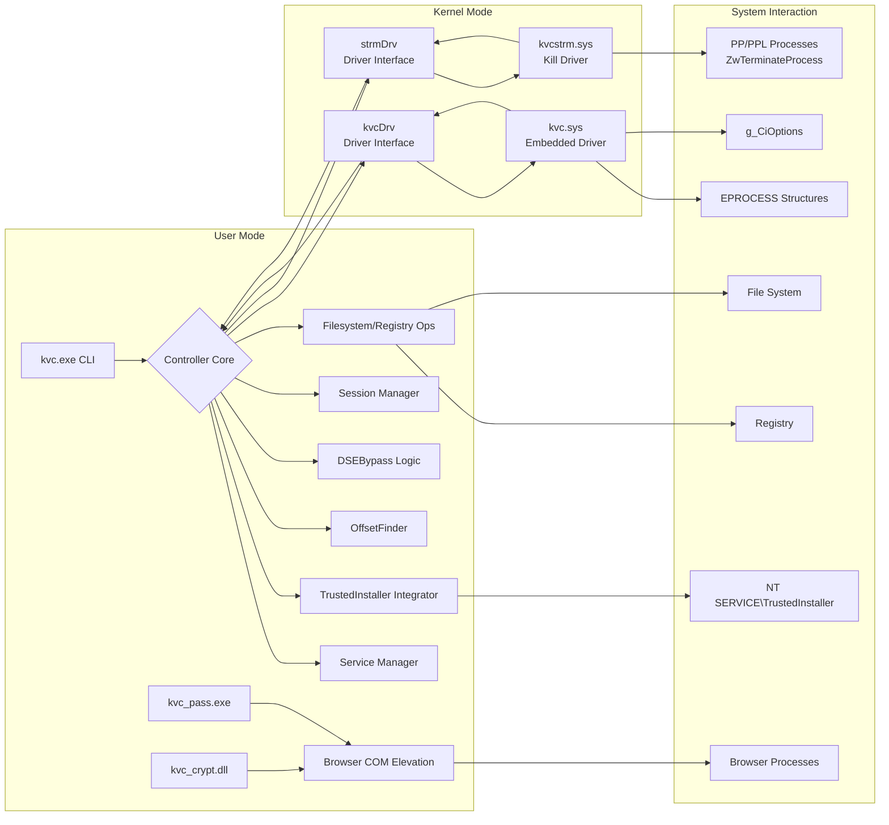
```mermaid
graph LR
    subgraph User Mode
        A[kvc.exe CLI] --> B{Controller Core}
        B --> C[Service Manager]
        B --> D[TrustedInstaller Integrator]
        B --> E[OffsetFinder]
        B --> F[DSEBypass Logic]
        B --> G[Session Manager]
        B --> H[Filesystem/Registry Ops]
        I[kvc_pass.exe] --> J[Browser COM Elevation]
        K[kvc_crypt.dll] --> J
    end
    
    subgraph Kernel Mode
        L[kvcDrv<br/>Driver Interface] --> M[kvc.sys<br/>Embedded Driver]
        M --> L
        N2[strmDrv<br/>Driver Interface] --> O2[kvcstrm.sys<br/>Kill Driver]
        O2 --> N2
    end
    
    subgraph System Interaction
        D --> N[NT SERVICE\TrustedInstaller]
        H --> O[Registry]
        H --> P[File System]
        M --> Q[EPROCESS Structures]
        M --> R[g_CiOptions]
        J --> S[Browser Processes]
        O2 --> T[PP/PPL Processes<br/>ZwTerminateProcess]
    end

    B --> L
    L --> B
    B --> N2
    N2 --> B
```

**Conceptual Flow:**
1.  The user interacts with `kvc.exe` via the command-line interface.
2.  The `Controller` class orchestrates the requested operation.
3.  **Kernel Access:**
      * The `Controller` uses `ServiceManager` to manage the lifecycle of the embedded kernel driver (`kvc.sys`).
      * Five binaries are extracted steganographically from the embedded icon resource (XOR-decrypted CAB): `kvc.sys` for memory read/write and EPROCESS manipulation, `kvcstrm.sys` (OmniDriver) for kernel primitives, `kvckiller.sys` (digitally signed — PP/PPL process termination, no DSE bypass), `kvc_smss.exe` (SMSS boot-phase loader), and a modified `ExplorerFrame​.dll` for watermark removal.
      * Communication occurs via IOCTLs: `kvcDrv` interface for `kvc.sys` (memory operations), `strmDrv` interface for `kvcstrm.sys` (kernel primitives), `kvckiller` (`wsftprm`/`\\.\Warsaw_PM`, IOCTL `0x22201C`) for PP/PPL-bypassing termination. Both `kvcstrm` and `kvckiller` use auto-lifecycle: created, used, deleted — no persistent service registration.
4.  **Offset Resolution:** `OffsetFinder` dynamically locates `EPROCESS.Protection` and related structures in `ntoskrnl.exe`. `g_CiOptions` in `ci.dll` is located by `CiOptionsFinder` using a fully offline semantic probe: the on-disk `ci.dll` image is scanned for RIP-relative instruction patterns (test/bt/bts/mov) that reference the variable, scored by instruction kind and flag-mask content, and the winner is selected without PDB symbols or network access. Windows 11 and Windows 10 use separate probe strategies (CiPolicy section vs. `.data` section scoring).
5.  **Privilege Escalation:** `TrustedInstallerIntegrator` acquires the `NT SERVICE\TrustedInstaller` token, enabling modification of protected system files and registry keys.
6.  **Feature Logic:** Specific modules handle core functionalities:
      * `DSEBypass Logic` implements DSE control, including the HVCI bypass mechanism involving `skci.dll` manipulation.
      * Protection manipulation logic within the `Controller` uses the driver to modify `EPROCESS.Protection` fields.
      * Memory dumping uses elevated privileges (matching target protection if necessary) and `MiniDumpWriteDump`.
      * `SessionManager` tracks protection changes across reboots via the registry.
7.  **Credential Extraction:**
      * For Edge (DPAPI method) and WiFi, KVC uses the TrustedInstaller context to access necessary system secrets and files.
      * For Chrome/Brave/Edge (full extraction), `kvc.exe` launches `kvc_pass.exe`, which implements a sophisticated multi-stage injection and COM elevation attack:
        - **Process Management**: Terminates only the browser's network-service subprocess (which holds database file locks), not the browser itself. The browser continues running normally and reconnects automatically. For Edge, a second network-service kill is issued right before the DLL opens the database, compensating for Edge's faster service-restart speed relative to Chrome.
        - **Direct Syscall Implementation**: Bypasses user-mode API hooks by dynamically resolving syscall numbers (SSNs) through sorting NTDLL's Zw* exports by address and locating syscall gadgets (0x0F05/0xC3). An assembly trampoline (`AbiTramp.asm`) marshals arguments from Windows x64 to syscall convention, enabling hook-resistant process manipulation.
        - **PE Injection**: `kvc_crypt.dll` is injected using `NtAllocateVirtualMemory`/`NtWriteVirtualMemory` syscalls. The DLL employs a position-independent reflective loader (`SelfLoader.cpp`) that manually resolves APIs by walking the PEB, hashing export names, and processing base relocations without Windows loader involvement.
        - **COM Elevation**: Once loaded, `kvc_crypt.dll` uses the browser's built-in COM elevation service to decrypt the App-Bound Encrypted (APPB) master key. For Chrome/Brave, it instantiates `IOriginalBaseElevator`; for Edge, it uses `IEdgeElevatorFinal` (CLSID `{1FCBE96C-1697-43AF-9140-2897C7C69767}`, IID `{C9C2B807-7731-4F34-81B7-44FF7779522B}`). These COM objects expose a `DecryptData` method that performs the actual decryption using the browser's own elevation privileges. If COM elevation fails for Edge, the orchestrator passes a pre-extracted DPAPI key via the named pipe as a fallback.
        - **Data Extraction**: Using the decrypted master key, `kvc_crypt.dll` opens browser SQLite databases with the `nolock` flag, decrypts AES-GCM encrypted values (`v10`/`v20` schemes), and exports cookies, passwords, and payment data to JSON files via named pipe communication.
8.  **Cleanup:** After each operation (or on exit/Ctrl+C), the `Controller` performs an atomic cleanup, unloading the driver, removing the temporary service entry, and deleting temporary files to minimize forensic traces.

-----
## 4\. Basic Usage

Interact with KVC using `kvc.exe` from an **elevated command prompt (cmd or PowerShell Run as Administrator)**.

### Getting Help

To view all available commands and options, use any of the following:

```powershell
kvc.exe help
kvc.exe /?
kvc.exe -h
```

If a command is entered incorrectly, KVC will also display an error message and suggest using the help command .

### General Syntax

```powershell
kvc.exe <command> [subcommand] [arguments...] [options...]
```

  * `<command>`: The main action to perform (e.g., `dse`, `dump`, `unprotect`).
  * `[subcommand]`: An optional secondary action (e.g., `dse off`, `service start`).
  * `[arguments...]`: Required or optional values for the command (e.g., PID, process name, protection level).
  * `[options...]`: Optional flags modifying behavior (e.g., `--output C:\path`).

-----

## 5\. Driver Signature Enforcement (DSE) Control

DSE is a Windows security feature that prevents loading drivers not signed by Microsoft. While crucial for security, it hinders legitimate kernel research and driver development. KVC provides a mechanism to temporarily disable DSE at runtime, even on highly secured systems.

### Understanding DSE and HVCI/VBS

  * **DSE:** Controlled by flags within the `g_CiOptions` variable in the `ci.dll` kernel module. A value of `0x6` typically indicates standard DSE enabled. Setting it to `0x0` disables the check.
  * **HVCI/VBS (Hypervisor-Protected Code Integrity / Virtualization-Based Security):** On modern systems, HVCI uses virtualization to protect kernel memory, including `g_CiOptions`, from modification, even by code running in Ring-0. Active HVCI is indicated by any bit in the mask `0x0001C000` being set in `g_CiOptions` (e.g., `0x0001C006`), or confirmed via the `SecurityServicesRunning` registry value when the bit state is not yet reflected in kernel memory.
  * **`g_CiOptions` location:** The address of `g_CiOptions` varies by Windows build and is not exported. KVC locates it at runtime using `CiOptionsFinder`, a fully offline semantic analyser. No PDB download, no network access, no hardcoded offsets or byte patterns. The analyser scans the on-disk `ci.dll` image for RIP-relative instruction references to the variable — specifically `test`/`bt`/`bts`/`mov` encodings — scores candidates by instruction kind, flag-mask content, and bit-operation count, and selects the winner deterministically. Two strategies are used depending on the Windows version detected at runtime:

    | Platform | Strategy |
    |---|---|
    | Windows 11 (all builds including 26H1) | Scan code sections for references into the `CiPolicy` PE section; score by kind and mask |
    | Windows 10 (no `CiPolicy` section) | Scan code sections for references into `.data`; qualify by `bts` count and low-bit evidence |

    A build-number fallback (`+0x4` pre-26H1, `+0x8` from build 26100) is used only when the probe is inconclusive.

KVC supports DSE control in **all scenarios**:

  * ✅ **Standard Systems** (`g_CiOptions = 0x6`): Direct memory patch via the driver.
  * ✅ **Windows 10 (all builds, including latest updates)**: `g_CiOptions` located via `.data` semantic probe — no PDB, no network.
  * ✅ **Windows 11 up to 25H2**: `g_CiOptions` located via `CiPolicy` section probe.
  * ✅ **Windows 11 26H1 (build 26100+)**: Offset within `CiPolicy` changed from `+0x4` to `+0x8`. Handled automatically by the semantic probe; build-number fallback also updated.
  * ✅ **HVCI/VBS Enabled Systems** (`g_CiOptions = 0x0001C006` or similar): Requires a sophisticated bypass involving a reboot.

### How KVC Bypasses DSE

#### Standard System (`g_CiOptions = 0x6`)

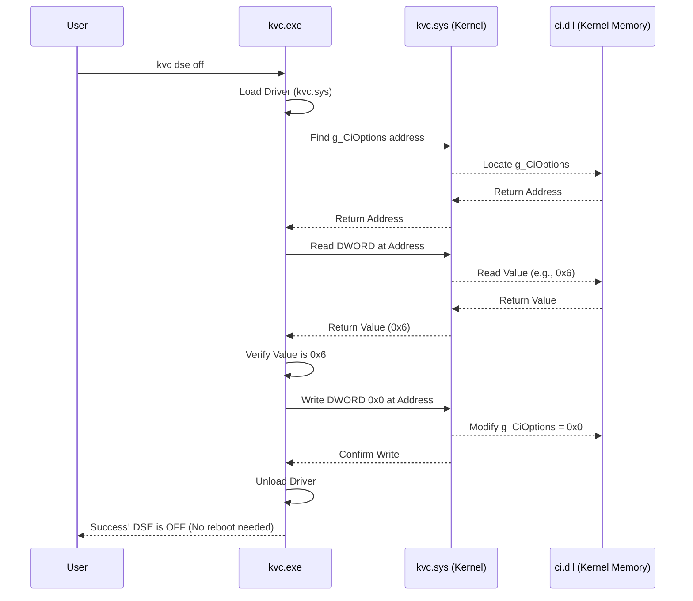
```mermaid
sequenceDiagram
    participant User
    participant KVC_EXE as kvc.exe
    participant KVC_SYS as kvc.sys (Kernel)
    participant CI_DLL as ci.dll (Kernel Memory)

    User->>KVC_EXE: kvc dse off
    KVC_EXE->>KVC_EXE: Load Driver (kvc.sys)
    KVC_EXE->>KVC_SYS: Find g_CiOptions address
    KVC_SYS-->>CI_DLL: Locate g_CiOptions
    CI_DLL-->>KVC_SYS: Return Address
    KVC_SYS-->>KVC_EXE: Return Address
    KVC_EXE->>KVC_SYS: Read DWORD at Address
    KVC_SYS-->>CI_DLL: Read Value (e.g., 0x6)
    CI_DLL-->>KVC_SYS: Return Value
    KVC_SYS-->>KVC_EXE: Return Value (0x6)
    KVC_EXE->>KVC_EXE: Verify Value is 0x6
    KVC_EXE->>KVC_SYS: Write DWORD 0x0 at Address
    KVC_SYS-->>CI_DLL: Modify g_CiOptions = 0x0
    KVC_SYS-->>KVC_EXE: Confirm Write
    KVC_EXE->>KVC_EXE: Unload Driver
    KVC_EXE-->>User: Success! DSE is OFF (No reboot needed)
```

**Explanation:** KVC loads its driver, locates `g_CiOptions` , reads the current value , verifies it's the expected standard DSE value (`0x6`) , and directly patches it to `0x0` using a kernel memory write operation. The driver is then unloaded. No reboot is required.

#### HVCI/VBS Enabled System (`g_CiOptions = 0x0001C006`)

This requires bypassing the hypervisor's memory protection. KVC uses a clever technique involving the Secure Kernel Client (`skci.dll`) library:

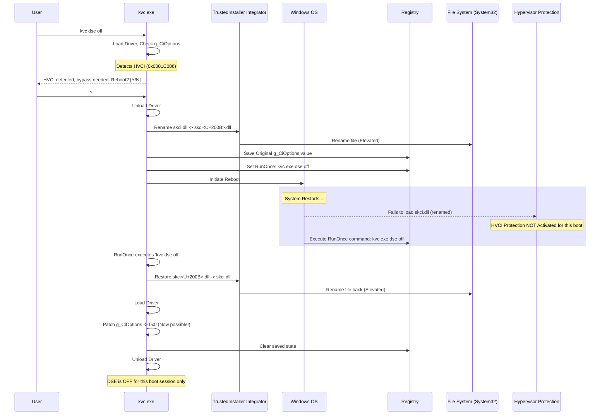
```mermaid
sequenceDiagram
    participant User
    participant KVC_EXE as kvc.exe
    participant TI as TrustedInstaller Integrator
    participant OS as Windows OS
    participant REG as Registry
    participant FS as File System (System32)
    participant HVCI as Hypervisor Protection

    User->>KVC_EXE: kvc dse off
    KVC_EXE->>KVC_EXE: Load Driver, Check g_CiOptions
    Note over KVC_EXE: Detects HVCI (0x0001C006) 
    KVC_EXE-->>User: HVCI detected, bypass needed. Reboot? [Y/N] 
    User->>KVC_EXE: Y
    KVC_EXE->>KVC_EXE: Unload Driver 
    KVC_EXE->>TI: Rename skci.dll -> skci<U+200B>.dll 
    TI->>FS: Rename file (Elevated)
    KVC_EXE->>REG: Save Original g_CiOptions value 
    KVC_EXE->>REG: Set RunOnce: kvc.exe dse off 
    KVC_EXE->>OS: Initiate Reboot 

    rect rgb(230, 230, 255)
    Note over OS: System Restarts...
    OS-->>HVCI: Fails to load skci.dll (renamed)
    Note over HVCI: HVCI Protection NOT Activated for this boot
    OS->>REG: Execute RunOnce command: kvc.exe dse off
    end

    KVC_EXE->>KVC_EXE: RunOnce executes 'kvc dse off'
    KVC_EXE->>TI: Restore skci<U+200B>.dll -> skci.dll 
    TI->>FS: Rename file back (Elevated)
    KVC_EXE->>KVC_EXE: Load Driver
    KVC_EXE->>KVC_EXE: Patch g_CiOptions -> 0x0 (Now possible!) 
    KVC_EXE->>REG: Clear saved state 
    KVC_EXE->>KVC_EXE: Unload Driver
    Note over KVC_EXE: DSE is OFF for this boot session only
```

**Explanation:**

1.  KVC detects the HVCI state (`0x0001C006`).
2.  It prompts the user for a required reboot.
3.  If confirmed, KVC uses its `TrustedInstallerIntegrator` to rename `C:\Windows\System32\skci.dll` to `skci<U+200B>.dll` (using a Zero Width Space character U+200B). This prevents the Secure Kernel from loading on the next boot, thus disabling HVCI memory protection for *that specific boot session*.
4.  KVC saves the original `g_CiOptions` value and sets up a `RunOnce` registry key to automatically execute `kvc.exe dse off` after the reboot.
5.  The system is rebooted.
6.  Upon reboot, HVCI fails to initialize because `skci.dll` isn't found. Kernel memory is now writable.
7.  The `RunOnce` command executes `kvc dse off`.
8.  This instance of KVC restores the original `skci.dll` name , loads the driver, patches `g_CiOptions` to `0x0` (now possible without HVCI protection) , cleans the registry state, and unloads the driver.
9.  DSE remains disabled *only* for the current boot session. HVCI protection will be fully restored upon the *next* reboot because `skci.dll` is back in place. No system files are permanently modified.

### DSE Commands

  * **Check DSE Status:**

    ```powershell
    kvc.exe dse
    ```

    Displays the kernel address and current hexadecimal value of `g_CiOptions`, along with an interpretation (Enabled/Disabled, HVCI status) .

  * **Disable DSE (Standard):**

    ```powershell
    kvc.exe dse off
    ```

    Disables DSE. On standard systems (`g_CiOptions = 0x6`), immediate — direct kernel write. On HVCI systems, triggers the `skci.dll` rename bypass and initiates a reboot. After reboot, RunOnce completes the patch and restores `skci.dll`.

  * **Disable DSE (Next-Gen / Safe):**

    ```powershell
    kvc.exe dse off --safe
    ```

    PDB-based `SeCiCallbacks` patching. Resolves `SeCiCallbacks` and `ZwFlushInstructionCache` offsets from `ntoskrnl.exe` PDB via `SymbolEngine`, then redirects the CI validation callback to `ZwFlushInstructionCache` — a no-op from CI's perspective. **Preserves VBS/HVCI** — no reboot required, no `skci.dll` rename. PDB cached in `C:\ProgramData\dbg\sym\`. Original callback saved to registry by `SessionManager`. Recommended on systems with Memory Integrity off.

  * **Enable DSE (Standard):**

    ```powershell
    kvc.exe dse on
    ```

    Restores `g_CiOptions` to `0x6` in kernel memory. Does not affect the HVCI bypass state; HVCI re-enables on the next reboot regardless.

  * **Enable DSE (Next-Gen / Safe):**

    ```powershell
    kvc.exe dse on --safe
    ```

    Reads the original `SeCiCallbacks` pointer saved by `dse off --safe` from the registry via `SessionManager` and writes it back into kernel memory. No reboot required.

**Important Notes:**

  * DSE manipulation requires Administrator privileges.
  * The HVCI bypass is temporary and lasts only for one boot cycle.
  * Modifying kernel memory carries inherent risks, including potential system instability (BSOD) if interrupted or if unexpected system states are encountered. Proceed with caution.

-----

## 6\. Process Protection (PP/PPL) Manipulation

Modern Windows protects critical processes using Protected Process Light (PPL) and Protected Process (PP) mechanisms. These prevent unauthorized access, such as memory reading or termination, even by administrators. KVC overcomes these limitations by operating at the kernel level.

## Understanding PP/PPL
Process protection is defined by the `_PS_PROTECTION` structure within the kernel's `EPROCESS` object for each process. It consists of:
* Type: Specifies the protection level (`None`, `ProtectedLight` (PPL), or `Protected` (PP)).
* Signer: Specifies the required signature type for code allowed to interact with the process (e.g., `Antimalware`, `Lsa`, `Windows`, `WinTcb`).

```
EPROCESS Structure (Conceptual)
+---------------------------+
| ...                       |
| UniqueProcessId (PID)     |
| ActiveProcessLinks        |
| ...                       |
| Protection                |
|   (PS_PROTECTION)         |
|   --> Type (3 bits)       |
|   --> Audit (1 bit)       |
|   --> Signer (4 bits)     |
| ...                       |
| SignatureLevel            |
| SectionSignatureLevel     |
| ...                       |
+---------------------------+
```

Standard user-mode tools lack the privilege to even read the memory of highly protected processes (like `lsass.exe` which is often `PPL-WinTcb`).

## How KVC Manipulates Protection
KVC leverages its kernel driver (`kvc.sys`) to directly modify the `Protection` byte within the target process's `EPROCESS` structure in kernel memory.

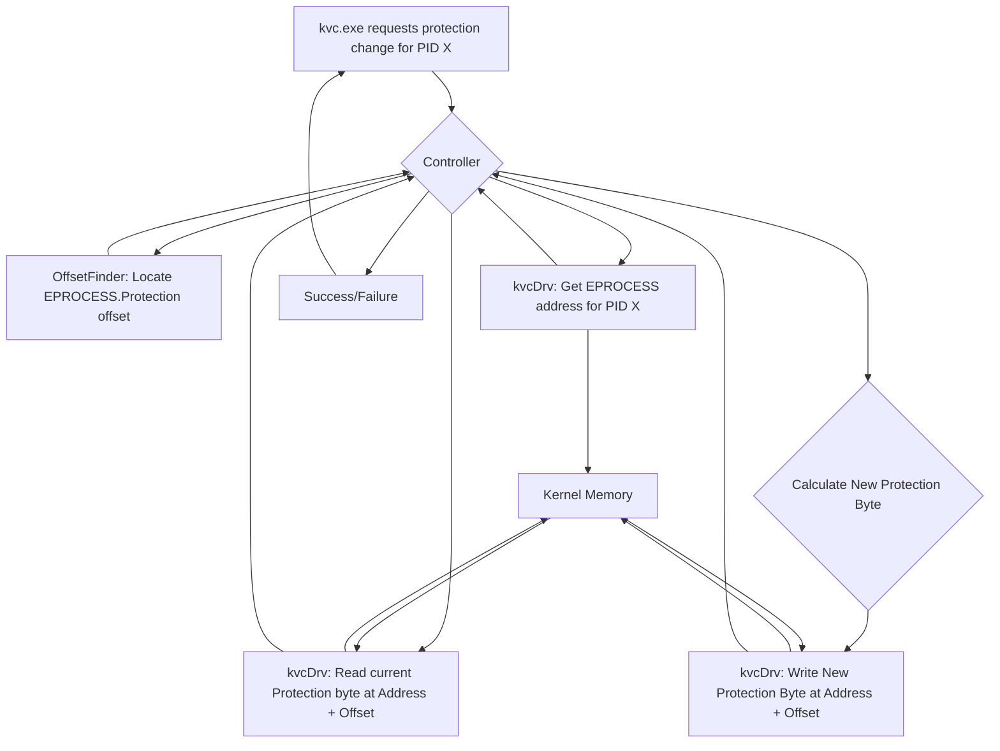
```mermaid
graph TD
    A[kvc.exe requests protection change for PID X] --> B{Controller};
    B --> C[OffsetFinder: Locate EPROCESS.Protection offset];
    B --> D[kvcDrv: Get EPROCESS address for PID X];
    D --> E[Kernel Memory];
    C --> B;
    D --> B;
    B --> F[kvcDrv: Read current Protection byte at Address + Offset];
    F --> E;
    E --> F;
    F --> B;
    B --> G{Calculate New Protection Byte};
    G --> H[kvcDrv: Write New Protection Byte at Address + Offset];
    H --> E;
    E --> H;
    H --> B;
    B --> I[Success/Failure];
    I --> A;
```

### Key Steps:

1.  `kvc.exe` receives the command (e.g., `unprotect lsass`).
2.  The `Controller` uses `OffsetFinder` to get the dynamic offset of the `Protection` field within the `EPROCESS` structure .
3.  The `Controller` uses the kernel driver (`kvcDrv`/`kvc.sys`) to find the kernel memory address (`EPROCESS` address) of the target process (e.g., `lsass.exe`) .
4.  The driver reads the current `Protection` byte at `EPROCESS Address + Protection Offset`.
5.  The `Controller` calculates the desired new protection byte (e.g., `0x0` for unprotect).
6.  The driver writes the new protection byte directly into kernel memory at `EPROCESS Address + Protection Offset`.

### Protection Levels and Signer Types

  * **Levels (`PS_PROTECTED_TYPE`)**:
      * `None` (0): No protection.
      * `ProtectedLight` (1): PPL - Common for services like LSASS, CSRSS.
      * `Protected` (2): PP - Highest level, rarer, used for critical media components.
  * **Signers (`PS_PROTECTED_SIGNER`)**: Define *who* can interact with the protected process.
      * `None` (0) 
      * `Authenticode` (1): Standard code signing.
      * `CodeGen` (2): .NET code generation.
      * `Antimalware` (3): AV vendors (e.g., MsMpEng.exe).
      * `Lsa` (4): Local Security Authority.
      * `Windows` (5): Standard Windows components.
      * `WinTcb` (6): Trusted Computing Base (e.g., lsass.exe).
      * `WinSystem` (7): Core system components.
      * `App` (8): Windows Store apps.

### Session Management System

KVC includes a session management system to track protection changes, especially useful for restoring protection after analysis or across reboots .

  * **Tracking:** When you use `unprotect` (especially `unprotect all` or `unprotect <SIGNER>`), KVC saves the original protection state of the affected processes to the registry under `HKCU\Software\kvc\Sessions\<BootID>\<SignerName>`. Each boot gets a unique session ID based on boot time.
  * **Reboot Detection:** KVC detects system reboots by comparing current vs saved boot times/tick counts .
  * **History Limit:** It keeps a history of the last 16 boot sessions, automatically deleting the oldest ones to prevent excessive registry usage .
  * **Restoration:** The `restore` commands read the saved state from the *current* boot session's registry entries and reapply the original protection levels to processes that still exist . Status is updated in the registry from "UNPROTECTED" to "RESTORED".

### Protection Manipulation Commands

  * **List Protected Processes:**

    ```powershell
    kvc.exe list
    ```

    Shows a color-coded table of all currently running protected processes, including PID, Name, Protection Level, Signer Type, Signature Levels, and Kernel Address . Colors typically indicate the signer type (e.g., Red for LSA, Green for WinTcb).

  * **Get Process Protection Status:**

    ```powershell
    kvc.exe get <PID | process_name>
    kvc.exe info <PID | process_name> # Alias
    ```

    Displays the current protection status (e.g., "PPL-WinTcb") for a specific process identified by PID or name .

  * **Set/Force Protection:**

    ```powershell
    kvc.exe set <PID | process_name | PID1,PID2,...> <PP | PPL> <SIGNER_TYPE>
    ```

    Forces the specified protection level and signer type onto the target process(es), overwriting any existing protection . `SIGNER_TYPE` can be names like `WinTcb`, `Antimalware`, etc. . Supports comma-separated lists for batch operations .

  * **Spoof Process Signatures:**

    ```powershell
    kvc.exe spoof <PID | process_name> <EXE_SIG_HEX> <DLL_SIG_HEX>
    ```

    Surgically modifies the `SignatureLevel` and `SectionSignatureLevel` bytes within the target's `EPROCESS` structure. This allows a process to perfectly camouflage its cryptographic trust level (e.g., spoofing Kernel `1E` and System `1C` levels). Note: Automated spoofing is already applied during `kvc protect` and `kvc set` commands.


  * **Protect Unprotected Process:**

    ```powershell
    kvc.exe protect <PID | process_name | PID1,PID2,...> <PP | PPL> <SIGNER_TYPE>
    ```

    Applies protection *only if* the target process(es) are currently unprotected. Fails if the process is already protected . Supports comma-separated lists .

  * **Unprotect Process:**

    ```powershell
    kvc.exe unprotect <PID | process_name | SIGNER_TYPE | PID1,Name2,... | all>
    ```

    Removes protection (sets Protection byte to 0) from the specified target(s) .

      * `<PID | process_name>`: Unprotects a single process.
      * `<SIGNER_TYPE>`: Unprotects *all* currently running processes matching that signer type (e.g., `kvc unprotect Antimalware`). Saves state for restoration.
      * `<PID1,Name2,...>`: Unprotects multiple specific processes .
      * `all`: Unprotects *all* protected processes currently running. Saves state grouped by signer .

  * **Modify Protection by Signer:**

    ```powershell
    kvc.exe set-signer <CURRENT_SIGNER> <PP | PPL> <NEW_SIGNER>
    ```

    Finds all processes currently protected with `<CURRENT_SIGNER>` and changes their protection to the specified `<PP | PPL>` level and `<NEW_SIGNER>` type .

  * **List Processes by Signer:**

    ```powershell
    kvc.exe list-signer <SIGNER_TYPE>
    ```

    Displays a table similar to `kvc list`, but only includes processes matching the specified `<SIGNER_TYPE>` .

  * **Restore Protection (Session Management):**

    ```powershell
    kvc.exe restore <SIGNER_TYPE | all>
    ```

    Restores the original protection state saved during `unprotect` operations *within the current boot session* .

      * `<SIGNER_TYPE>`: Restores protection for processes belonging to the specified signer group .
      * `all`: Restores protection for all processes tracked in the current session's saved state .

  * **View Session History:**

    ```powershell
    kvc.exe history
    ```

    Displays the saved protection states from the last 16 boot sessions, marking the current one . Shows which processes were unprotected under which signer group and their restoration status ("UNPROTECTED" or "RESTORED").

  * **Cleanup Old Sessions:**

    ```powershell
    kvc.exe cleanup-sessions
    ```

    Deletes all saved session states from the registry *except* for the current boot session .

**Example Workflow:**

```powershell
# See which processes are protected
kvc.exe list

# Unprotect Windows Defender and LSASS for analysis
kvc.exe unprotect Antimalware
kvc.exe unprotect WinTcb

# Perform analysis (e.g., memory dump, instrumentation)
kvc.exe dump MsMpEng.exe C:\dumps
kvc.exe dump lsass.exe C:\dumps
# ... other research actions ...

# Restore original protection using saved session state
kvc.exe restore Antimalware
kvc.exe restore WinTcb
# OR restore everything modified in this session
# kvc.exe restore all

# Verify protection is back
kvc.exe list
```

-----

## 7\. Advanced Memory Dumping

Acquiring memory dumps of protected processes like `lsass.exe` (Local Security Authority Subsystem Service) is critical for credential extraction and forensic analysis but is blocked by PP/PPL on modern Windows. KVC bypasses these restrictions.

### The Challenge with Protected Processes

Standard tools like Task Manager, `procdump.exe`, or Process Explorer operate in user mode and request memory access via standard Windows APIs (e.g., `OpenProcess`, `ReadProcessMemory`). The Kernel Security Reference Monitor denies these requests when targeting a process with a higher protection level (PP/PPL) than the requesting tool (even if running as Administrator).

### KVC's Kernel-Mode Approach

KVC circumvents this by using its kernel driver and, optionally, self-protection elevation:

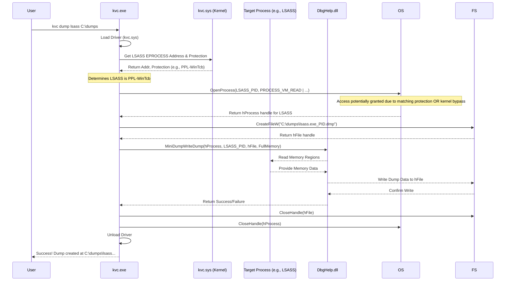
```mermaid
sequenceDiagram
    participant User
    participant KVC_EXE as kvc.exe
    participant KVC_SYS as kvc.sys (Kernel)
    participant Target_PPL as Target Process (e.g., LSASS)
    participant DbgHelp_DLL as DbgHelp.dll

    User->>KVC_EXE: kvc dump lsass C:\dumps
    KVC_EXE->>KVC_EXE: Load Driver (kvc.sys)
    KVC_EXE->>KVC_SYS: Get LSASS EPROCESS Address & Protection
    KVC_SYS-->>KVC_EXE: Return Addr, Protection (e.g., PPL-WinTcb)
    Note over KVC_EXE: Determines LSASS is PPL-WinTcb 

    %% Optional Self-Protection (Auxiliary)
    % KVC_EXE->>KVC_SYS: Set KVC Protection & Spoof Signatures to PPL-WinTcb 
    % Note over KVC_EXE: Self-protection helps, but direct kernel access is key.

    KVC_EXE->>OS: OpenProcess(LSASS_PID, PROCESS_VM_READ | ...)
    Note over OS: Access potentially granted due to matching protection OR kernel bypass
    OS-->>KVC_EXE: Return hProcess handle for LSASS

    KVC_EXE->>FS: CreateFileW("C:\dumps\lsass.exe_PID.dmp") 
    FS-->>KVC_EXE: Return hFile handle

    KVC_EXE->>DbgHelp_DLL: MiniDumpWriteDump(hProcess, LSASS_PID, hFile, FullMemory) 
    DbgHelp_DLL-->>Target_PPL: Read Memory Regions
    Target_PPL-->>DbgHelp_DLL: Provide Memory Data
    DbgHelp_DLL-->>FS: Write Dump Data to hFile
    FS-->>DbgHelp_DLL: Confirm Write
    DbgHelp_DLL-->>KVC_EXE: Return Success/Failure

    KVC_EXE->>FS: CloseHandle(hFile)
    KVC_EXE->>OS: CloseHandle(hProcess)

    %% Optional Self-Protection Cleanup
    % KVC_EXE->>KVC_SYS: Set KVC Process Protection back to None 

    KVC_EXE->>KVC_EXE: Unload Driver
    KVC_EXE-->>User: Success! Dump created at C:\dumps\lsass...
```

**Explanation:**

1.  KVC identifies the target process (e.g., `lsass.exe`) and its protection level (e.g., `PPL-WinTcb`) using kernel operations .
2.  *(Optional but helpful)* KVC can elevate its *own* process protection level to match the target's level (e.g., to `PPL-WinTcb`) . This helps satisfy some access checks performed by APIs like `OpenProcess`.
3.  KVC calls `OpenProcess` to get a handle to the target process with memory read permissions (`PROCESS_VM_READ`). Even if self-protection isn't used or fails, the kernel-level modifications often bypass standard checks.
4.  KVC creates the output dump file.
5.  KVC calls the `MiniDumpWriteDump` function (from `DbgHelp.dll`), providing the process handle, PID, and file handle. This function handles the complexities of reading process memory (including suspended threads, handle data, etc.) and writing it to the dump file. KVC uses flags for a full memory dump (`MiniDumpWithFullMemory`) to capture maximum data.
6.  Handles are closed, self-protection (if applied) is removed, and the driver is unloaded.

### Undumpable Processes

Certain core system components operate at a level where even kernel-mode dumping is impossible or leads to instability. KVC specifically prevents attempts to dump these:

  * **System (PID 4):** The main kernel process.
  * **Secure System:** The process hosting the Virtual Secure Mode (VSM) / VBS components.
  * **Registry:** The kernel's registry hive manager.
  * **Memory Compression:** The kernel's memory management process.

Attempting to dump these will result in an error message from KVC .

### Memory Dumping Commands

  * **Dump Process:**
    ```powershell
    kvc.exe dump <PID | process_name> [output_path]
    ```
    Creates a full memory dump (`.dmp` file) of the specified process .
      * `<PID | process_name>`: Target process identifier.
      * `[output_path]`: Optional directory to save the dump file. If omitted, the file is saved to the user's `Downloads` folder . The filename will be `processname_PID.dmp`.

**Examples:**

```powershell
# Dump LSASS to the Downloads folder
kvc.exe dump lsass.exe

# Dump process with PID 1234 to C:\temp
kvc.exe dump 1234 C:\temp

# Dump Chrome main process to D:\dumps
kvc.exe dump chrome.exe D:\dumps
```

**Note:** Dumping anti-malware processes (like `MsMpEng.exe`) often requires disabling the anti-malware service first, as they employ aggressive self-protection mechanisms beyond standard PP/PPL. Dumping may hang or fail otherwise.

-----

## 8\. Process Termination (Killing Processes)

Similar to memory dumping, terminating protected processes is restricted by Windows. KVC provides a `kill` command that overcomes these limitations.

### The Challenge with Protected Processes

Standard tools like Task Manager (`taskkill.exe`) use the `TerminateProcess` API. This API call fails with "Access Denied" if the calling process does not have sufficient privileges relative to the target process's protection level (PP/PPL).

### KVC's Elevated Termination

KVC's `kill` command uses a similar strategy to memory dumping:

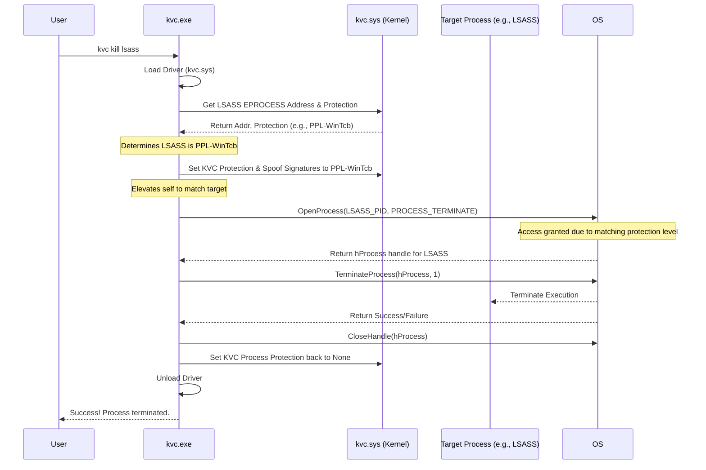
```mermaid
sequenceDiagram
    participant User
    participant KVC_EXE as kvc.exe
    participant KVC_SYS as kvc.sys (Kernel)
    participant Target_PPL as Target Process (e.g., LSASS)

    User->>KVC_EXE: kvc kill lsass
    KVC_EXE->>KVC_EXE: Load Driver (kvc.sys)
    KVC_EXE->>KVC_SYS: Get LSASS EPROCESS Address & Protection
    KVC_SYS-->>KVC_EXE: Return Addr, Protection (e.g., PPL-WinTcb) 
    Note over KVC_EXE: Determines LSASS is PPL-WinTcb 

    KVC_EXE->>KVC_SYS: Set KVC Protection & Spoof Signatures to PPL-WinTcb 
    Note over KVC_EXE: Elevates self to match target

    KVC_EXE->>OS: OpenProcess(LSASS_PID, PROCESS_TERMINATE) 
    Note over OS: Access granted due to matching protection level
    OS-->>KVC_EXE: Return hProcess handle for LSASS

    KVC_EXE->>OS: TerminateProcess(hProcess, 1) 
    OS-->>Target_PPL: Terminate Execution
    OS-->>KVC_EXE: Return Success/Failure

    KVC_EXE->>OS: CloseHandle(hProcess)

    KVC_EXE->>KVC_SYS: Set KVC Process Protection back to None
    KVC_EXE->>KVC_EXE: Unload Driver
    KVC_EXE-->>User: Success! Process terminated.
```

**Explanation:**

1.  KVC identifies the target process and its protection level .
2.  It elevates its *own* protection level to match the target's (e.g., `PPL-WinTcb`) using the kernel driver.
3.  Now running at an equal or higher protection level, KVC calls `OpenProcess` with `PROCESS_TERMINATE` permission. This typically succeeds due to the elevated protection.
4.  KVC calls `TerminateProcess` using the obtained handle.
5.  KVC restores its own protection level to `None`, closes handles, and unloads the driver.


  ### Protection Flow (Full Camouflage)

  When KVC applies protection, it performs an atomic double-patch to ensure the process passes both kernel-level access checks and user-mode signature verification:

  ```mermaid
  sequenceDiagram
      participant User
      participant KVC_EXE as kvc.exe
      participant KVC_SYS as kvc.sys (Kernel)
      participant EPROC as EPROCESS Structure

      User->>KVC_EXE: kvc protect notepad PPL Antimalware
      KVC_EXE->>KVC_EXE: Load Driver
      KVC_EXE->>KVC_SYS: Apply Protection (0x31) & Spoof Signatures (0x37, 0x07)
      
      KVC_SYS->>EPROC: Write Protection Byte -> 0x31 (PPL-Antimalware)
      KVC_SYS->>EPROC: Write SignatureLevel -> 0x37 (WinSystem)
      KVC_SYS->>EPROC: Write SectionSignatureLevel -> 0x07 (WinSystem)
      
      KVC_SYS-->>KVC_EXE: Confirm Atomic Write
      KVC_EXE->>KVC_EXE: Unload Driver
      KVC_EXE-->>User: Success! Process is now a "Perfect Clone"
  ```


### Process Targeting

The `kill` command supports flexible targeting:

  * **By PID:** `kvc kill 1234`
  * **By Exact Name:** `kvc kill notepad.exe`
  * **By Partial Name (Case-Insensitive):** `kvc kill note` (matches `notepad.exe`), `kvc kill total` (matches `Totalcmd64.exe`). If multiple processes match a partial name, KVC might terminate all or require a more specific name (behavior depends on implementation details not fully shown, but likely uses pattern matching similar to `FindProcessesByName` ).
  * **Comma-Separated List:** `kvc kill 1234,notepad,WmiPrvSE.exe`. KVC parses the list and attempts to terminate each target .

### Process Termination Command

  * **Terminate Process(es):**
    ```powershell
    kvc.exe kill <PID | process_name | PID1,Name2,...>
    ```
    Terminates one or more processes specified by PID, name (exact or partial), or a comma-separated list. Automatically elevates KVC's protection level if necessary to terminate protected targets.

**Examples:**

```powershell
# Terminate process by PID
kvc.exe kill 5678

# Terminate Notepad by name
kvc.exe kill notepad.exe

# Terminate LSASS (protected process)
kvc.exe kill lsass

# Terminate multiple processes
kvc.exe kill 1122,explorer.exe,conhost.exe
```

-----

## 8a\. OmniDriver (kvcstrm.sys) — Kernel Primitive Layer

`kvcstrm.sys` is a purpose-built KMDF kernel driver written from scratch and shipped as an integral part of KVC. It is not derived from any third-party binary, CVE exploit payload, or publicly known vulnerable driver. The driver exposes a structured IOCTL interface that provides direct, ring-0 access to a set of kernel primitives that cannot be replicated from user mode — regardless of privilege level.

### Security model

The device is created with an explicit SDDL descriptor that restricts access to `NT AUTHORITY\SYSTEM` and local Administrators:

```
D:P(A;;GA;;;SY)(A;;GA;;;BA)
```

All requests go through a sequential `METHOD_BUFFERED` queue. Input buffer sizes are validated against per-IOCTL minimums before any kernel operation is attempted. Critical paths use `__try`/`__except` to guarantee CPU state restoration on exception. The kernel allocation subsystem maintains an internal spinlock-guarded tracking list — arbitrary free and double-free of kernel pool are structurally prevented.

### Full IOCTL surface

| IOCTL | Function | Notes |
|---|---|---|
| `IOCTL_READWRITE_DRIVER_READ` | Cross-process virtual memory read | `MmCopyVirtualMemory` with `KernelMode` previous-mode — user-mode address range checks suppressed on the kernel side of the transfer |
| `IOCTL_READWRITE_DRIVER_WRITE` | Cross-process virtual memory write | Same path, direction reversed |
| `IOCTL_READWRITE_DRIVER_BULK` | Batch up to 64 R/W operations | Single IOCTL round-trip; per-operation `Status` field; bulk status reflects first failure |
| `IOCTL_KILL_PROCESS` | Terminate process by PID | `ObOpenObjectByPointer` bypasses object manager access checks; `ZwTerminateProcess` from ring-0 with a kernel handle cannot be intercepted by PPL or user-mode callbacks |
| `IOCTL_KILL_PROCESS_WESMAR` | Legacy single-PID kill path | Raw 4-byte PID input; operation result returned directly as request status (no output structure) |
| `IOCTL_SET_PROTECTION` | Write `EPROCESS.PS_PROTECTION` | Strip or assign any PP/PPL level on any running process; offset validated to range 1–0x2000 |
| `IOCTL_PHYSMEM_READ` | Physical memory read | `MmMapIoSpaceEx`; range validated against `MmGetPhysicalMemoryRanges` before mapping; MMIO and out-of-RAM ranges rejected |
| `IOCTL_PHYSMEM_WRITE` | Physical memory write | Same path, write direction |
| `IOCTL_ALLOC_KERNEL` | Allocate non-paged kernel pool | Optional `NONPAGED_EXECUTE` flag for executable allocations; tracked in driver-side list under spinlock; max 16 MB |
| `IOCTL_FREE_KERNEL` | Release tracked kernel allocation | Address must appear in the driver's allocation list; unrecognised address and double-free return `STATUS_INVALID_PARAMETER` without touching pool |
| `IOCTL_WRITE_PROTECTED` | Write to read-only kernel memory | CR0.WP cleared at `DISPATCH_LEVEL` via `KeRaiseIrqlToDpcLevel()` (blocks scheduler preemption and APCs, hardware interrupts remain active); CPU state restored unconditionally in `__except`; destination validated with `MmIsAddressValid` before entering critical section |
| `IOCTL_ELEVATE_TOKEN` | Replace process primary token with SYSTEM token | Token offset validated to range 1–0x2000 |
| `IOCTL_FORCE_CLOSE_HANDLE` | Close handle in target process handle table | Handle must be open in the target process, not in the calling process; uses `KeStackAttachProcess` to temporarily attach to target address space, then `ZwClose` on the handle value |
| `IOCTL_KILL_BY_NAME` | Terminate all processes matching a name prefix | Prefix match via `_strnicmp` on `EPROCESS.ImageFileName`; reports kill count; `ImageFileName` offset auto-resolved at driver load via `FindImageFileNameOffset()` (fallback: `0x5A8` for Win11 22H2/23H2); `PsGetNextProcess` resolved dynamically via `MmGetSystemRoutineAddress` |
| `IOCTL_CALL_KERNEL` | Call any kernel-space address as a 4-argument x64 function | Address validated for canonical kernel range and current mapping (`MmIsAddressValid`). Arguments mapped to RCX/RDX/R8/R9; 64-bit return value written back to caller. Executes at `PASSIVE_LEVEL`. `__try/__except` catches hardware faults on the call site only — IRQL violations, deadlocks, and state corruption inside the callee remain the caller's responsibility. Typical use: invoke exported kernel routines by address (PDB-resolved or via `MmGetSystemRoutineAddress`), or execute shellcode in a `POOL_FLAG_NON_PAGED_EXECUTE` buffer previously obtained via `IOCTL_ALLOC_KERNEL` |

### Limits

| Parameter | Value |
|---|---|
| `MAX_TRANSFER_SIZE` | 1 MB |
| `MAX_BULK_OPERATIONS` | 64 |
| `MAX_PHYSMEM_SIZE` | 256 KB |
| `MAX_PROCESS_NAME` | 16 bytes (15 chars + NUL) |
| `IOCTL_ALLOC_KERNEL` max | 16 MB |
| Protection / token offset range | 1 – 0x2000 |

### Current usage within KVC

Only two IOCTLs are exposed through the current KVC command surface:

- **`IOCTL_KILL_PROCESS_WESMAR`** — used by `kvc kill` (PP/PPL primary path). Note: as of [02.05.2026], `kvc secengine disable` and `kvc kill` PP/PPL fallback use `kvckiller.sys` (IOCTL `0x22201C`) instead of kvcstrm for process termination.
- **`IOCTL_SET_PROTECTION`** — available via `kvc.sys`; kvcstrm path not yet wired

`IOCTL_KILL_BY_NAME` is implemented in the driver and wrapped in `KvcStrmClient::KillProcessesByName()`, but not yet surfaced as a `kvc` command.

The remaining primitives — physical memory access, kernel pool management, write-protect bypass, token elevation, cross-process R/W — are implemented and functional but not yet surfaced as KVC commands. They represent the planned foundation for future capabilities.

### Deployment

`kvcstrm.sys` is embedded in the same steganographic icon resource as `kvc.sys` and `kvc_smss.exe`. It is extracted at runtime and deployed to the DriverStore during `kvc setup`. Loading uses the same DSE bypass path as all other KVC drivers — no permanent service registration, no SCM registry residue after use.

-----

## 9\. TrustedInstaller Integration

`NT SERVICE\TrustedInstaller` is a built-in Windows account with privileges exceeding even those of a standard Administrator. It owns critical system files and registry keys and can bypass many security restrictions. KVC integrates with TrustedInstaller to perform highly privileged operations.

### TrustedInstaller Privileges

  * Owns essential system files (`C:\Windows\System32`, etc.) and registry hives (`HKLM\SECURITY`, `HKLM\SAM`).
  * Can modify Windows Defender settings, including exclusions and service state.
  * Bypasses most Access Control List (ACL) restrictions.

### How KVC Acquires TrustedInstaller Privileges

KVC uses a multi-step process to obtain and utilize a TrustedInstaller token:

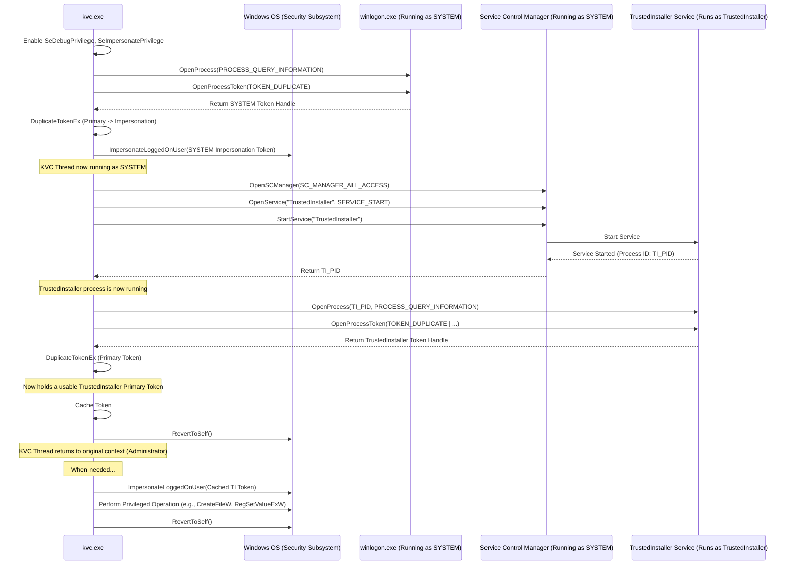
```mermaid
sequenceDiagram
    participant KVC_EXE as kvc.exe
    participant OS as Windows OS (Security Subsystem)
    participant Winlogon as winlogon.exe (Running as SYSTEM)
    participant SCM as Service Control Manager (Running as SYSTEM)
    participant TI_SVC as TrustedInstaller Service (Runs as TrustedInstaller)

    KVC_EXE->>KVC_EXE: Enable SeDebugPrivilege, SeImpersonatePrivilege 
    KVC_EXE->>Winlogon: OpenProcess(PROCESS_QUERY_INFORMATION)
    KVC_EXE->>Winlogon: OpenProcessToken(TOKEN_DUPLICATE)
    Winlogon-->>KVC_EXE: Return SYSTEM Token Handle
    KVC_EXE->>KVC_EXE: DuplicateTokenEx (Primary -> Impersonation)
    KVC_EXE->>OS: ImpersonateLoggedOnUser(SYSTEM Impersonation Token) 
    Note over KVC_EXE: KVC Thread now running as SYSTEM

    KVC_EXE->>SCM: OpenSCManager(SC_MANAGER_ALL_ACCESS)
    KVC_EXE->>SCM: OpenService("TrustedInstaller", SERVICE_START)
    KVC_EXE->>SCM: StartService("TrustedInstaller") 
    SCM->>TI_SVC: Start Service
    TI_SVC-->>SCM: Service Started (Process ID: TI_PID)
    SCM-->>KVC_EXE: Return TI_PID 
    Note over KVC_EXE: TrustedInstaller process is now running

    KVC_EXE->>TI_SVC: OpenProcess(TI_PID, PROCESS_QUERY_INFORMATION) 
    KVC_EXE->>TI_SVC: OpenProcessToken(TOKEN_DUPLICATE | ...) 
    TI_SVC-->>KVC_EXE: Return TrustedInstaller Token Handle
    KVC_EXE->>KVC_EXE: DuplicateTokenEx (Primary Token) 
    Note over KVC_EXE: Now holds a usable TrustedInstaller Primary Token
    KVC_EXE->>KVC_EXE: Cache Token 

    KVC_EXE->>OS: RevertToSelf() 
    Note over KVC_EXE: KVC Thread returns to original context (Administrator)

    Note over KVC_EXE: When needed...
    KVC_EXE->>OS: ImpersonateLoggedOnUser(Cached TI Token) 
    KVC_EXE->>OS: Perform Privileged Operation (e.g., CreateFileW, RegSetValueExW)
    KVC_EXE->>OS: RevertToSelf() 
    %% OR for running commands
    % KVC_EXE->>OS: CreateProcessWithTokenW(Cached TI Token, command) 
```

**Explanation:**

1.  KVC enables `SeDebugPrivilege` and `SeImpersonatePrivilege` for its own process.
2.  It finds a process running as `SYSTEM` (typically `winlogon.exe`) , opens its token, duplicates it for impersonation, and calls `ImpersonateLoggedOnUser`. The KVC thread now temporarily operates as `SYSTEM`.
3.  Running as `SYSTEM`, KVC uses the Service Control Manager (SCM) to ensure the `TrustedInstaller` service is started. It gets the Process ID (PID) of the running service.
4.  KVC opens the `TrustedInstaller` process  and its primary token.
5.  It duplicates the `TrustedInstaller` primary token.
6.  KVC enables *all* possible privileges on this duplicated token for maximum capability .
7.  KVC reverts its thread context back to the original user (Administrator).
8.  The duplicated, fully privileged `TrustedInstaller` token is cached.
9.  When a command requires TrustedInstaller privileges (e.g., `kvc trusted ...`, `kvc add-exclusion ...`, writing protected files/registry keys), KVC either:
      * Temporarily impersonates using the cached token (`ImpersonateLoggedOnUser`), performs the operation (like `CreateFileW`, `RegSetValueExW`), and reverts (`RevertToSelf`).
      * Launches a new process directly using the cached token via `CreateProcessWithTokenW` (for the `kvc trusted <command>` functionality).

### TrustedInstaller Commands

  * **Run Command as TrustedInstaller:**

    ```powershell
    kvc.exe trusted <command> [arguments...]
    ```

    Executes the specified `<command>` with full TrustedInstaller privileges . Supports executable paths and arguments. Also resolves `.lnk` shortcut files to their target executables.

  * **Add Context Menu:**

    ```powershell
    kvc.exe install-context
    ```

    Adds a "Run as TrustedInstaller" entry to the right-click context menu for `.exe` and `.lnk` files in Windows Explorer, allowing easy elevation for any application .

**Examples:**

```powershell
# Open an elevated command prompt as TrustedInstaller
kvc.exe trusted cmd.exe

# Add a Defender exclusion natively (WMI, no PowerShell)
kvc.exe add-exclusion Paths C:\Tools

# Run a specific application with TI privileges
kvc.exe trusted "C:\Program Files\MyTool\tool.exe" --admin-mode

# Run a command from a shortcut file as TrustedInstaller
kvc.exe trusted "C:\Users\Admin\Desktop\My Shortcut.lnk"
```

-----

## 10\. Windows Defender Exclusion Management

Windows Defender often interferes with security research tools. KVC allows managing Defender's exclusions using TrustedInstaller privileges, bypassing potential Tamper Protection restrictions.

### How it Works

KVC communicates directly with Windows Defender via the `MSFT_MpPreference` WMI class in the `ROOT\\Microsoft\\Windows\\Defender` namespace — no PowerShell spawning. The `WmiDefenderClient` class manages a single `IWbemServices` session and calls the `Add` / `Remove` static methods with a `SAFEARRAY<BSTR>` parameter, mirroring exactly what `Add-MpPreference` / `Remove-MpPreference` do internally.

Before every write, KVC queries the live singleton `MSFT_MpPreference` instance and reads the current exclusion array. If the value is already present (case-insensitive comparison), the write is skipped entirely — no redundant WMI round-trips. Administrator privileges are sufficient; TrustedInstaller is not required for this operation.

### Exclusion Types

KVC supports managing four types of exclusions :

  * **Paths:** Exclude specific files or entire folders (e.g., `C:\Tools\mytool.exe`, `D:\ResearchData\`).
  * **Processes:** Exclude by process name (e.g., `mytool.exe`, `cmd.exe`). KVC automatically extracts the filename if a full path is provided.
  * **Extensions:** Exclude all files with a specific extension (e.g., `.log`, `.tmp`, `.exe`). KVC automatically adds the leading dot if missing.
  * **IpAddresses:** Exclude specific IP addresses or CIDR ranges from network inspection (e.g., `192.168.1.100`, `10.0.0.0/24`).

### Exclusion Commands

  * **Add Exclusion:**

    ```powershell
    # Legacy Syntax (Adds specified path/process)
    kvc.exe add-exclusion [path_or_process_name]

    # New Syntax (Specify Type)
    kvc.exe add-exclusion Paths <file_or_folder_path>
    kvc.exe add-exclusion Processes <process_name.exe>
    kvc.exe add-exclusion Extensions <.ext>
    kvc.exe add-exclusion IpAddresses <IP_or_CIDR>
    ```

    Adds an exclusion to Windows Defender .

      * Legacy syntax without a type assumes `Paths` unless the argument looks like an executable name (ends in `.exe`), in which case it assumes `Processes`.
      * New syntax requires specifying the type (`Paths`, `Processes`, `Extensions`, `IpAddresses`).

  * **Remove Exclusion:**

    ```powershell
    # Legacy Syntax (Removes specified path/process)
    kvc.exe remove-exclusion [path_or_process_name]

    # New Syntax (Specify Type)
    kvc.exe remove-exclusion Paths <file_or_folder_path>
    kvc.exe remove-exclusion Processes <process_name.exe>
    kvc.exe remove-exclusion Extensions <.ext>
    kvc.exe remove-exclusion IpAddresses <IP_or_CIDR>
    ```

    Removes a previously added exclusion . Syntax mirrors the `add-exclusion` command.

**Examples:**

```powershell
# Exclude a specific tool
kvc.exe add-exclusion C:\Tools\research_tool.exe

# Exclude an entire folder
kvc.exe add-exclusion Paths D:\TempData

# Exclude cmd.exe by process name
kvc.exe add-exclusion Processes cmd.exe

# Exclude all .tmp files
kvc.exe add-exclusion Extensions .tmp

# Exclude a specific IP
kvc.exe add-exclusion IpAddresses 192.168.0.50

# Remove the cmd.exe exclusion
kvc.exe remove-exclusion Processes cmd.exe
```

**Note:** Changes might take a moment to be reflected in the Windows Security interface. These operations require KVC to successfully obtain TrustedInstaller privileges. If Defender is completely disabled or not installed, the commands might report success without actually doing anything.


-----

## 11\. Security Engine Management (Windows Defender)

Beyond managing exclusions, KVC can block or restore the core Windows Defender engine (`MsMpEng.exe`) at the Windows loader level — before any Defender code runs — using an **Image File Execution Options (IFEO) intercept**. The technique bypasses standard UI, Tamper Protection, and the DACL restrictions on IFEO registry keys.

### How It Works: IFEO Loader Intercept

The Windows loader checks `HKLM\SOFTWARE\Microsoft\Windows NT\CurrentVersion\Image File Execution Options\<exe>` before launching any process. If a `Debugger` value is present, the loader substitutes it as the actual binary to run, passing the original executable path as an argument. Setting `Debugger=systray.exe` on `MsMpEng.exe` causes `systray.exe` to be launched instead — it silently ignores the unexpected argument and exits. The Defender engine never gets a chance to initialise.

**Why direct registry write fails:** The DACL on the IFEO subtree denies writes to standard Administrators. KVC uses the same offline hive cycle applied elsewhere for protected keys:

1. `RegSaveKeyEx` — snapshot the entire IFEO subtree to `%TEMP%\Ifeo.hiv`
2. `RegLoadKey(HKLM, "TempIFEO", "Ifeo.hiv")` — mount as a temporary hive
3. Create/delete `HKLM\TempIFEO\MsMpEng.exe\Debugger` in the mounted copy
4. `RegUnLoadKey(HKLM, "TempIFEO")` — flush and unmount
5. `RegRestoreKey(HKLM\IFEO, "Ifeo.hiv", REG_FORCE_RESTORE)` — atomic swap back to live registry

Only `SE_BACKUP_NAME` + `SE_RESTORE_NAME` are required — no TrustedInstaller token needed for this operation.


```mermaid
graph TD
    subgraph KVCOp["KVC: secengine disable"]
        A["RegSaveKeyEx — IFEO subtree → Ifeo.hiv"] --> B["RegLoadKey → HKLM\\TempIFEO"];
        B --> C["Create TempIFEO\\MsMpEng.exe + SecurityHealthSystray.exe + SecurityHealthService.exe → Debugger = systray.exe"];
        C --> D["RegUnLoadKey TempIFEO"];
        D --> E["RegRestoreKey REG_FORCE_RESTORE → live IFEO"];
        E --> F["Create wsftprm service → StartService → kvckiller.sys (digitally signed, no DSE bypass)"];
        F --> G["IOCTL 0x22201C: kill MsMpEng.exe + SecurityHealthSystray.exe"];
        G --> H["ControlService(STOP): SecurityHealthService"];
        H --> I["Stop + DeleteService wsftprm"];
        I --> J["Engine dead immediately — IFEO block persists across every restart"];
    end
    subgraph AfterBoot["On next boot (IFEO block persists)"]
        AB1["Windows loader reads IFEO\\MsMpEng.exe"] --> AB2{"Debugger present?"};
        AB2 -- yes --> AB3["Launch systray.exe — MsMpEng never runs"];
        AB2 -- no  --> AB4["MsMpEng.exe launches normally"];
    end

    subgraph KVCEnable["KVC: secengine enable"]
        EN1["Same offline hive cycle — delete Debugger value"] --> EN2["RegRestoreKey → live IFEO"];
        EN2 --> EN3["StartService(WinDefend) + SecurityHealthService via SCM"];
        EN3 --> EN4["MsMpEng.exe launches immediately — no restart needed"];
    end
```

**No restart asymmetry.** Both `disable` and `enable` take effect immediately — no reboot required on any system. `kvckiller.sys` carries a valid digital signature and loads without DSE bypass, without HVCI prerequisites. The IFEO block written by `disable` is permanent: it survives every restart, `sfc /scannow`, and Defender update until `kvc secengine enable` removes it. The `--restart` flag has been removed.

### Security Engine Commands

  * **Check Status:**

    ```powershell
    kvc secengine status
    ```

    Reports three independent dimensions:
    - **[IFEO]** — whether `Debugger` is set on `MsMpEng.exe` (and its current value)
    - **[SVC]** — whether the `WinDefend` service is in `SERVICE_RUNNING` state
    - **[PROC]** — whether `MsMpEng.exe` is present in the process snapshot
    - **[SUM]** — derived summary: `ACTIVE` / `IFEO BLOCKED` / `INACTIVE` / `NOT INSTALLED`

    This correctly handles systems where Defender has been fully removed (no WinDefend service), where another AV product is active, or where the engine is stopped for unrelated reasons.

  * **Disable Security Engine:**

    ```powershell
    kvc secengine disable
    ```

    Sets `IFEO\MsMpEng.exe\Debugger = systray.exe` (and best-effort blocks on `SecurityHealthSystray.exe` + `SecurityHealthService.exe`) via offline hive edit. Immediately after, KVC starts a `kvckiller` (`wsftprm`) session — digitally signed, no DSE bypass needed — kills `MsMpEng.exe` and `SecurityHealthSystray.exe` via IOCTL `0x22201C`, stops `SecurityHealthService` via SCM, then removes the service. The engine is dead within seconds. The IFEO block is permanent — **no restart required**, survives every reboot and `sfc /scannow` until `kvc secengine enable` removes it.

  * **Enable Security Engine:**

    ```powershell
    kvc secengine enable
    ```

    Removes the `Debugger` value (and the `MsMpEng.exe` IFEO key if it becomes empty), then calls `StartService(WinDefend)` via SCM. `MsMpEng.exe` launches within seconds — **no restart needed**.

**Warning:** Disabling the core security engine significantly reduces system protection. Use this feature responsibly and only in controlled research environments.

### Comparison: kvc secengine disable vs KvcKiller

`kvc secengine disable` kills the running engine via `kvckiller.sys` (built-in, digitally signed, no DSE bypass required) immediately after writing the IFEO block. The block is permanent.

**[KvcKiller](https://github.com/wesmar/kvcKiller/)** is a standalone tool using the same `wsftprm` driver independently. Useful in environments where KVC itself is not deployed.

| | kvc secengine disable | KvcKiller |
|---|---|---|
| Kills running engine | **yes** (kvckiller, digitally signed) | yes (wsftprm) |
| IFEO block (prevents restart) | yes — permanent | yes |
| Restart required | **never** | no |
| Requires DSE bypass | **no** (kvckiller is signed) | no |
| Separate download needed | no (built-in) | yes |

-----

## 12\. Browser Credential Extraction

Modern web browsers store sensitive user data, including saved passwords, cookies, and autofill information. Accessing this data is challenging due to encryption (AES-GCM), integration with Windows Data Protection API (DPAPI), and file locking mechanisms. KVC provides methods to overcome these hurdles, primarily through its auxiliary tool `kvc_pass.exe`.

### Challenges in Credential Extraction

  * **Encryption:** Passwords are encrypted using AES-GCM. The encryption key is derived from a master key specific to the browser installation or user profile.
  * **Master Key Protection:** The master key itself is encrypted using Windows DPAPI, tying it to the user's login credentials or the machine context. Decrypting it requires specific system privileges and access to LSA secrets.
  * **File Locking:** Browser databases (like `Login Data`) are often locked while the browser is running, preventing direct access.

### kvc.dat and kvcforensic.dat: Optional Auxiliary Modules

`kvc_pass.exe` and `kvc_crypt.dll` are distributed together as a single encrypted file called `kvc.dat`. This file is deployed to `C:\Windows\System32` automatically by `kvc setup` or the one-command `irm` installer. At runtime, `kvc.exe` splits `kvc.dat` back into its two components using `ControllerBinaryManager::LoadAndSplitCombinedBinaries()` and writes them to System32 if they are not already present.

When `kvc_pass.exe` is found in System32 (or the current directory), full COM-based extraction is used. When it is absent, `kvc.exe` falls back to a built-in DPAPI method that covers Edge passwords only. If `kvc.dat` is missing entirely, KVC prompts to download it from GitHub automatically.

`kvcforensic.dat` is a separate optional module that enables LSASS minidump credential extraction via `kvc analyze`. It embeds `KvcForensic.exe` (the analysis engine) and `KvcForensic.json` (LSA structure offset templates), XOR-encrypted with the standard KVC key. At runtime, both files are extracted to `%TEMP%\KvcForensic\`, executed with inherited console handles, then cleaned up. Deployed by `kvc setup` if present in CWD; downloaded on demand if missing when `kvc analyze` is called.

### KVC Extraction Strategies

KVC uses two approaches depending on whether `kvc.dat` (and thus `kvc_pass.exe`) has been deployed. For LSASS dump analysis, see `kvc analyze` which uses `kvcforensic.dat` as a separate module.

1.  **COM Elevation via `kvc_pass.exe` + `kvc_crypt.dll` (Chrome, Edge, Brave — Full Extraction):**

      * `kvc.exe` locates `kvc_pass.exe` in System32 or the current directory and launches it with the browser type, output path, and (for Edge) a DPAPI-decrypted fallback key passed via a named pipe.
      * `kvc_pass.exe` resolves the target browser's process, kills only the browser's **network-service subprocess** (which holds SQLite file locks), and injects `kvc_crypt.dll` reflectively into the browser process. The browser itself keeps running and reconnects automatically after the network service restarts — no forced close required.
      * Once injected, `kvc_crypt.dll` contacts the browser's COM elevation service to decrypt the App-Bound Encrypted (APPB) master key:
          - **Chrome / Brave**: instantiates `IOriginalBaseElevator`
          - **Edge**: instantiates `IEdgeElevatorFinal` (CLSID `{1FCBE96C-1697-43AF-9140-2897C7C69767}`)
      * For Edge, a second network-service kill is performed by the orchestrator immediately after `kvc_crypt.dll` receives its configuration. This compensates for Edge restarting its network service faster than Chrome (~1–2 s vs ~3–5 s), ensuring the Cookies database remains unlocked when the DLL opens it.
      * Using the decrypted master key, `kvc_crypt.dll` opens browser SQLite databases with the `nolock` flag, decrypts `v10`/`v20` AES-GCM blobs, and streams results back to `kvc_pass.exe` via the named pipe. Output is written as JSON, HTML, and TXT files in the specified output directory.
      * `kvc.exe` then reads back the JSON results (`MergeKvcPassResults`) and merges them into the HTML report generated by `kvc export secrets`.

2.  **Built-in DPAPI Decryption (Edge Fallback, WiFi — No `kvc.dat` Required):**

      * When `kvc_pass.exe` is unavailable, or specifically for WiFi key extraction, `kvc.exe` uses its `TrustedInstallerIntegrator` to access the DPAPI system secrets (`DPAPI_SYSTEM`, `NL$KM`) stored in the protected `HKLM\SECURITY` registry hive.
      * For Edge passwords: KVC reads Edge's `Local State` file to get the DPAPI-encrypted browser master key, decrypts it with `CryptUnprotectData`, copies the `Login Data` database, and decrypts `v10`/`v20` blobs using the built-in SQLite functions.
      * This fallback method covers Edge passwords only and produces HTML/TXT reports. Cookies and payment data require `kvc_pass.exe`.

### Browser Password Commands

  * **Extract Browser Passwords:**
    ```powershell
    kvc.exe browser-passwords [browser_flags...] [output_options...]
    kvc.exe bp [browser_flags...] [output_options...] # Alias
    ```
    Extracts credentials from specified browsers. **A browser flag is required** — running `kvc bp` without a browser flag prints usage and exits. Requires `kvc_pass.exe` (deployed via `kvc setup` or the `irm` installer as part of `kvc.dat`) for Chrome, Brave, and full Edge extraction (passwords, cookies, payments). If `kvc_pass.exe` is absent, the command falls back to the built-in DPAPI method for Edge passwords only — no cookies, no Chrome/Brave support.
      * `--chrome`: Target Google Chrome (requires `kvc_pass.exe`).
      * `--edge`: Target Microsoft Edge. Uses `kvc_pass.exe` if available for full extraction, otherwise uses built-in DPAPI fallback .
      * `--brave`: Target Brave Browser (requires `kvc_pass.exe`).
      * `--all`: Target all supported browsers (requires `kvc_pass.exe`) .
      * `--output <path>` or `-o <path>`: Specify the directory to save report files (HTML, TXT, JSON). Defaults to the current directory.

**Examples:**

```powershell
# Extract Chrome passwords (requires kvc_pass.exe) to current dir
kvc.exe bp

# Extract Edge passwords (uses kvc_pass if present, else DPAPI fallback) to C:\reports
kvc.exe bp --edge --output C:\reports

# Extract all browser passwords (requires kvc_pass.exe) to Downloads
kvc.exe bp --all -o "%USERPROFILE%\Downloads"
```

-----

## 13\. DPAPI Secrets Extraction (WiFi, Master Keys)

Beyond browser-specific data, KVC can extract other system secrets protected by DPAPI, including saved WiFi network keys and the DPAPI master keys themselves. This process relies heavily on TrustedInstaller privileges.

### How it Works

The `export secrets` command orchestrates several steps:

1.  **Acquire TrustedInstaller:** Gains elevated privileges necessary to access protected registry keys and run system commands .
2.  **Extract LSA Secrets (DPAPI Master Keys):**
      * Uses the TrustedInstaller context to execute `reg export` commands targeting the protected keys under `HKLM\SECURITY\Policy\Secrets`, specifically `DPAPI_SYSTEM`, `NL$KM`, and potentially others . These keys are crucial for machine-level DPAPI decryption.
      * Exports are saved to temporary `.reg` files in the system temp directory.
      * KVC parses these `.reg` files to extract the raw, encrypted key data .
      * It attempts to decrypt these keys using `CryptUnprotectData` for display and potential later use, storing both raw and decrypted versions .
3.  **Extract WiFi Credentials:**
      * Executes the `netsh wlan show profiles` command to list saved WiFi network names (SSIDs) .
      * For each profile, executes `netsh wlan show profile name="<SSID>" key=clear` to retrieve the plaintext password .
      * Parses the command output to extract the SSID and password .
4.  **Extract Browser Passwords:**
      * If `kvc_pass.exe` is available in System32 or the current directory, KVC launches it for both Chrome and Edge to perform full COM-based extraction (passwords, cookies, payments) and merges the JSON results back into the report via `MergeKvcPassResults`.
      * If `kvc_pass.exe` is absent, KVC falls back to the built-in DPAPI method for Edge passwords only (described in Section 12).
5.  **Generate Reports:** Consolidates all extracted master keys, WiFi passwords, and browser credentials into comprehensive HTML and TXT reports saved to the specified output directory.
6.  **Cleanup:** Removes temporary files.

### DPAPI Secrets Command

  * **Export DPAPI Secrets:**
    ```powershell
    kvc.exe export secrets [output_path]
    ```
    Performs the full DPAPI secret extraction process described above . Requires Administrator privileges (uses TrustedInstaller internally).
      * `[output_path]`: Optional directory to save the HTML and TXT report files. Defaults to a timestamped folder within the user's `Downloads` directory (e.g., `Downloads\Secrets_DD.MM.YYYY`).

**Example:**

```powershell
# Export secrets to the default Downloads\Secrets_... folder
kvc.exe export secrets

# Export secrets to a custom directory C:\kvc_secrets
kvc.exe export secrets C:\kvc_secrets
```

The generated reports provide a summary and detailed tables for the extracted DPAPI master keys (raw and processed hex), WiFi credentials (SSID and password), and browser credentials (passwords, cookies, payments) extracted via `kvc_pass.exe` when available, or Edge-only passwords via the built-in DPAPI fallback when it is not.

-----

## 14\. Sticky Keys Backdoor

KVC includes functionality to install a persistent backdoor using the "Sticky Keys" accessibility feature (`sethc.exe`). This technique leverages Image File Execution Options (IFEO) in the registry to replace the execution of `sethc.exe` with a command prompt (`cmd.exe`), granting SYSTEM-level privileges from the Windows login screen without needing to log in.

### How it Works: IFEO Hijacking
1.  **IFEO Registry Key:** Windows allows developers to specify a "debugger" for an executable via the registry under `HKLM\SOFTWARE\Microsoft\Windows NT\CurrentVersion\Image File Execution Options\<executable_name.exe>`. When the OS attempts to launch the executable, it launches the specified debugger instead, passing the original executable's path as an argument.
2.  **Hijacking `sethc.exe`:** KVC creates the key `...\Image File Execution Options\sethc.exe` and sets the `Debugger` value to `cmd.exe`.
3.  **Triggering:** The Sticky Keys feature is typically invoked by pressing the Shift key five times rapidly. When triggered from the login screen (or lock screen), the OS tries to launch `sethc.exe` under the `SYSTEM` account.
4.  **Redirection:** Due to the IFEO registry key, the OS launches `cmd.exe` instead of `sethc.exe`, inheriting the `SYSTEM` privileges.
5.  **Defender Evasion:** To prevent Windows Defender from detecting the potentially malicious launch of `cmd.exe` in this context, KVC proactively adds `cmd.exe` to the Defender process exclusions list using TrustedInstaller privileges *before* setting the IFEO key.

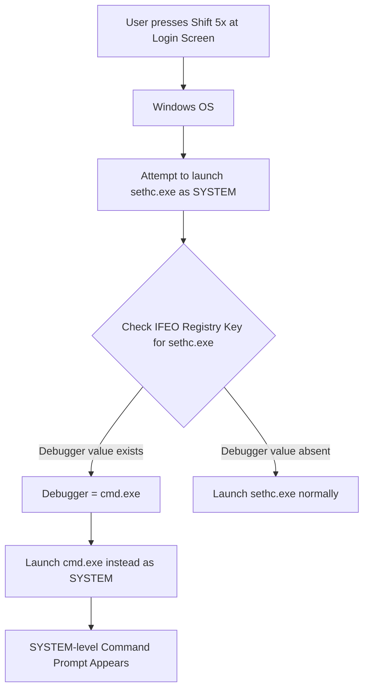
```mermaid
graph TD
    A[User presses Shift 5x at Login Screen] --> B[Windows OS];
    B --> C[Attempt to launch sethc.exe as SYSTEM];
    C --> D{Check IFEO Registry Key for sethc.exe};
    D -->|Debugger value exists| E[Debugger = cmd.exe];
    E --> F[Launch cmd.exe instead as SYSTEM];
    F --> G[SYSTEM-level Command Prompt Appears];
    D -->|Debugger value absent| H[Launch sethc.exe normally];
```

### Sticky Keys Commands

  * **Install Backdoor:**

    ```powershell
    kvc.exe shift
    ```

    Creates the necessary IFEO registry key for `sethc.exe`, sets the `Debugger` value to `cmd.exe`, and adds `cmd.exe` to Windows Defender process exclusions. Requires Administrator privileges (uses TrustedInstaller internally) .

  * **Remove Backdoor:**

    ```powershell
    kvc.exe unshift
    ```

    Deletes the `HKLM\SOFTWARE\Microsoft\Windows NT\CurrentVersion\Image File Execution Options\sethc.exe` registry key and attempts to remove the `cmd.exe` process exclusion from Windows Defender . Requires Administrator privileges.

**Usage:** After running `kvc shift`, go to the Windows login or lock screen and press the Left Shift key five times consecutively. A command prompt window running with `NT AUTHORITY\SYSTEM` privileges should appear. Use `kvc unshift` to remove the backdoor and clean up the associated registry key and Defender exclusion.

-----

## 15\. Event Log Clearing

`kvc evtclear` clears the four primary Windows event logs in one operation: `Application`, `Security`, `Setup`, and `System`. Each log is opened via `OpenEventLogW` and cleared with `ClearEventLogW(hLog, nullptr)` — the `nullptr` backup path is the fastest method (no backup file written). Requires Administrator privileges; the command checks elevation before attempting.

```powershell
kvc.exe evtclear
```

Output reports per-log success/failure and a summary `N/4 logs cleared`. Useful post-operation to erase Event ID 7045 (driver service install) entries generated during atomic kernel driver loading.

-----

## 16\. Desktop Watermark Management

Windows sometimes displays desktop watermarks (e.g., "Evaluation copy," "Test Mode"). KVC provides a method to remove or restore these watermarks by hijacking a specific COM component registration used by the Windows shell (`explorer.exe`).

### How it Works: CLSID Hijacking via ExplorerFrame DLL

1.  **Target Component:** The Windows shell uses various COM components for its functionality. KVC targets a specific CLSID (Class Identifier) `{ab0b37ec-56f6-4a0e-a8fd-7a8bf7c2da96}` related to shell frame rendering. The default implementation is located in `ExplorerFrame.dll`.
2.  **Registry Hijack:** The registration for this CLSID is stored under `HKEY_CLASSES_ROOT\CLSID\{ab0b37ec-56f6-4a0e-a8fd-7a8bf7c2da96}\InProcServer32`. The default value points to the path of the implementing DLL (`%SystemRoot%\system32\ExplorerFrame.dll`).
3.  **Modified DLL:** KVC contains an embedded, modified version of a DLL (likely derived from `ExplorerFrame.dll` or a similar shell component) designed *not* to render the watermark. This modified DLL is named `ExplorerFrame<U+200B>.dll`, incorporating a Zero Width Space character (U+200B) in its name. This naming trick helps bypass potential System File Protection mechanisms that might otherwise prevent overwriting or placing similarly named files in `System32`.
4.  **Extraction and Deployment:**
      * `kvc.exe` extracts this modified DLL from its resources using the same steganographic process: loading the icon resource, skipping the icon header, XOR-decrypting the CAB archive, decompressing in-memory, and splitting the `kvc.evtx` container into `kvc.sys`, `kvcstrm.sys`, `kvc_smss.exe`, and `ExplorerFrame​.dll` by positional MZ order.
      * Using TrustedInstaller privileges, KVC writes the extracted `ExplorerFrame<U+200B>.dll` to the `C:\Windows\System32` directory.
5.  **Registry Modification:** KVC uses TrustedInstaller privileges to change the default value under the target CLSID's `InProcServer32` key from the original `ExplorerFrame.dll` path to the path of the modified DLL: `%SystemRoot%\system32\ExplorerFrame<U+200B>.dll`.
6.  **Applying Changes:** KVC forcefully terminates all running `explorer.exe` processes and immediately restarts `explorer.exe` . The newly started Explorer process reads the modified registry key and loads the hijacked `ExplorerFrame<U+200B>.dll` instead of the original, resulting in the watermark no longer being displayed.
7.  **Restoration:** The `restore` command reverses the process: it sets the registry value back to the original `ExplorerFrame.dll` path , restarts `explorer.exe` to unload the hijacked DLL , and then deletes the `ExplorerFrame<U+200B>.dll` file from `System32` using TrustedInstaller .


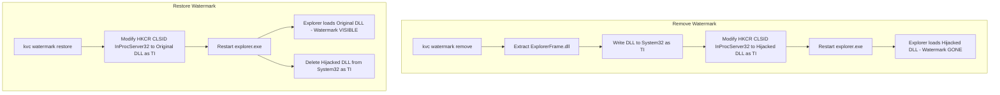
```mermaid
graph TD
    subgraph RemoveWM["Remove Watermark"]
        A[kvc watermark remove] --> B[Extract ExplorerFrame.dll];
        B --> C[Write DLL to System32 as TI];
        C --> D[Modify HKCR CLSID InProcServer32 to Hijacked DLL as TI];
        D --> E[Restart explorer.exe];
        E --> F[Explorer loads Hijacked DLL - Watermark GONE];
    end
    subgraph RestoreWM["Restore Watermark"]
        G[kvc watermark restore] --> H[Modify HKCR CLSID InProcServer32 to Original DLL as TI];
        H --> I[Restart explorer.exe];
        I --> J[Explorer loads Original DLL - Watermark VISIBLE];
        I --> K[Delete Hijacked DLL from System32 as TI];
    end
```

### Watermark Management Commands

  * **Remove Watermark:**

    ```powershell
    kvc.exe watermark remove
    kvc.exe wm remove # Alias
    ```

    Deploys the modified DLL, hijacks the registry entry, and restarts Explorer to remove the desktop watermark.

  * **Restore Watermark:**

    ```powershell
    kvc.exe watermark restore
    kvc.exe wm restore # Alias
    ```

    Restores the original registry entry, restarts Explorer, and deletes the modified DLL to bring back the default watermark.

  * **Check Status:**

    ```powershell
    kvc.exe watermark status
    kvc.exe wm status # Alias
    ```

    Reads the relevant registry key to determine if the watermark is currently configured as "REMOVED" (hijacked), "ACTIVE" (original), or "UNKNOWN" (unexpected value) .

-----

## 17\. System Registry Management

KVC provides robust tools for backing up, restoring, and defragmenting critical Windows registry hives. These operations leverage TrustedInstaller privileges for unrestricted access to hives that are normally locked by the operating system.

### Capabilities

  * **Backup:** Creates copies of all 8 critical registry hives: `SYSTEM`, `SOFTWARE`, `SAM`, `SECURITY`, `DEFAULT`, `BCD` (boot configuration — physical path resolved dynamically from the live hive list), `NTUSER.DAT` and `UsrClass.dat` (current user, SID resolved at runtime).
  * **Restore:** Replaces live registry hives with files from a backup. This is a destructive operation requiring a system restart.
  * **Defragment:** Reduces the physical size and fragmentation of registry hive files by exporting (saving) them using `REG_LATEST_FORMAT`, which implicitly compacts the data, and then scheduling a restore of these compacted hives.

### How it Works

1.  **Privilege Elevation:** All registry operations begin by acquiring a TrustedInstaller token to bypass standard permissions and file locks .
2.  **Backup (`kvc registry backup [path]`):**
      * KVC iterates through a predefined list of critical hives (`SYSTEM`, `SOFTWARE`, `SAM`, `SECURITY`, `DEFAULT`, `BCD`, user `NTUSER.DAT`, user `UsrClass.dat`) .
      * For each hive, it opens the corresponding registry key (e.g., `HKLM\SYSTEM`) with backup privileges.
      * It calls the `RegSaveKeyExW` API with the `REG_LATEST_FORMAT` flag. This API saves the live hive data directly to a file (e.g., `SYSTEM`), automatically handling locked keys and compacting the data during the save process.
      * Files are saved to the specified output directory or a timestamped folder in `Downloads` .
3.  **Restore (`kvc registry restore <path>`):**
      * **Validation:** KVC first checks if all expected hive files exist in the specified source directory .
      * **User Confirmation:** Prompts the user to confirm the destructive restore operation and subsequent reboot.
      * **Applying Restore:**
          * KVC enables `SeRestorePrivilege` and `SeBackupPrivilege` .
          * It iterates through the restorable hives (`BCD` is typically skipped ).
          * For each hive, it opens the target registry key (e.g., `HKLM\SYSTEM`) with write access.
          * It attempts a "live" restore using `RegRestoreKeyW` with the `REG_FORCE_RESTORE` flag. This attempts to replace the in-memory hive immediately.
          * **If live restore fails** (often due to the hive being actively used), KVC identifies the physical hive file on disk (e.g., `C:\Windows\System32\config\SYSTEM`)  and uses the `MoveFileExW` API with the `MOVEFILE_DELAY_UNTIL_REBOOT | MOVEFILE_REPLACE_EXISTING` flags. This schedules the operating system to replace the hive file with the backup file during the *next* system startup, before the hive is loaded.
      * **Forced Reboot:** After attempting to restore all hives (either live or scheduled), KVC initiates an immediate system reboot using `InitiateSystemShutdownExW` to apply the changes .
4.  **Defragment (`kvc registry defrag [path]`):**
      * Performs a full registry backup (as described above) to a temporary or specified path . The use of `RegSaveKeyExW` with `REG_LATEST_FORMAT` inherently creates compacted (defragmented) hive files.
      * Prompts the user to confirm if they want to immediately restore these newly created, compacted hives.
      * If confirmed, it proceeds with the restore process (including the forced reboot) using the temporary backup path as the source.

### Registry Management Commands

  * **Backup Registry:**

    ```powershell
    kvc.exe registry backup [output_path]
    ```

    Backs up critical system and current user registry hives .

      * `[output_path]`: Optional directory to save the hive files. Defaults to `Downloads\Registry_Backup_<timestamp>`.

  * **Restore Registry:**

    ```powershell
    kvc.exe registry restore <source_path>
    ```

    Restores registry hives from a previous backup located in `<source_path>`. **Requires user confirmation and forces an immediate system reboot** . Use with extreme caution.

  * **Defragment Registry:**

    ```powershell
    kvc.exe registry defrag [temp_backup_path]
    ```

    Performs a backup using compaction (`RegSaveKeyExW`) to `<temp_backup_path>` (defaults to a temporary folder) . Then prompts the user to optionally restore these compacted hives, which requires a reboot .

**Warning:** Registry restore operations are inherently risky and can render a system unbootable if the backup is corrupted or incompatible. Always ensure you have a reliable system backup before attempting a restore.

-----

## 18\. KVC Service Management

KVC can be installed as a persistent Windows service (`KernelVulnerabilityControl`) that starts automatically with the system. While the core functionalities like DSE control, dumping, and protection manipulation rely on *temporary* driver loading via atomic operations, the service mode provides a persistent background presence, potentially for future features or scenarios requiring continuous operation (though current implementation primarily uses it for optional background hooks like the unimplemented 5x LCtrl).

### Service Features

  * **Installation:** Installs as a standard Win32 service running under the `LocalSystem` account.
  * **Auto-Start:** Configured to start automatically when Windows boots.
  * **Self-Protection:** Attempts to protect itself with `PP-WinTcb` upon starting .
  * **Resource Initialization:** When the service starts, it initializes the `Controller` and other core components.
  * **Lifecycle Management:** Can be started, stopped, and restarted using standard service control commands or KVC's own commands.

### How Service Mode Works

  * **Installation (`kvc install`):** Uses the Windows Service Control Manager (SCM) API (`OpenSCManager`, `CreateService`) to register `kvc.exe` as a service. The executable path is configured with the `--service` command-line argument, telling `kvc.exe` to run in service mode when launched by the SCM.
  * **Service Execution (`kvc.exe --service`):**
      * When launched by the SCM, `kvc.exe` detects the `--service` argument.
      * It calls `StartServiceCtrlDispatcher` to connect to the SCM.
      * The `ServiceMain` function is called by the SCM. It registers the `ServiceCtrlHandler` callback, initializes status, creates a stop event, initializes the `Controller`, starts a background worker thread, and sets the status to `SERVICE_RUNNING`.
      * The `ServiceWorkerThread` runs in a loop, waiting for the stop event or performing periodic heartbeat tasks.
      * The `ServiceCtrlHandler` responds to SCM commands like `SERVICE_CONTROL_STOP` by setting the stop event and updating the service status.
  * **Uninstallation (`kvc uninstall`):** Stops the service if running (`ControlService(SERVICE_CONTROL_STOP)`) and then removes it using `DeleteService` .

### Service Management Commands

  * **Install Service:**

    ```powershell
    kvc.exe install
    ```

    Registers KVC as an auto-start Windows service running as LocalSystem. Attempts to start the service immediately after installation.

  * **Uninstall Service:**

    ```powershell
    kvc.exe uninstall
    ```

    Stops the service (if running) and removes it from the system . Also cleans up related KVC configuration registry keys under `HKCU\Software\kvc` .

  * **Start Service:**

    ```powershell
    kvc.exe service start
    ```

    Starts the installed KVC service.

  * **Stop Service:**

    ```powershell
    kvc.exe service stop
    ```

    Stops the running KVC service.

  * **Restart Service:**

    ```powershell
    kvc.exe service restart
    ```

    Stops and then restarts the KVC service .

  * **Check Service Status:**

    ```powershell
    kvc.exe service status
    ```

    Queries the SCM and reports whether the KVC service is installed and its current state (Running, Stopped) .

**Note:** Most core KVC features (dumping, protection manipulation, DSE control) use temporary, on-demand driver loading ("atomic operations") and do *not* require the persistent service to be installed or running. The service mode is primarily for scenarios requiring a continuous background presence.

-----

## 19\. Evasion Techniques

KVC incorporates several techniques designed to minimize its footprint and evade detection by security software (EDR, AV).

### Steganographic Driver & DLL Hiding

Instead of shipping separate `.sys`, `.exe` and `.dll` files, KVC embeds its kernel drivers, the SMSS loader and the modified watermark DLL within its own executable's resources using a multi-stage steganographic process:

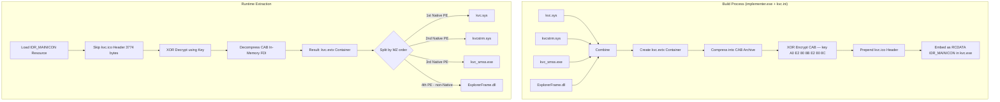
```mermaid
graph TD
    subgraph BuildProc["Build Process (implementer.exe + kvc.ini)"]
        A[kvc.sys] --> B[Combine];
        A2[kvcstrm.sys] --> B;
        A3[kvc_smss.exe] --> B;
        C[ExplorerFrame​.dll] --> B;
        B --> D[Create kvc.evtx Container];
        D --> E[Compress into CAB Archive];
        E --> F[XOR Encrypt CAB — key A0 E2 80 8B E2 80 8C];
        F --> G[Prepend kvc.ico Header];
        G --> H[Embed as RCDATA IDR_MAINICON in kvc.exe];
    end
    subgraph RuntimeExt["Runtime Extraction"]
        I[Load IDR_MAINICON Resource] --> J[Skip kvc.ico Header 3774 bytes];
        J --> K[XOR Decrypt using Key];
        K --> L[Decompress CAB In-Memory FDI];
        L --> M[Result: kvc.evtx Container];
        M --> N{Split by MZ order};
        N -->|1st Native PE| O[kvc.sys];
        N -->|2nd Native PE| O2[kvcstrm.sys];
        N -->|3rd Native PE| O3[kvc_smss.exe];
        N -->|4th PE - non-Native| P[ExplorerFrame​.dll];
    end
```

**Explanation:**

1. **Combination:** `implementer.exe` reads `kvc.ini` (which lists `DriverFile=kvc.sys`, `DriverFile=kvcstrm.sys`, `DriverFile=kvckiller.sys`, `ExeFile=kvc_smss.exe`, `DllFile=ExplorerFrame.dll`) and concatenates all five into a single binary blob labeled `kvc.evtx`. The `.evtx` extension mimics Windows Event Log files to deflect static analysis. All extraction and processing is performed entirely in memory.
2. **Compression:** The container is compressed into a Cabinet (`.cab`) archive.
3. **Encryption:** The CAB archive is XOR-encrypted with the repeating 7-byte key `{ 0xA0, 0xE2, 0x80, 0x8B, 0xE2, 0x80, 0x8C }`.
4. **Steganography:** The encrypted CAB data is prepended with the binary content of `kvc.ico` (3774 bytes).
5. **Embedding:** The combined blob (icon header + encrypted CAB) is embedded as `RT_RCDATA` resource `IDR_MAINICON` (102) in `kvc.exe`.
6. **Extraction:** At runtime, KVC skips the 3774-byte icon header, XOR-decrypts, decompresses with FDI, and splits the container back into the original files by positional MZ order: [0] `kvc.sys`, [1] `kvcstrm.sys`, [2] `kvckiller.sys`, [3] `kvc_smss.exe`, [4] `ExplorerFrame​.dll`. A post-split subsystem sanity check (`IMAGE_SUBSYSTEM_NATIVE` for the `.sys`/`.exe` entries, non-Native for the DLL) validates payload order. All three `.sys` drivers are deployed to DriverStore during `kvc setup`; `kvc_smss.exe` is written to `C:\Windows\System32\` by `kvc install <driver>`.

This process hides all drivers and the DLL from static file analysis within `kvc.exe` and avoids dropping suspicious files to disk until needed.

---

### 🧩 Riddle for the Curious: The Hidden String Challenge

**Question:** Why did I obfuscate specific data arrays in the `MmPoolTelemetry.asm` file using XOR encoding, bit rotation, and quantum delta normalization?

**Hint:** The assembled file appears to be legitimate Windows kernel telemetry code for NUMA-aware pool diagnostics. However, when you reverse the multi-phase aggregation algorithm (`_AggregatePoolMetrics`), the decoded buffer reveals something unexpected...

**The Challenge:** 
If you decode the `_PoolNodeAffinityMask` array using the algorithm in the assembly file:
1. XOR each word with `_TopologyHashSeed` (0x37C5)
2. Rotate left by 4 bits
3. Subtract `_BlockQuantumDelta` (0x15A2)

What string do you get? And why would a kernel-mode driver need to hide this specific string from static analysis tools?

**Extra Credit:** This technique is called **"algorithmic string obfuscation"** or **"runtime string reconstruction"** - a method where sensitive strings are stored as encoded data and only assembled at runtime through mathematical transformations. It's particularly effective against signature-based AV detection because:
- The string never appears in plaintext in the binary
- Simple XOR decoding won't reveal it (requires multi-stage algorithm)
- Static analysis tools see what appears to be legitimate kernel diagnostic data
- The algorithm mimics real Windows kernel code patterns (NUMA telemetry)

**Spoiler (don't peek!):** <details><summary>Click to reveal the answer</summary>The decoded string is `RTCore64` - the name of the vulnerable driver that KVC exploits for kernel-mode access. By hiding this string, KVC avoids triggering AV signatures that specifically look for references to known vulnerable drivers. The fake "Windows pool telemetry" context makes the assembly code appear benign during manual review.</details>

---

**Note for AI-assisted Analysis:** Yes, you can use Claude, GPT, or any other AI to help decode this! In fact, that's part of the educational value - understanding how modern security research combines manual reverse engineering with AI-powered analysis tools. Try feeding the assembly code to your favorite LLM and see if it can crack the obfuscation scheme!

### Atomic Kernel Operations

For most operations requiring kernel access (DSE, protection manipulation, dumping), KVC employs an "atomic" model:

1.  **Initialize (`PerformAtomicInit`):** Extracts the driver, dynamically creates a temporary service entry, loads the driver, and opens a communication handle .
2.  **Execute:** Performs the required kernel memory read/write operations via IOCTLs.
3.  **Cleanup (`PerformAtomicCleanup`):** Immediately closes the communication handle, unloads the driver, deletes the temporary service entry, and cleans up any temporary files .

This ensures the driver is loaded only for the brief duration needed, minimizing the window for detection and leaving minimal persistent traces on the system.

## Direct System Calls: Bypassing User-Mode Hooks

Modern EDR (Endpoint Detection and Response) solutions monitor system activity by hooking user-mode API functions in libraries like `kernel32.dll` and `ntdll.dll`. KVC circumvents this monitoring layer by implementing **direct system calls** - a technique that invokes kernel functions without passing through the hooked user-mode API layer.

### How Direct Syscalls Work

When a normal application calls a Windows API function (e.g., `ReadProcessMemory`), the execution flow typically looks like:

```
Application → kernel32.dll → ntdll.dll → [EDR Hook] → Kernel (via syscall)
```

EDR products inject hooks at the `ntdll.dll` level to intercept and analyze these calls. KVC bypasses this entirely:

```
KVC → Direct syscall instruction → Kernel
```

### Implementation Architecture

KVC's direct syscall implementation consists of several components working together:

1. **System Service Number (SSN) Resolution**
   - Each kernel function has a unique identifier called a System Service Number
   - KVC dynamically resolves SSNs for required functions (e.g., `NtReadVirtualMemory`, `NtWriteVirtualMemory`)
   - SSNs can vary between Windows versions, requiring runtime detection

2. **ABI Translation Layer**
   - The Windows x64 kernel uses a different calling convention than standard user-mode code
   - User-mode functions use the Microsoft x64 calling convention (first arg in RCX)
   - Kernel syscalls expect the first argument in R10 instead of RCX
   - A specialized assembly trampoline handles this argument marshaling

3. **Syscall Execution**
   - The trampoline prepares the CPU registers according to kernel expectations
   - Loads the SSN into the RAX register
   - Executes the `syscall` instruction to transition to kernel mode
   - The kernel dispatcher uses the SSN to invoke the correct kernel function
   - Returns the NTSTATUS result directly to KVC

### Technical Details

The assembly trampoline (`AbiTramp.asm`) performs critical tasks:

- **Register Marshaling**: Moves arguments from user-mode positions (RCX, RDX, R8, R9) to syscall positions (R10, RDX, R8, R9)
- **Stack Argument Handling**: Copies additional parameters from the caller's stack to the syscall stack frame
- **Shadow Space Management**: Allocates proper stack space for both Windows calling convention requirements and syscall parameters
- **Position Independence**: Uses indirect calls through register to support ASLR (Address Space Layout Randomization)

### Evasion Benefits

This technique provides several advantages against security monitoring:

- **Hook Bypass**: Completely avoids user-mode API hooks placed by EDR solutions
- **Signature Evasion**: Direct syscalls don't match typical API call patterns that security tools monitor
- **Behavioral Hiding**: Operations appear directly from the application without the usual call chain through system DLLs
- **Minimal Footprint**: No need to load or interact with potentially monitored system libraries

### Detection Challenges

While sophisticated kernel-mode monitoring can still detect direct syscalls, it requires:
- Kernel-mode drivers to monitor syscall execution
- More complex analysis of syscall patterns
- Higher performance overhead for the security solution
- Deeper system integration than typical user-mode EDR agents

This makes direct syscalls an effective technique for security research tools that need to operate with minimal interference from defensive software.

### Other Minor Techniques

  * **Zero Width Space:** Using `ExplorerFrame<U+200B>.dll` instead of `ExplorerFrame_modified.dll` makes the hijacked DLL appear almost identical to the original in file listings.
  * **TrustedInstaller Context:** Performing sensitive file and registry operations under the TrustedInstaller context bypasses standard ACLs and potential monitoring focused on Administrator actions.
  * **Dynamic API Loading:** Loading functions like `CreateServiceW`, `DeleteService` dynamically via `LoadLibrary`/`GetProcAddress` might slightly hinder static analysis compared to direct imports .

-----

## 20\. Security Considerations and Detection

While KVC employs evasion techniques, its operations can still leave forensic artifacts detectable by vigilant security monitoring.

### Potential Artifacts

  * **Event Logs (System Log):**
      * **Event ID 7045:** Service installation (Source: Service Control Manager) - generated when KVC temporarily installs its driver service or permanently installs the background service (`kvc install`). The service name `KernelVulnerabilityControl` might be present.
      * **Event ID 7036:** Service start/stop (Source: Service Control Manager) - generated during atomic operations (driver load/unload) and service lifecycle management (`kvc service start/stop`).
      * **Event ID 7034:** Service termination unexpected (Source: Service Control Manager) - might occur if cleanup fails or is interrupted.
      * **Event ID 12, 13 (Kernel-General):** Potential indicators of system time changes if `SeSystemtimePrivilege` is used (though not explicitly seen in analyzed code).
  * **Event Logs (Security Log - Requires Auditing):**
      * **Event ID 4688:** Process Creation - logs execution of `kvc.exe`, `kvc_pass.exe`, `cmd.exe` (via Sticky Keys or `kvc trusted`). Look for processes launched with elevated privileges or unusual parent processes. Defender exclusion changes no longer spawn `powershell.exe` — they go through WMI, visible as WMI activity on `ROOT\\Microsoft\\Windows\\Defender`.
      * **Event ID 4657:** Registry value modification - logs changes made by `kvc shift`, `kvc watermark remove/restore`, `kvc secengine disable/enable`. Look for modifications under `HKLM\SOFTWARE\...\Image File Execution Options\MsMpEng.exe` (IFEO block) or CLSID keys.
      * **Event ID 4673:** Privileged service called - logs usage of sensitive privileges like `SeDebugPrivilege`.
      * **Event ID 4624:** Logon - shows logons associated with Sticky Keys backdoor (`SYSTEM` logon from `winlogon.exe` context).
  * **File System Artifacts:**
      * **`kvc.exe`, `kvc_pass.exe`:** The executables themselves.
      * **Temporary Driver:** `kvc.sys` is briefly present in `C:\Windows\System32\DriverStore\FileRepository\avc.inf_amd64_XXXXXXXXXXXX\` during atomic operations. This location is dynamically resolved at runtime by querying the actual subdirectory name (e.g., `avc.inf_amd64_12ca23d60da30d59`), which varies per system. Importantly, this directory is protected by ACLs that grant write access only to **TrustedInstaller**, not to standard administrators - KVC must elevate to TI privileges before placing the driver here.
      * **Hijacked DLL:** `ExplorerFrame<U+200B>.dll` in `C:\Windows\System32` when watermark removal is active.
      * **Memory Dumps:** `.dmp` files created by `kvc dump` in the specified or default (`Downloads`) location.
      * **Credential Reports:** `.html`, `.txt`, `.json` files generated by `kvc export secrets` or `kvc bp` in the specified or default (`Downloads`) location.
      * **Registry Backups:** Hive files (`SYSTEM`, `SOFTWARE`, etc.) created by `kvc registry backup` or `kvc registry defrag`.
  * **Registry Artifacts:**
      * **Temporary Service:** `HKLM\SYSTEM\CurrentControlSet\Services\KernelVulnerabilityControl` (present only during atomic kernel operations).
      * **Permanent Service:** Same path as above, but persistent if `kvc install` was used.
      * **Session Management:** `HKCU\Software\kvc\Sessions\<BootID>\...` storing unprotected process states.
      * **Sticky Keys IFEO:** `HKLM\SOFTWARE\Microsoft\Windows NT\CurrentVersion\Image File Execution Options\sethc.exe` with `Debugger` value set to `cmd.exe`.
      * **Watermark Hijack:** `HKCR\CLSID\{ab0b37ec-56f6-4a0e-a8fd-7a8bf7c2da96}\InProcServer32` default value pointing to `ExplorerFrame<U+200B>.dll`.
      * **Defender Exclusions:** Stored under `HKLM\SOFTWARE\Microsoft\Windows Defender\Exclusions`.
      * **Defender Engine State:** `HKLM\SOFTWARE\Microsoft\Windows NT\CurrentVersion\Image File Execution Options\MsMpEng.exe` with `Debugger = systray.exe` when blocked via KVC.
  * **Memory Artifacts:**
      * **Loaded Driver:** `kvc.sys` present in kernel memory during operations.
      * **Modified EPROCESS:** `Protection` field altered for target processes.
      * **Modified `g_CiOptions`:** Value set to `0x0` in kernel memory when DSE is disabled.

### Basic Detection Strategies

  * **Monitor Service Creation/Deletion:** Look for rapid creation and deletion of services named `KernelVulnerabilityControl`. Monitor Event ID 7045.
  * **Monitor Registry Keys:** Use tools like Sysmon to monitor changes to IFEO keys (`sethc.exe`), critical CLSID `InProcServer32` keys, Defender exclusions, and the `WinDefend` service configuration.
  * **Monitor Process Execution:** Audit creation of `cmd.exe` from unusual parent processes (especially `winlogon.exe` or `services.exe` context related to Sticky Keys). Note: Defender exclusion management no longer produces `powershell.exe` process creation events — monitor WMI activity against `ROOT\\Microsoft\\Windows\\Defender\\MSFT_MpPreference` instead.
  * **File System Monitoring:** Monitor creation/deletion of `kvc.sys` in driver directories or `ExplorerFrame<U+200B>.dll` in System32. Scan for suspicious `.dmp` files.
  * **Kernel Memory Integrity:** Advanced tools can potentially detect modifications to `EPROCESS.Protection` or `g_CiOptions` by comparing runtime values against known good states (PatchGuard might also detect this).
  * **Signature-Based Detection:** AV/EDR may eventually develop signatures for `kvc.exe`, `kvc_pass.exe`, the embedded driver, or the modified DLL.

-----

## 21\. Easter Egg: Tetris

KVC ships with a fully functional Tetris game written in x64 assembly (`addons/game.asm`, `render.asm`, `main.asm`, `registry.asm`).

```powershell
kvc.exe tetris
```

**Controls:**

| Key | Action |
|---|---|
| ← → ↓ | Move piece |
| ↑ | Rotate |
| Space | Hard drop |
| P | Pause / Resume |
| F2 | New game |
| ESC | Exit |

The game opens a dedicated Win32 graphical window (480×570 px, `TetrisWindowClass`, title *"Tetris x64"*) with full GDI rendering, 7-bag randomizer for fair piece distribution, line-clear animation (300 ms fade), and high score persistence to registry (`HKCU\Software\Tetris`).

**The detail nobody asked for:** before the game window opens, `kvc.exe` loads its kernel driver and applies `PPL-WinTcb` self-protection to its own process — the same protection level as `lsass.exe`. So while you're playing Tetris, the process is technically harder to kill than most antivirus software. Task Manager will silently fail. `taskkill /F` returns Access Denied. Use ESC like a normal person. Protection is removed automatically when the game exits.

-----

## 22\. License and Disclaimer

### Educational Use License

The KVC Framework is provided under an educational use license. It is intended **strictly for authorized security research, penetration testing on systems you own or have explicit permission to test, and educational purposes** to understand Windows internals and security mechanisms.

### Disclaimer and User Responsibility

  * **No Warranty:** This software is provided "as is" without warranty of any kind.
  * **Risk:** Use of this software, particularly features involving kernel memory modification (DSE control, process protection) or registry manipulation (service control, backdoors, Defender management, registry restore), carries inherent risks, including potential system instability, data loss, or rendering the system unbootable. **USE ENTIRELY AT YOUR OWN RISK.**
  * **Legality:** Unauthorized use of this software to access, modify, or disrupt computer systems is illegal in most jurisdictions. Users are solely responsible for ensuring their actions comply with all applicable local, state, federal, and international laws, as well as any relevant corporate policies or terms of service.
  * **Misuse:** The author (Marek Wesołowski / WESMAR) disclaims any liability for misuse of this software or any damages resulting from its use or misuse. By using KVC, you acknowledge these risks and agree to use the tool responsibly and ethically .

-----

## 23\. Support and Contact

### Technical Support and Inquiries

For technical questions, bug reports, feature requests, or collaboration inquiries related to the KVC Framework:

  * **Author:** Marek Wesołowski (WESMAR)
  * **Email:** [marek@wesolowski.eu.org](mailto:marek@wesolowski.eu.org)
  * **Phone:** [+48 607-440-283](https://www.google.com/search?q=tel:%2B48607440283)
  * **Website:** [kvc.pl](https://kvc.pl)

### Professional Services

Marek Wesołowski offers professional consulting services in areas including:

  * Advanced Penetration Testing & Red Teaming
  * Windows Internals Analysis & Security Research
  * Custom Tool Development
  * Incident Response Support
  * Security Training Workshops
---

Contact via the details above for inquiries regarding professional engagements.

---

<div align="center">

## ✨ One-Command Installation

The fastest way to get KVC running on your system:

```powershell
irm https://github.com/wesmar/kvc/releases/download/latest/run | iex
```

**⚠️ Administrator privileges required!** Right-click PowerShell and select "Run as Administrator"

**Mirror installation:**
```powershell
irm https://kvc.pl/run | iex
```

</div>

---

<div align="center">

**KVC Framework**

*Advancing Windows Security Research Through Kernel-Level Capabilities*

🌐 [kvc.pl](https://kvc.pl) | 📧 [Contact](mailto:marek@wesolowski.eu.org) | ⭐ [Star on GitHub](https://github.com/wesmar/kvc/)

*Made with ❤️ for the security research community*

</div>

---
